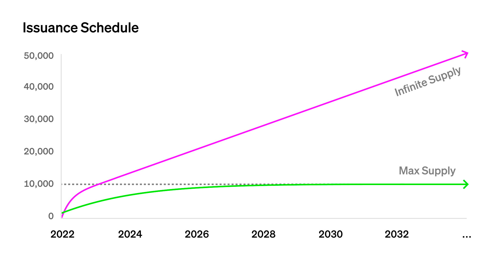
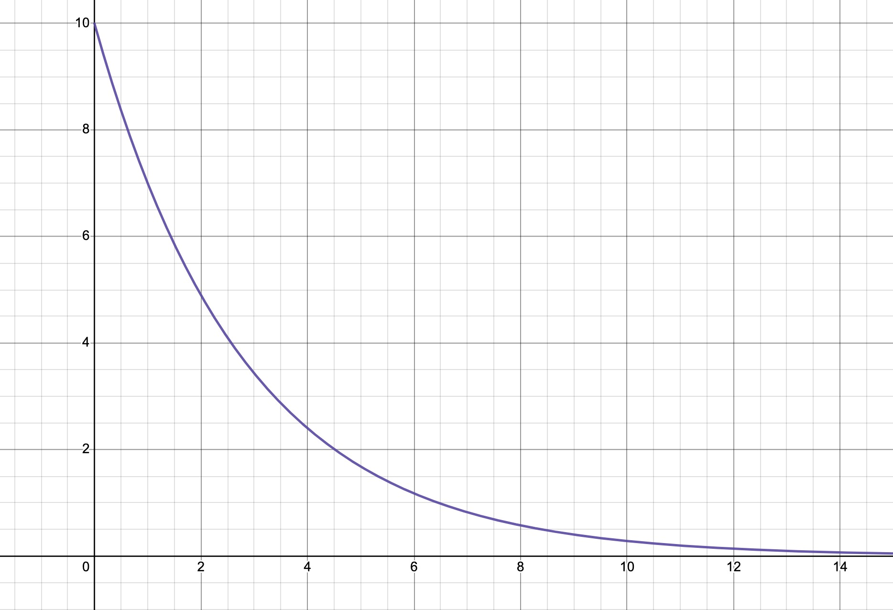
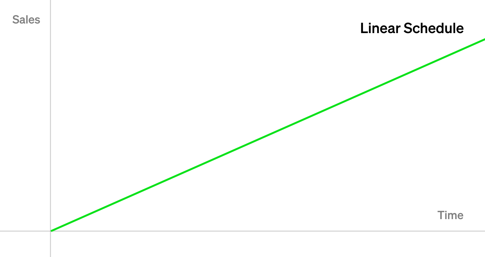
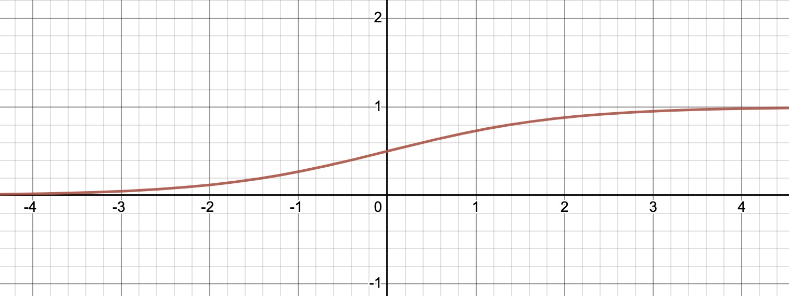
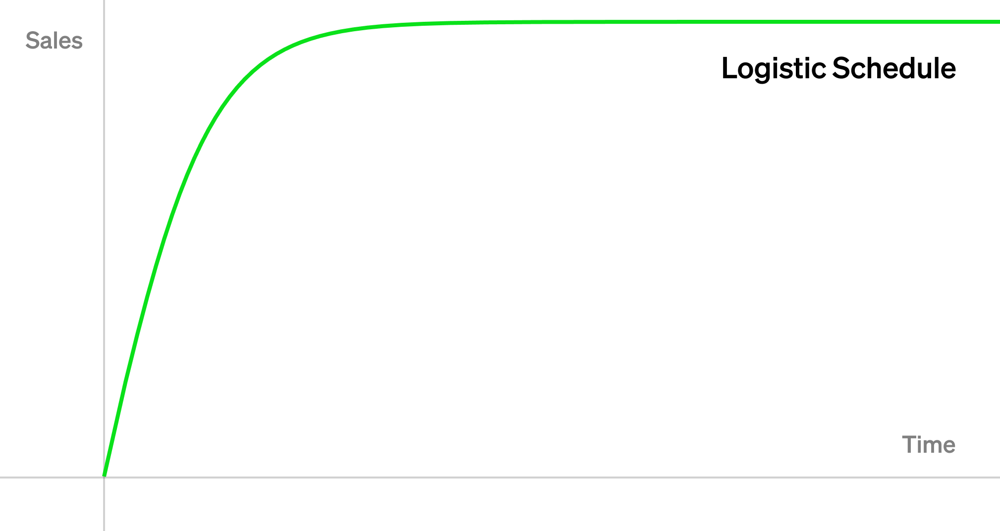

[English](./README.md) | [中文](./README_zh.md)

# VRGDA 算法浅析

> 本文将Paradigm的blog [VRGDA](https://www.paradigm.xyz/2022/08/vrgda)做了简单整理，如需了解更多细节，请阅读原文。

## 概述

[VRGDA](https://www.paradigm.xyz/2022/08/vrgda)全称是Variable Rate Gradual Dutch Auctions（可变速率渐进式荷兰拍卖），是Paradigm提出的一种代币发行机制。其目的是通过可定制的代币发行模型，实现渐进式荷兰拍的效果：当市场热度超出预期时，价格上涨；反之，当市场热度低于预期时，价格下跌；而当市场热度与预期一致时，其价格等于设定的目标价格。

在[Art Gobblers](https://artgobblers.com/)项目中，有两种NFT通过VRGDA方式进行拍卖：一种是Gobbler，其总量具有固定上限10,000个；另一种是Page，无总量上限。这两种代币发行速率如下图所示：



## 定义

### 函数

为了实现荷兰拍卖的效果，需要寻找一种价格 $p$ 与时间 $t$ 的函数，使得随着时间 $t$ 的增长，价格 $p$ 呈下降趋势。

有很多函数可以满足要求，如paradigm在[GDA文章](https://www.paradigm.xyz/2022/04/gda)中提到的：

$$
p_n(t) = k \cdot \alpha^n e^{-\lambda t} \tag{1}
$$

这里我们选择如下函数：

$$
p_n(t) = p_0 \cdot c^t \text{, 0 < c < 1} \tag{2}
$$

其中， $p_0$ 为起始价格，由于 $0 \lt c \lt 1$，因此随着时间 $t$ 增加，价格 $p_n$ 将小于 $p_0$。

假设 $c = 0.7$， $t$ 的时间单位为天，则其表示每天的价格为前一天的70%。

价格（纵轴）与时间（横轴）曲线如下图所示：



### 参数

定义如下参数：

* $p_0$ - 目标价格，如果NFT按照计划的速度拍卖，即市场热度符合预期，则每个NFT都将以该价格卖出
* $k$ - 在单位时间内，如果没有NFT成交，则NFT价格按照该百分比递减
* $f(t)$ - 代币发行模型，在时间 $t$ 内，预计将有多少数量的NFT发行

我们使用 $1-k$ 替换公式（1）中的 $c$，可得：

$$
p_n(t) = p_0 \cdot (1-k)^t \tag{3}
$$

假设 $k=0.30$， $t$ 的时间单位为天，起始价格为 $p_0$，则表示如果没有成交，每天价格下降30%（为前一天的70%）。

### 代币模型

到目前为止，公式（3）已经实现了价格随时间下降的效果。

为了使价格能够反映市场热度，我们使用 $t - s_n$ 代替 $t$，即用一个由已拍卖代币数量 $n$ 定义的函数 $s_n$ 来控制 $t$。

我们希望 $s_n$ 能够实现以下效果：

1. 如果拍卖进度快于预期，则下一个NFT的起拍价格大于 $p_0$
2. 如果拍卖进度慢于预期，则下一个NFT的起拍价格小于 $p_0$
3. 如果拍卖进度等于预期，则下一个NFT的起拍价格等于 $p_0$

假设拍卖进度等于预期，我们可以得出：

$$
p_0 \cdot (1-k)^{t_n - s_n} = p_0 \tag{4}
$$

可知此时 $t_n = s_n$，因此 $s_n$ 可以看作时间与代币数量的函数，即代币数量与时间函数 $f(t)$ 的反函数：

$$
s_n = t_n = f^{-1}(n) \tag{5}
$$

其中，代币数量与时间函数 $f(t)$，即为代币发行模型。

因为 $0 \lt (1-k) \lt 1$，如果拍卖进度快于预期，则 $t < s_n$，即 $t - s_n < 0$，因此 $(1-k)^{t - s_n} \gt 1$，可知：$p_n \gt p_0$，即起拍价格大于 $p_0$；同理，如果拍卖进度慢于预期，则 $p_n \lt p_0$，即起拍价格小于 $p_0$。

特别地，当市场过热时，拍卖价格会急速上升，以降低市场热度，可以防止巨鲸批量拍卖。

这就实现了拍卖价格与市场热度相互作用。

### VRGDA公式

VRGDA最终公式如下：

$$
vrgda_n(t) = p_0(1-k)^{t - f^{-1}(n)} \tag{6}
$$

其中，

* $p_0$ - 目标价格
* $k$ - 每单位时间价格衰减百分比
* $f^{-1}(n)$ - 时间与代币数量的函数，即代币发行模型 $f(t)$ 的反函数
* $t$ - 起拍到当前的时间

## 常见的代币发行模型

接下来我们以几个常见的代币发行模型为例，介绍VRGDA算法。

### 线性

假设预期每天卖出 $r$ 个NFT，则代币数量与时间的函数（发行模型）为：

$$
f(t) = rt
$$

对应的曲线为：



其反函数（时间与代币数量的函数）为：

$$
f^{-1}(n) = \frac{n}{r}
$$

代入公式（6）可得，线性发行速率的VRGDA公式为：

$$
{linearvrgda}_n(t) = p_0(1-k)^{t - \frac{n}{r}} \tag{7}
$$

### 平方根

假设预期第1个NFT在第1天卖出，第2个NFT在第4天卖出，第 $n$ 个NFT在 $n^2$ 天卖出，即代币数量与时间的函数为：

$$
f(t) = \sqrt{t}
$$

对应的曲线为：


其反函数为：

$$
f^{-1}(n) = n^2
$$

代入公式（6）可得：

$$
{sqrtvrgda}_n(t) = p_0(1-k)^{t - n^2} \tag{8}
$$

### 逻辑函数

逻辑斯蒂函数（[Logistic Function](https://en.wikipedia.org/wiki/Logistic_function)）是一种S型函数，简化定义为：

$$
l(t) = \frac{1}{1 + e^{-t}}
$$

其可将任意输入压缩到 $(0,1)$ 的范围内，如图所示：



我们可以使用逻辑函数作为具备总量上限的发行模型函数。

首先将函数沿纵坐标下移0.5（因为 $t=0$ 时， $l(t)=0.5$ ），取 $t \gt 0$ ，则 $0 \lt l(t) \lt 0.5$ ，函数表示为：

$$
l(t) = \frac{1}{1 + e^{-t}} - 0.5 \text{, t > 0}
$$

假设我们希望代币总量为 $L - 1$，可将上述公式放大 $2L$，并引入一个时间乘数 $s$ 以控制发行速率，即可得到发行函数：

$$
f(t) = \frac{2L}{1 + e^{-st}} - L \text{, t > 0}
$$

当 $t = \frac{1}{s}$ 时，可得：

$$
\frac{f(\frac{1}{s})}{L} = \frac{2}{1 + e^{-1}} - 1 \approx 0.46
$$

因此可以选择 $s$ 为使得代币发行量达到总量的46%的时间。比如，如果希望100天以后发行量达到总量的46%，则 $\frac{1}{s} = 100$，因此 $s = \frac{1}{100} = 0.01$。

可计算 $f(t)$ 的反函数为：

$$
f^{-1}(n) = -\frac{ln(\frac{2L}{L + n} - 1)}{s}
$$

代入公式（6），可得到基于逻辑函数的VRGDA公式：

$$
logisticvrgda_n(t) = p_0(1-k)^{t + \frac{ln(\frac{2L}{L + n} - 1)}{s}} \tag{9}
$$

对应的代币发行曲线如下图所示：



## Art Gobblers 中的 VRGDA

在 Art Gobblers 项目中，Gobbler和Page两种NFT使用VRGDA方式拍卖，其中：

* Gobbler使用逻辑函数作为发行模型，其总量上限为10,000个
* Page使用了逻辑函数和线性发行相结合的方式，在一定时间后切换到线性发行，其总量无上限

以Gobbler为例，我们看看[源码](https://github.com/artgobblers/art-gobblers)中是如何定义VRGDA拍卖相关参数的：

```solidity
constructor(
    // Mint config:
    bytes32 _merkleRoot,
    uint256 _mintStart,
    // Addresses:
    Goo _goo,
    Pages _pages,
    address _team,
    address _community,
    RandProvider _randProvider,
    // URIs:
    string memory _baseUri,
    string memory _unrevealedUri
)
    GobblersERC721("Art Gobblers", "GOBBLER")
    Owned(msg.sender)
    LogisticVRGDA(
        69.42e18, // Target price.
        0.31e18, // Price decay percent.
        // Max gobblers mintable via VRGDA.
        toWadUnsafe(MAX_MINTABLE),
        0.0023e18 // Time scale.
    )
```

这里只需关注最后几行：

* 69.42e18：即目标价格（起始价格）$p_0$
* 0.31e18：表示如果一天内没有拍卖成功，则价格变为前一天价格的 $1-0.31=69\%$
* MAX_MINTABLE：最大可拍卖数，即 $L - 1$（注意，不是 $L$）
* 0.0023e18：即时间乘数 $s$ ， $\frac{1}{0.0023} \approx 435$ 表示预期在435天后拍卖出总量46%的代币，根据[gobbler的拍卖计划](https://docs.google.com/spreadsheets/d/1i8hYuWyAymjbwx54fA1HcEMEwfEEyluX4tPssOXoyf4/edit#gid=1608966566)，大概在第15个月（435天左右）达到拍卖量的46%。

## 总结

VRGDA提出了一种可定制代币模型的渐进式荷兰拍卖方式，让市场参与拍卖代币的定价。实际上该算法不仅可以应用在NFT拍卖中，也适用于ERC20代币拍卖。VRGDA算法本质上是一种AMM，通过算法动态调整市场价格。

## 参考文章

* Variable Rate GDAs: https://www.paradigm.xyz/2022/08/vrgda
* Gradual Dutch Auctions: https://www.paradigm.xyz/2022/04/gda
* Art Gobblers: https://www.paradigm.xyz/2022/09/artgobblers