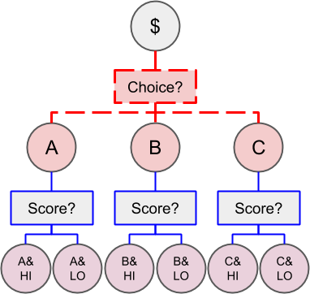
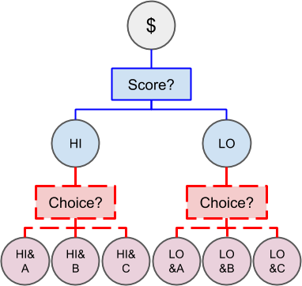
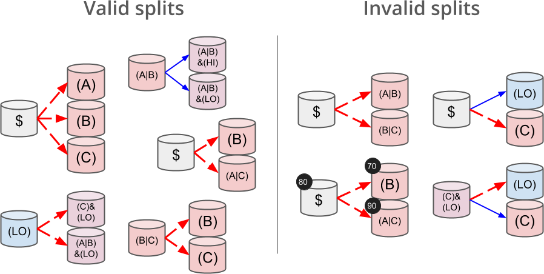

[English](./README.md) | [中文](./README_zh.md)

# Deep Dive into Conditional Tokens

[Conditional Tokens](https://conditional-tokens.readthedocs.io/en/latest/index.html) is a smart contract framework developed by the Gnosis team based on the [ERC-1155](https://ethereum.org/developers/docs/standards/tokens/erc-1155/) standard. Its core purpose is to support complex "Combinatorial Prediction Markets" and solve the liquidity fragmentation problem faced by traditional prediction markets when dealing with nested conditions.

This article details the design philosophy and operational mechanism of this system.

## Design Principles of Conditional Tokens

### The "Path Dependence" Problem in Combinatorial Prediction Markets

In prediction markets, we care not only about single events (e.g., "Who wins the election?") but often about chain events (e.g., "If A wins the election, will the stock market go up or down?"). This is known as Combinatorial Prediction Markets.

Assume there are two independent prediction questions:

  * Question A (Election): Result is Alice or Bob?
  * Question B (Economy): Result is High or Low?

We want to predict the scenario: "Alice is elected **AND** Economy goes High".

**Limitations of Traditional Methods**

In older contract designs, achieving this combination required nesting tokens. However, this creates a serious problem: **Path Dependence**.

* **Path 1:** You first collateralize funds to generate tokens representing "Alice", and then use the "Alice Token" as collateral to generate "Alice & High" tokens.



* **Path 2:** You first collateralize funds to generate tokens representing "High", and then use the "High Token" as collateral to generate "High & Alice" tokens.



Although "Alice & High" and "High & Alice" represent the exact same real-world outcome logically, on the blockchain, they are two completely different tokens.


This leads to the following issues:

  * **Liquidity Fragmentation:** People betting on the same result hold incompatible tokens because they were generated in a different order, preventing them from trading in the same pool.
  * **Poor User Experience:** Users cannot merge their positions unless they operate in a specific order.

### Design Goal: Path Independence (Fungibility)

To solve the above pain points, the design goal of Conditional Tokens is clear: to achieve **Path Independence**, or **Fungibility**.
The system must guarantee that whether a user chooses A then B, or B then A, as long as the final set of conditions is the same, the generated Token ID must be exactly the same.

Expressed mathematically, we need to satisfy **Commutativity**:

$$Token(A + B) = Token(B + A)$$

### Why Not Use Simple XOR / Addition?

To achieve commutativity, we need to choose a mathematical operation to generate the Token ID.

**Bitwise XOR or Regular Addition**

The most obvious solution is to use XOR or modular addition.
Assume A's feature value is Hash(A), and B's is Hash(B).
Operation: $ID = Hash(A) \oplus Hash(B)$.
Since XOR satisfies commutativity ($A \oplus B = B \oplus A$), this looks perfect and is extremely fast.

However, because simple algorithms (XOR, addition) are linear, they are vulnerable to **Generalized Birthday Attacks** (Wagner's Algorithm) in cryptography.

**The Attack Logic:**

1.  The attacker wants to forge a high-value ID (generated by conditions A and B).
2.  The attacker can create a large number of "junk conditions" (C, D, E, F...) at very low cost.
3.  Since the operation is linear, the attacker can efficiently use algorithms to find a combination among the junk conditions (e.g., C+D+E) such that their XOR result exactly equals the result of A+B. This is a hash collision. The attacker then uses the tokens from the junk conditions to trick the contract and withdraw the real collateral belonging to the A+B condition.

### Final Solution: Elliptic Curve

To satisfy both "Commutativity" and "Collision Resistance," Gnosis chose point addition in **Elliptic Curve Cryptography (ECC)**.

**Why Elliptic Curve?**

**Satisfies Commutativity:**

On an elliptic curve, adding two points $P_1$ and $P_2$ follows geometric definitions such that $P_1 + P_2 = P_2 + P_1$. This means that regardless of the order in which conditions are combined, the final calculated point (and the corresponding ID) is unique. This solves the liquidity fragmentation problem. Therefore, no matter the order users combine conditions, the generated Token IDs are identical.

**Non-linearity and Security:**

Elliptic curve point addition involves complex geometric tangent operations, which is a highly non-linear operation.
It destroys simple linear relationships, making the aforementioned "Generalized Birthday Attack" extremely difficult and practically infeasible.
Hackers cannot use simple calculations to cobble together two junk conditions to collide with a real condition's ID. This ensures collision resistance.

**ID Generation Flow**

At the code level, the logic for generating Token IDs is as follows:

1.  Map each basic condition to a point on the elliptic curve.
2.  When conditions are combined, perform elliptic curve point addition.
3.  Encode the resulting point to generate the Collection ID.

## Core Concepts of Conditional Tokens

### Condition

In the Conditional Tokens framework, a **Condition** is the core unit of the prediction market. A Condition is a Question with multiple preset alternative results, typically resolved to a specific Outcome by an Oracle at a future time.

### Outcome Collection

An **Outcome Collection** refers to a combination of all possible outcomes under a specific condition event. It does not include the empty set or the full set, as the empty set has no practical meaning, and the full set implies all outcomes happen, offering no predictive value.

For example, for a condition event with three options (A, B, C), its Outcome Collections include:

  * {A}: Result is A;
  * {B}: Result is B;
  * {C}: Result is C;
  * {A, B}: Result is A or B;
  * {A, C}: Result is A or C;
  * {B, C}: Result is B or C.

#### Index Set

An `Index Set` can be used to represent an Outcome Collection, where each result corresponds to a binary bit: 1 means the result is included, 0 means it is not. From low bit to high bit, they correspond to results A, B, and C respectively. For example:

  * {A} corresponds to Index Set 0b001 = 1
  * {B} corresponds to Index Set 0b010 = 2
  * {A, B} corresponds to Index Set 0b011 = 3

#### Collection ID

The Collection ID represents the unique ID of the outcome collection, represented using 32 bytes.

After hashing the Condition ID and the Index Set, the result is mapped to a point on the elliptic curve, which becomes the Collection ID for that selected outcome set of the condition event.

For outcome collections of different condition events, the Collection ID of individual condition event outcome collections can be calculated separately. Then, via elliptic curve point addition, the Collection ID of the **combinatorial** condition event outcome collection is calculated.

1.  **Map:** Hash the Condition ID + Index Set to deterministically map it to a point $P_{new}$ on the elliptic curve.
2.  **Decode:** If a `parentCollectionId` exists, decode it from `bytes32` back to a point $P_{parent}$ on the elliptic curve.
3.  **Add:** Perform elliptic curve addition: $P_{result} = P_{parent} + P_{new}$. Since elliptic curve addition satisfies commutativity, the final $P_{result}$ is the same regardless of the combination order of the condition events.
4.  **Encode:** Compress the final point $P_{result}$ losslessly (taking the x-coordinate + the parity bit of the y-coordinate, compressed into 32 bytes) and return it directly as the new Collection ID.

### Position

In the Conditional Tokens framework, users represent their equity in a specific position by holding ERC-1155 standard conditional tokens, where the Position ID serves as the Token ID of the ERC-1155 token.

A **Position** consists of the following two elements:

  * **Collateral Token:** The ERC-20 base token used by the user to enter the market, such as USDC.
  * **Outcome Collection:** The prediction result selected by the user.
      * If a combinatorial condition event outcome collection is needed, the Collection ID is calculated as described in [Collection ID](#collection-id).

The **Position ID** can be obtained by hashing the Collateral Token address and the Collection ID of the outcome collection.

## Smart Contract Implementation Logic

The smart contract for Conditional Tokens is primarily implemented by `ConditionalTokens.sol`. It manages the lifecycle of the prediction market through the following core operations:

  * Prepare Condition
  * Resolve Condition
  * Split Position
  * Merge Positions
  * Redeem Positions

### Preparing a Condition

Each condition event is defined by the following parameters:

  * `oracle`: The address responsible for resolving the result of the condition.
  * `questionId`: A hash value uniquely identifying the question. Set by the caller, it can be an IPFS hash or other unique identifier.
  * `outcomeSlotCount`: The number of possible outcomes for the condition (e.g., 3 for a choice of three), not exceeding 256.

<!-- end list -->

```solidity
// @dev This function prepares a condition by initializing a payout vector associated with the condition.
/// @param oracle The account assigned to report the result for the prepared condition.
/// @param questionId An identifier for the question to be answered by the oracle.
/// @param outcomeSlotCount The number of outcome slots which should be used for this condition. Must not exceed 256.
function prepareCondition(address oracle, bytes32 questionId, uint outcomeSlotCount) external {
    // Limit of 256 because we use a partition array that is a number of 256 bits.
    require(outcomeSlotCount <= 256, "too many outcome slots");
    require(outcomeSlotCount > 1, "there should be more than one outcome slot");
    bytes32 conditionId = CTHelpers.getConditionId(oracle, questionId, outcomeSlotCount);
    require(payoutNumerators[conditionId].length == 0, "condition already prepared");
    payoutNumerators[conditionId] = new uint[](outcomeSlotCount);
    emit ConditionPreparation(conditionId, oracle, questionId, outcomeSlotCount);
}
```

The `prepareCondition` method generates a unique condition event ID, `conditionId`, using the hash of "oracle address" + "question ID" + "outcome count".

`payoutNumerators` is a mapping that stores the array of outcome payout ratios for each `conditionId`. It starts as an empty array. For example, for a Condition with 3 outcomes, `payoutNumerators` might eventually be [1, 1, 0] (meaning the first two outcomes pay out 50% each, and the third pays 0). One can check `payoutNumerators[conditionId].length` to determine if the Condition has been initialized.

### Resolving a Condition

After the event ends, the oracle calls the `reportPayouts` method to publish the final result of the condition.

```solidity
/// @dev Called by the oracle for reporting results of conditions. Will set the payout vector for the condition with the ID ``keccak256(abi.encodePacked(oracle, questionId, outcomeSlotCount))``, where oracle is the message sender, questionId is one of the parameters of this function, and outcomeSlotCount is the length of the payouts parameter, which contains the payoutNumerators for each outcome slot of the condition.
/// @param questionId The question ID the oracle is answering for
/// @param payouts The oracle's answer
function reportPayouts(bytes32 questionId, uint[] calldata payouts) external {
    uint outcomeSlotCount = payouts.length;
    require(outcomeSlotCount > 1, "there should be more than one outcome slot");
    // IMPORTANT, the oracle is enforced to be the sender because it's part of the hash.
    bytes32 conditionId = CTHelpers.getConditionId(msg.sender, questionId, outcomeSlotCount);
    require(payoutNumerators[conditionId].length == outcomeSlotCount, "condition not prepared or found");
    require(payoutDenominator[conditionId] == 0, "payout denominator already set");

    uint den = 0;
    for (uint i = 0; i < outcomeSlotCount; i++) {
        uint num = payouts[i];
        den = den.add(num);

        require(payoutNumerators[conditionId][i] == 0, "payout numerator already set");
        payoutNumerators[conditionId][i] = num;
    }
    require(den > 0, "payout is all zeroes");
    payoutDenominator[conditionId] = den;
    emit ConditionResolution(conditionId, msg.sender, questionId, outcomeSlotCount, payoutNumerators[conditionId]);
}
```

The `reportPayouts` method requires the caller to be the oracle address (`msg.sender`), and the length of the passed `payouts` array must match the `outcomeSlotCount` of the prepared condition.

In [Preparing a Condition](#preparing-a-condition), we know that a condition event is uniquely determined by `oracle address + questionId + outcomeSlotCount`. Therefore, by passing `questionId`, combined with `msg.sender` (the oracle address) and `payouts.length` (the outcomeSlotCount), the `conditionId` can be recomputed.

The `payoutNumerators` array is updated with the outcome payout ratios (numerators) published by the oracle, and `payoutDenominator` is set to the sum of all payout ratios (denominator), ensuring that the actual payout amount for each outcome can be correctly calculated during subsequent settlement.

### Split Position

This is the operation to enter the market.

There are two scenarios:

1.  A user locks collateral (usually stablecoins like USDC) to mint a set of mutually exclusive outcome tokens.
2.  A user locks a set of outcome tokens to mint more granular sub-outcome tokens. For example, splitting an "Alice OR Bob" token into separate "Alice" and "Bob" tokens.

The value of the position before and after the split should be equal, based on the conservation of probability (the sum of probabilities of all possible outcomes is 1):

1.  For scenario 1, 1 unit of collateral is split into tokens for all possible outcomes.
2.  For scenario 2, 1 unit of an outcome collection token is split into tokens for its sub-collections, because the sum of the probabilities of the sub-collections equals the probability of the parent collection.



```solidity
/// @dev This function splits a position. If splitting from the collateral, this contract will attempt to transfer `amount` collateral from the message sender to itself. Otherwise, this contract will burn `amount` stake held by the message sender in the position being split worth of EIP 1155 tokens. Regardless, if successful, `amount` stake will be minted in the split target positions. If any of the transfers, mints, or burns fail, the transaction will revert. The transaction will also revert if the given partition is trivial, invalid, or refers to more slots than the condition is prepared with.
/// @param collateralToken The address of the positions' backing collateral token.
/// @param parentCollectionId The ID of the outcome collections common to the position being split and the split target positions. May be null, in which only the collateral is shared.
/// @param conditionId The ID of the condition to split on.
/// @param partition An array of disjoint index sets representing a nontrivial partition of the outcome slots of the given condition. E.g. A|B and C but not A|B and B|C (is not disjoint). Each element's a number which, together with the condition, represents the outcome collection. E.g. 0b110 is A|B, 0b010 is B, etc.
/// @param amount The amount of collateral or stake to split.
function splitPosition(
    IERC20 collateralToken,
    bytes32 parentCollectionId,
    bytes32 conditionId,
    uint[] calldata partition,
    uint amount
) external {
    require(partition.length > 1, "got empty or singleton partition");
    uint outcomeSlotCount = payoutNumerators[conditionId].length;
    require(outcomeSlotCount > 0, "condition not prepared yet");

    // For a condition with 4 outcomes fullIndexSet's 0b1111; for 5 it's 0b11111...
    uint fullIndexSet = (1 << outcomeSlotCount) - 1;
    // freeIndexSet starts as the full collection
    uint freeIndexSet = fullIndexSet;
    // This loop checks that all condition sets are disjoint (the same outcome is not part of more than 1 set)
    uint[] memory positionIds = new uint[](partition.length);
    uint[] memory amounts = new uint[](partition.length);
    for (uint i = 0; i < partition.length; i++) {
        uint indexSet = partition[i];
        require(indexSet > 0 && indexSet < fullIndexSet, "got invalid index set");
        require((indexSet & freeIndexSet) == indexSet, "partition not disjoint");
        freeIndexSet ^= indexSet;
        positionIds[i] = CTHelpers.getPositionId(collateralToken, CTHelpers.getCollectionId(parentCollectionId, conditionId, indexSet));
        amounts[i] = amount;
    }

    if (freeIndexSet == 0) {
        // Partitioning the full set of outcomes for the condition in this branch
        if (parentCollectionId == bytes32(0)) {
            require(collateralToken.transferFrom(msg.sender, address(this), amount), "could not receive collateral tokens");
        } else {
            _burn(
                msg.sender,
                CTHelpers.getPositionId(collateralToken, parentCollectionId),
                amount
            );
        }
    } else {
        // Partitioning a subset of outcomes for the condition in this branch.
        // For example, for a condition with three outcomes A, B, and C, this branch
        // allows the splitting of a position $:(A|C) to positions $:(A) and $:(C).
        _burn(
            msg.sender,
            CTHelpers.getPositionId(collateralToken,
                CTHelpers.getCollectionId(parentCollectionId, conditionId, fullIndexSet ^ freeIndexSet)),
            amount
        );
    }

    _batchMint(
        msg.sender,
        // position ID is the ERC 1155 token ID
        positionIds,
        amounts,
        ""
    );
    emit PositionSplit(msg.sender, collateralToken, parentCollectionId, conditionId, partition, amount);
}
```

The `splitPosition` method accepts the following parameters:

  * `collateralToken`: The address of the collateral token.
  * `parentCollectionId`: The parent outcome collection ID. If splitting from collateral, this is null.
  * `conditionId`: The condition event ID to split on.
  * `partition`: An array representing the `Index Sets` of the sub-outcome collections to be split into.
  * `amount`: The amount to split.

<!-- end list -->

```solidity
// For a condition with 4 outcomes fullIndexSet's 0b1111; for 5 it's 0b11111...
uint fullIndexSet = (1 << outcomeSlotCount) - 1;
// freeIndexSet starts as the full collection
uint freeIndexSet = fullIndexSet;
```

The code above calculates the full set `fullIndexSet` of all possible outcomes for the given condition event (e.g., for 4 outcomes, `fullIndexSet = 0b1111`) and initializes a `freeIndexSet` to track which outcomes have not yet been assigned to a sub-collection.

```solidity
for (uint i = 0; i < partition.length; i++) {
    uint indexSet = partition[i];
    require(indexSet > 0 && indexSet < fullIndexSet, "got invalid index set");
    require((indexSet & freeIndexSet) == indexSet, "partition not disjoint");
    freeIndexSet ^= indexSet;
    positionIds[i] = CTHelpers.getPositionId(collateralToken, CTHelpers.getCollectionId(parentCollectionId, conditionId, indexSet));
    amounts[i] = amount;
}
```

This code iterates through the `partition` array, validating each sub-collection:

  * Each sub-collection must be non-empty and not equal to the full set (as mentioned in [Outcome Collection](#outcome-collection), empty and full sets have no practical meaning).

  * Sub-collections must be disjoint (no overlapping outcomes).
    This is checked using bitwise `indexSet & freeIndexSet`, and the remaining unassigned outcomes are updated using XOR `freeIndexSet ^= indexSet`.
    Simultaneously, the Position ID for each sub-collection is calculated, and the split quantity is stored in the `amounts` array. Since the total value before and after the split must be equal, the quantity for each sub-collection equals the passed `amount` (because the sum of probabilities of sub-collections equals the probability of the parent).

  * If `freeIndexSet` is 0, it means the full set is being split:

      * If `parentCollectionId` is null, it means splitting from collateral, so the corresponding amount of collateral tokens is deducted from the user's account.
      * Otherwise, the corresponding amount of parent outcome collection tokens is deducted from the user's account.

  * If `freeIndexSet` is not 0, it means a subset is being split, so the corresponding amount of parent outcome collection tokens is deducted. Unlike splitting the full set, here the parent set's Index Set must be calculated as `fullIndexSet ^ freeIndexSet`, representing the outcome collection that has already been split.

Finally, the ERC-1155 `_batchMint` method is called to mint the split sub-outcome collection tokens to the user's account, with the Position ID as the token ID. Note that the amount for each sub-collection is `amount`.

### Merge Positions

This is the reverse operation of Split. When a user has collected tokens for all possible outcomes (or a set forming a parent collection), they can merge them back into collateral or into a larger outcome collection token.


```solidity
function mergePositions(
    IERC20 collateralToken,
    bytes32 parentCollectionId,
    bytes32 conditionId,
    uint[] calldata partition,
    uint amount
) external {
    require(partition.length > 1, "got empty or singleton partition");
    uint outcomeSlotCount = payoutNumerators[conditionId].length;
    require(outcomeSlotCount > 0, "condition not prepared yet");

    uint fullIndexSet = (1 << outcomeSlotCount) - 1;
    uint freeIndexSet = fullIndexSet;
    uint[] memory positionIds = new uint[](partition.length);
    uint[] memory amounts = new uint[](partition.length);
    for (uint i = 0; i < partition.length; i++) {
        uint indexSet = partition[i];
        require(indexSet > 0 && indexSet < fullIndexSet, "got invalid index set");
        require((indexSet & freeIndexSet) == indexSet, "partition not disjoint");
        freeIndexSet ^= indexSet;
        positionIds[i] = CTHelpers.getPositionId(collateralToken, CTHelpers.getCollectionId(parentCollectionId, conditionId, indexSet));
        amounts[i] = amount;
    }
    _batchBurn(
        msg.sender,
        positionIds,
        amounts
    );

    if (freeIndexSet == 0) {
        if (parentCollectionId == bytes32(0)) {
            require(collateralToken.transfer(msg.sender, amount), "could not send collateral tokens");
        } else {
            _mint(
                msg.sender,
                CTHelpers.getPositionId(collateralToken, parentCollectionId),
                amount,
                ""
            );
        }
    } else {
        _mint(
            msg.sender,
            CTHelpers.getPositionId(collateralToken,
                CTHelpers.getCollectionId(parentCollectionId, conditionId, fullIndexSet ^ freeIndexSet)),
            amount,
            ""
        );
    }

    emit PositionsMerge(msg.sender, collateralToken, parentCollectionId, conditionId, partition, amount);
}
```

The parameters and logic of the `mergePositions` method are very similar to `splitPosition`. The main differences are:

  * First, `_batchBurn` is called to deduct all sub-outcome collection tokens from the user's account.
  * Then, based on the value of `freeIndexSet`, it decides whether to merge back to collateral or into a larger outcome collection token.
      * If `freeIndexSet` is 0, it means the full set is being merged:
          * If `parentCollectionId` is null, it means merging back to collateral, so the corresponding amount of collateral tokens is sent to the user.
          * Otherwise, the corresponding amount of parent outcome collection tokens is minted for the user.
      * If `freeIndexSet` is not 0, it means sub-sets are being merged, so the corresponding amount of parent outcome collection tokens is minted for the user.

### Redeem Positions

This is the settlement operation after the Oracle has published the results. Only users holding tokens for the "correct outcome" can redeem value; tokens for incorrect outcomes become worthless.

```solidity
function redeemPositions(IERC20 collateralToken, bytes32 parentCollectionId, bytes32 conditionId, uint[] calldata indexSets) external {
    uint den = payoutDenominator[conditionId];
    require(den > 0, "result for condition not received yet");
    uint outcomeSlotCount = payoutNumerators[conditionId].length;
    require(outcomeSlotCount > 0, "condition not prepared yet");

    uint totalPayout = 0;

    uint fullIndexSet = (1 << outcomeSlotCount) - 1;
    for (uint i = 0; i < indexSets.length; i++) {
        uint indexSet = indexSets[i];
        require(indexSet > 0 && indexSet < fullIndexSet, "got invalid index set");
        uint positionId = CTHelpers.getPositionId(collateralToken,
            CTHelpers.getCollectionId(parentCollectionId, conditionId, indexSet));

        uint payoutNumerator = 0;
        for (uint j = 0; j < outcomeSlotCount; j++) {
            if (indexSet & (1 << j) != 0) {
                payoutNumerator = payoutNumerator.add(payoutNumerators[conditionId][j]);
            }
        }

        uint payoutStake = balanceOf(msg.sender, positionId);
        if (payoutStake > 0) {
            totalPayout = totalPayout.add(payoutStake.mul(payoutNumerator).div(den));
            _burn(msg.sender, positionId, payoutStake);
        }
    }

    if (totalPayout > 0) {
        if (parentCollectionId == bytes32(0)) {
            require(collateralToken.transfer(msg.sender, totalPayout), "could not transfer payout to message sender");
        } else {
            _mint(msg.sender, CTHelpers.getPositionId(collateralToken, parentCollectionId), totalPayout, "");
        }
    }
    emit PayoutRedemption(msg.sender, collateralToken, parentCollectionId, conditionId, indexSets, totalPayout);
}
```

The `redeemPositions` method accepts the following parameters:

  * `collateralToken`: The address of the collateral token.
  * `parentCollectionId`: The parent outcome collection ID. If redeeming to collateral, this is null.
  * `conditionId`: The condition event ID to redeem.
  * `indexSets`: An array representing the outcome collection `Index Sets` held by the user.

The logic is as follows:

First, check if the condition event result has been resolved (`payoutDenominator[conditionId] > 0`). Since `payoutDenominator` is only set during [Resolving a Condition](#resolving-a-condition), a value of 0 means the result has not been published, and redemption is impossible.

Then, iterate through the `indexSets` array provided by the user. For each outcome collection `indexSet`:

  * Validate it (non-empty and not equal to full set).
  * Calculate the payout ratio `payoutNumerator` for that outcome collection by summing the payout ratios of all results included in the set. `indexSet & (1 << j) != 0` checks if the set contains the j-th result; if so, its payout ratio is added to `payoutNumerator`. If a result's payout ratio is 0, it won't affect the sum.
      * There is no check for whether the indexSet is valid here because [Split Position](#split-position) and [Merge Positions](#merge-positions) already ensure users can only hold tokens for valid outcome collections.
      * If a user tries to redeem an invalid indexSet or a Position they do not hold, the `_burn` call will fail, ensuring security.
  * Get the user's holding `payoutStake` for that outcome collection.
      * If the user holds tokens for that outcome collection, calculate the payout amount due and burn the tokens from the user's account.
      * The actual payout amount is calculated as `payoutStake.mul(payoutNumerator).div(den)`, i.e., holdings multiplied by the payout ratio.

Finally, if the user is due any payout amount, decide whether to redeem it as collateral tokens or mint it as parent outcome collection tokens based on `parentCollectionId`.

  * If `parentCollectionId` is null, redeem as collateral, sending the corresponding amount of collateral tokens to the user.
  * Otherwise, mint the corresponding amount of parent outcome collection tokens to the user.

## Summary

The core value of Conditional Tokens lies in diving into the mathematical depths to solve business problems:

1.  To support complex combinatorial predictions, it must support arbitrary nesting of conditions.
2.  To avoid liquidity fragmentation caused by nesting, it must guarantee **Path Independence** (using algorithms that satisfy commutativity).
3.  To prevent attackers from exploiting the algorithm to forge tokens, it abandons simple XOR in favor of secure **Elliptic Curve Point Addition**.

This entire design allows developers to build deeply liquid, composable, and secure prediction market applications on Ethereum.

## References

* [Conditional Tokens Documentation](https://conditional-tokens.readthedocs.io/en/latest/)
* [Conditional Tokens Contracts](https://github.com/gnosis/conditional-tokens-contracts)
