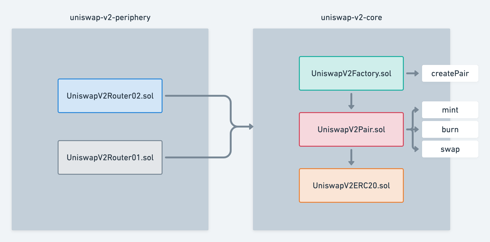
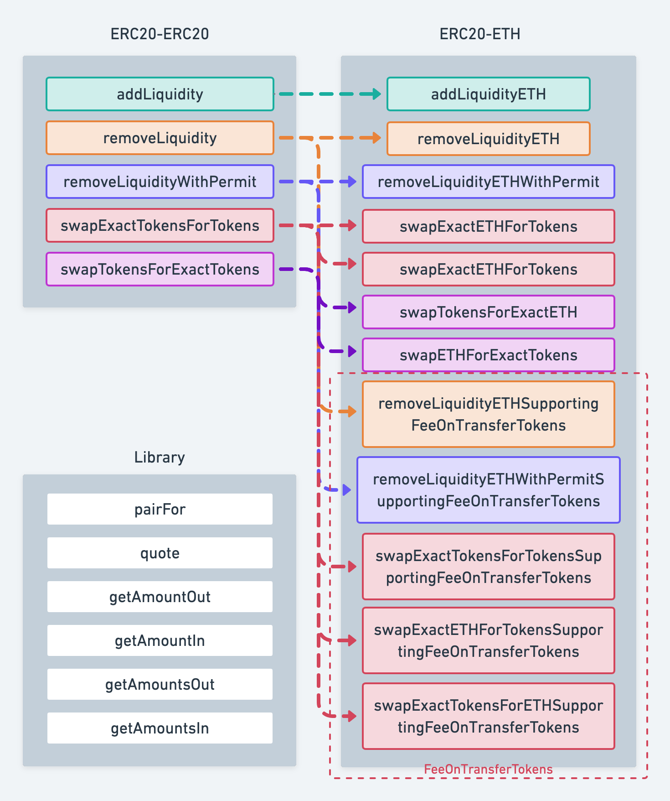

[English](./README.md) | [中文](./README_zh.md)

# Deep Dive into Uniswap v2 Smart Contracts

###### tags: `uniswap` `uniswap-v2` `smart contract` `solidity`

Following the introduction to the [Dive into Uniswap v2 Whitepaper](../dive-into-uniswap-v2-whitepaper/README.md), today we'll explore the Uniswap v2 contract code.

> This article won't cover the contract code line-by-line but will focus on the contract architecture and key methods. For detailed code explanations, I recommend reading Ethereum's official blog: [Uniswap v2 contract walk-through](https://ethereum.org/en/developers/tutorials/uniswap-v2-annotated-code/#introduction).

## Contract Architecture

Uniswap v2 contracts are primarily divided into two categories: core and periphery contracts. The core contracts contain only the most basic trading functionalities, with core code about 200 lines, ensuring minimization to avoid introducing bugs as users' funds are stored in these contracts. The periphery contracts provide various encapsulated methods tailored to user scenarios, such as supporting native ETH trades (automatically converted to WETH), multi-path swaps (executing A→B→C trades in one method), etc., all calling upon the core contracts. Operations on the [app.uniswap.org](https://app.uniswap.org/) interface utilize the periphery contracts.



Let's introduce the functionalities of a few main contracts:

* uniswap-v2-core
  * UniswapV2Factory: Factory contract for creating Pair contracts (and setting protocol fee recipient addresses)
  * UniswapV2Pair: Pair (trading pair) contract, defining several basic methods related to trading, such as swap/mint/burn, price oracle, etc., itself being an ERC20 contract inheriting UniswapV2ERC20
  * UniswapV2ERC20: Implements the ERC20 standard methods

* uniswap-v2-periphery
  * UniswapV2Router02: The latest version of the router contract, compared to UniswapV2Router01, it adds support for FeeOnTransfer tokens; implements Uniswap v2's most commonly used interfaces, such as adding/removing liquidity, swapping tokens A for B, swapping ETH for tokens, etc.
  * UniswapV1Router01: The older version of Router implementation, similar to Router02, but does not support FeeOnTransferTokens, and is no longer in use

## uniswap-v2-core

[Github](https://github.com/Uniswap/v2-core)

### UniswapV2Factory

The most important method in the factory contract is `createPair`:

```solidity
function createPair(address tokenA, address tokenB) external returns (address pair) {
    require(tokenA != tokenB, 'UniswapV2: IDENTICAL_ADDRESSES');
    (address token0, address token1) = tokenA < tokenB ? (tokenA, tokenB) : (tokenB, tokenA);
    require(token0 != address(0), 'UniswapV2: ZERO_ADDRESS');
    require(getPair[token0][token1] == address(0), 'UniswapV2: PAIR_EXISTS'); // single check is sufficient
    bytes memory bytecode = type(UniswapV2Pair).creationCode;
    bytes32 salt = keccak256(abi.encodePacked(token0, token1));
    assembly {
        pair := create2(0, add(bytecode, 32), mload(bytecode), salt)
    }
    IUniswapV2Pair(pair).initialize(token0, token1);
    getPair[token0][token1] = pair;
    getPair[token1][token0] = pair; // populate mapping in the reverse direction
    allPairs.push(pair);
    emit PairCreated(token0, token1, pair, allPairs.length);
}
```

Firstly, `token0` and `token1` are sorted to ensure `token0`'s literal address is less than `token1`'s. Then, a contract is created using `assembly` + `create2`. [`assembly`](https://docs.soliditylang.org/en/develop/assembly.html#inline-assembly) allows for direct EVM manipulation in Solidity using the [Yul](https://docs.soliditylang.org/en/develop/yul.html#yul) language, representing a lower-level method of operation. As discussed in the whitepaper, `create2` is mainly used to create deterministic trading pair contract addresses, meaning the pair address can be computed directly from the two token addresses without on-chain contract queries.

`CREATE2` comes from [EIP-1014](https://eips.ethereum.org/EIPS/eip-1014), according to which, the final generated address is influenced by the custom `salt` value provided during pair contract generation. For a trading pair of two tokens, the `salt` value should be consistent; naturally, using the trading pair's two token addresses comes to mind. To ensure order does not affect the pair, the contract starts by sorting the two tokens to generate the `salt` value in ascending order.

In the latest EVM versions, passing the `salt` parameter directly to the `new` method is supported, shown as:

```solidity
pair = new UniswapV2Pair{salt: salt}();
```

Due to the lack of this functionality during the development of Uniswap v2 contracts, `assembly create2` was used.

According to the [Yul specification](https://docs.soliditylang.org/en/develop/yul.html#yul), `create2` is defined as follows:

> create2(v, p, n, s)
> 
> create new contract with code mem[p…(p+n)) at address keccak256(0xff . this . s . keccak256(mem[p…(p+n))) and send v wei and return the new address, where 0xff is a 1 byte value, this is the current contract’s address as a 20 byte value and s is a big-endian 256-bit value; returns 0 on error

In the source code, the `create2` method call:

```solidity
pair := create2(0, add(bytecode, 32), mload(bytecode), salt)
```

The parameters are interpreted as follows:

- v=0: The amount of ETH tokens (in wei) sent to the newly created pair contract
- p=add(bytecode, 32): The starting position of the contract bytecode
  > Why add 32? Because the `bytecode` type is `bytes`, and per the ABI specification, `bytes` is a variable length type. The first 32 bytes store the length of the `bytecode`, followed by the actual content, making the start of the actual contract bytecode at `bytecode+32` bytes.
- n=mload(bytecode): The total byte length of the contract bytecode
  > As mentioned, the first 32 bytes of `bytecode` store the actual length of the contract bytecode (in bytes), and `mload` fetches the value of the first 32 bytes of the passed parameter, making `mload(bytecode)` equal to `n`.
- s=salt: The custom `salt`, which is the combination of `token0` and `token1` addresses encoded together.

### UniswapV2ERC20

This contract mainly defines UniswapV2's ERC20 standard implementation, with relatively straightforward code. Here, we'll introduce the `permit` method:

```solidity
function permit(address owner, address spender, uint value, uint deadline, uint8 v, bytes32 r, bytes32 s) external {
    require(deadline >= block.timestamp, 'UniswapV2: EXPIRED');
    bytes32 digest = keccak256(
        abi.encodePacked(
            '\x19\x01',
            DOMAIN_SEPARATOR,
            keccak256(abi.encode(PERMIT_TYPEHASH, owner, spender, value, nonces[owner]++, deadline))
        )
    );
    address recoveredAddress = ecrecover(digest, v, r, s);
    require(recoveredAddress != address(0) && recoveredAddress == owner, 'UniswapV2: INVALID_SIGNATURE');
    _approve(owner, spender, value);
}
```

The `permit` method implements the "Meta transactions for pool shares" feature introduced in section 2.5 of the whitepaper. [EIP-712](https://eips.ethereum.org/EIPS/eip-712) defines the standard for offline signatures, i.e., the format of `digest` that a user signs. The signature's content is the authorization (`approve`) by the owner to allow a contract (`spender`) to spend a certain amount (`value`) of tokens (Pair liquidity tokens) before a deadline. Applications (periphery contracts) can use the original information and the generated v, r, s signatures to call the Pair contract's `permit` method to obtain authorization. The `permit` method uses `ecrecover` to restore the signing address to the token owner; if verification passes, the approval is granted.

### UniswapV2Pair

The Pair contract primarily implements three methods: `mint` (adding liquidity), `burn` (removing liquidity), and `swap` (exchange).

#### mint

This method implements the functionality of adding liquidity.

```solidity
// this low-level function should be called from a contract which performs important safety checks
function mint(address to) external lock returns (uint liquidity) {
    (uint112 _reserve0, uint112 _reserve1,) = getReserves(); // gas savings
    uint balance0 = IERC20(token0).balanceOf(address(this));
    uint balance1 = IERC20(token1).balanceOf(address(this));
    uint amount0 = balance0.sub(_reserve0);
    uint amount1 = balance1.sub(_reserve1);

    bool feeOn = _mintFee(_reserve0, _reserve1);
    uint _totalSupply = totalSupply; // gas savings, must be defined here since totalSupply can update in _mintFee
    if (_totalSupply == 0) {
        liquidity = Math.sqrt(amount0.mul(amount1)).sub(MINIMUM_LIQUIDITY);
        _mint(address(0), MINIMUM_LIQUIDITY); // permanently lock the first MINIMUM_LIQUIDITY tokens
    } else {
        liquidity = Math.min(amount0.mul(_totalSupply) / _reserve0, amount1.mul(_totalSupply) / _reserve1);
    }
    require(liquidity > 0, 'UniswapV2: INSUFFICIENT_LIQUIDITY_MINTED');
    _mint(to, liquidity);

    _update(balance0, balance1, _reserve0, _reserve1);
    if (feeOn) kLast = uint(reserve0).mul(reserve1); // reserve0 and reserve1 are up-to-date
    emit Mint(msg.sender, amount0, amount1);
}
```

Initially, ```getReserves()``` fetches the cached balances of the two tokens. As mentioned in the whitepaper, caching balances is meant to prevent manipulation of the price oracle. It is also used here to calculate protocol fees by subtracting the cached balance from the current balance to determine the amount of transferred tokens.

_mintFee calculates protocol fees:

```solidity
// if fee is on, mint liquidity equivalent to 1/6th of the growth in sqrt(k)
function _mintFee(uint112 _reserve0, uint112 _reserve1) private returns (bool feeOn) {
    address feeTo = IUniswapV2Factory(factory).feeTo();
    feeOn = feeTo != address(0);
    uint _kLast = kLast; // gas savings
    if (feeOn) {
        if (_kLast != 0) {
            uint rootK = Math.sqrt(uint(_reserve0).mul(_reserve1));
            uint rootKLast = Math.sqrt(_kLast);
            if (rootK > rootKLast) {
                uint numerator = totalSupply.mul(rootK.sub(rootKLast));
                uint denominator = rootK.mul(5).add(rootKLast);
                uint liquidity = numerator / denominator;
                if (liquidity > 0) _mint(feeTo, liquidity);
            }
        }
    } else if (_kLast != 0) {
        kLast = 0;
    }
}
```

For calculations on protocol fees, please refer to the whitepaper.

The `mint` method determines that if it's the first time providing liquidity for the trading pair, liquidity tokens are generated based on the square root of xy and MINIMUM_LIQUIDITY (i.e., 1000 wei) is burned; otherwise, liquidity tokens are minted based on the ratio of the transferred token value to the current liquidity value.

#### burn

This method implements the functionality of removing liquidity.

```solidity
// this low-level function should be called from a contract which performs important safety checks
function burn(address to) external lock returns (uint amount0, uint amount1) {
    (uint112 _reserve0, uint112 _reserve1,) = getReserves(); // gas savings
    address _token0 = token0;                                // gas savings
    address _token1 = token1;                                // gas savings
    uint balance0 = IERC20(_token0).balanceOf(address(this));
    uint balance1 = IERC20(_token1).balanceOf(address(this));
    uint liquidity = balanceOf[address(this)];

    bool feeOn = _mintFee(_reserve0, _reserve1);
    uint _totalSupply = totalSupply; // gas savings, must be defined here since totalSupply can update in _mintFee
    amount0 = liquidity.mul(balance0) / _totalSupply; // using balances ensures pro-rata distribution
    amount1 = liquidity.mul(balance1) / _totalSupply; // using balances ensures pro-rata distribution
    require(amount0 > 0 && amount1 > 0, 'UniswapV2: INSUFFICIENT_LIQUIDITY_BURNED');
    _burn(address(this), liquidity);
    _safeTransfer(_token0, to, amount0);
    _safeTransfer(_token1, to, amount1);
    balance0 = IERC20(_token0).balanceOf(address(this));
    balance1 = IERC20(_token1).balanceOf(address(this));

    _update(balance0, balance1, _reserve0, _reserve1);
    if (feeOn) kLast = uint(reserve0).mul(reserve1); // reserve0 and reserve1 are up-to-date
    emit Burn(msg.sender, amount0, amount1, to);
}
```

Similar to `mint`, the `burn` method also calculates protocol fees.

Refer to the whitepaper, for saving transaction fees, Uniswap v2 only collects accumulated protocol fees when minting/burning liquidity.

After removing liquidity, the proportion of destroyed liquidity tokens to the total determines the corresponding amounts of the two tokens the user will receive.

#### swap

This method implements the functionality of exchanging (trading) two tokens.

```solidity
// this low-level function should be called from a contract which performs important safety checks
function swap(uint amount0Out, uint amount1Out, address to, bytes calldata data) external lock {
    require(amount0Out > 0 || amount1Out > 0, 'UniswapV2: INSUFFICIENT_OUTPUT_AMOUNT');
    (uint112 _reserve0, uint112 _reserve1,) = getReserves(); // gas savings
    require(amount0Out < _reserve0 && amount1Out < _reserve1, 'UniswapV2: INSUFFICIENT_LIQUIDITY');

    uint balance0;
    uint balance1;
    { // scope for _token{0,1}, avoids stack too deep errors
    address _token0 = token0;
    address _token1 = token1;
    require(to != _token0 && to != _token1, 'UniswapV2: INVALID_TO');
    if (amount0Out > 0) _safeTransfer(_token0, to, amount0Out); // optimistically transfer tokens
    if (amount1Out > 0) _safeTransfer(_token1, to, amount1Out); // optimistically transfer tokens
    if (data.length > 0) IUniswapV2Callee(to).uniswapV2Call(msg.sender, amount0Out, amount1Out, data);
    balance0 = IERC20(_token0).balanceOf(address(this));
    balance1 = IERC20(_token1).balanceOf(address(this));
    }
    uint amount0In = balance0 > _reserve0 - amount0Out ? balance0 - (_reserve0 - amount0Out) : 0;
    uint amount1In = balance1 > _reserve1 - amount1Out ? balance1 - (_reserve1 - amount1Out) : 0;
    require(amount0In > 0 || amount1In > 0, 'UniswapV2: INSUFFICIENT_INPUT_AMOUNT');
    { // scope for reserve{0,1}Adjusted, avoids stack too deep errors
    uint balance0Adjusted = balance0.mul(1000).sub(amount0In.mul(3));
    uint balance1Adjusted = balance1.mul(1000).sub(amount1In.mul(3));
    require(balance0Adjusted.mul(balance1Adjusted) >= uint(_reserve0).mul(_reserve1).mul(1000**2), 'UniswapV2: K');
    }

    _update(balance0, balance1, _reserve0, _reserve1);
    emit Swap(msg.sender, amount0In, amount1In, amount0Out, amount1Out, to);
}
```

To accommodate flash loan functionality and not rely on a specific token's transfer method, the entire `swap` method does not use parameters like `amountIn`, but rather calculates the amount of transferred tokens by comparing the current balance with the cached balance.

Since the `swap` method will check the balances (after subtracting fees) to comply with the constant product formula constraint (refer to the whitepaper formula), the contract can first transfer the tokens the user wishes to receive, if the user did not previously transfer tokens to the contract for the trade, it is equivalent to borrowing tokens (i.e., a flash loan); if using a flash loan, it is necessary to return the borrowed tokens in the custom `uniswapV2Call` method, otherwise, the transaction will revert.

The `swap` method updates the cumulative price required by the price oracle using the cached balance and finally updates the cached balance to the current balance at the end of the method.

```solidity
// update reserves and, on the first call per block, price accumulators
function _update(uint balance0, uint balance1, uint112 _reserve0, uint112 _reserve1) private {
    require(balance0 <= uint112(-1) && balance1 <= uint112(-1), 'UniswapV2: OVERFLOW');
    uint32 blockTimestamp = uint32(block.timestamp % 2**32);
    uint32 timeElapsed = blockTimestamp - blockTimestampLast; // overflow is desired
    if (timeElapsed > 0 and _reserve0 != 0 and _reserve1 != 0) {
        // * never overflows, and + overflow is desired
        price0CumulativeLast += uint(UQ112x112.encode(_reserve1).uqdiv(_reserve0)) * timeElapsed;
        price1CumulativeLast += uint(UQ112x112.encode(_reserve0).uqdiv(_reserve1)) * timeElapsed;
    }
    reserve0 = uint112(balance0);
    reserve1 = uint112(balance1);
    blockTimestampLast = blockTimestamp;
    emit Sync(reserve0, reserve1);
}
```

Note, both the block timestamp and cumulative prices are overflow-safe. (For detailed derivation, please refer to the whitepaper)

## uniswap-v2-periphery

Since UniswapV2Router01 has a bug in handling FeeOnTransferTokens, it is no longer used. Here, we will only introduce the latest version of the UniswapV2Router02 contract.

[Code Address](https://github.com/Uniswap/v2-periphery)

### UniswapV2Router02

Router02 encapsulates the most commonly used trading interfaces; to accommodate the need for native ETH trades, most interfaces are provided in ETH versions. Compared to Router01, some interfaces have added support for FeeOnTransferTokens.



We will mainly introduce the ERC20 version of the code, as the logic for the ETH version is identical, only involving conversion between ETH and WETH.

Before delving into specific ERC20 methods, let's first introduce several common methods from the Library contract and their mathematical derivations.

### Library

[Code Address](https://github.com/Uniswap/v2-periphery/blob/master/contracts/libraries/UniswapV2Library.sol)

#### pairFor

Input the factory address and two token addresses to calculate the address of their trading pair.

```solidity
// calculates the CREATE2 address for a pair without making any external calls
function pairFor(address factory, address tokenA, address tokenB) internal pure returns (address pair) {
    (address token0, address token1) = sortTokens(tokenA, tokenB);
    pair = address(uint(keccak256(abi.encodePacked(
            hex'ff',
            factory,
            keccak256(abi.encodePacked(token0, token1)),
            hex'96e8ac4277198ff8b6f785478aa9a39f403cb768dd02cbee326c3e7da348845f' // init code hash
        ))));
}
```

As mentioned previously, since the `CREATE2` opcode is used, the pair address can be directly computed without on-chain contract queries.

> create2(v, p, n, s)
>
> create new contract with code mem[p…(p+n)) at address keccak256(0xff . this . s . keccak256(mem[p…(p+n))) and send v wei and return the new address, where 0xff is a 1 byte value, this is the current contract’s address as a 20 byte value and s is a big-endian 256-bit value; returns 0 on error

The new pair contract's address is calculated as `keccak256(0xff + this + salt +  keccak256(mem[p…(p+n)))`:

* this: Factory contract address
* salt: `keccak256(abi.encodePacked(token0, token1))`
* `keccak256(mem[p…(p+n))`: `0x96e8ac4277198ff8b6f785478aa9a39f403cb768dd02cbee326c3e7da348845f`

Since every trading pair uses the UniswapV2Pair contract for creation, the init code hash is the same. We can write a Solidity method in the UniswapV2Factory to calculate the hash:

```solidity
function initCodeHash() external pure returns (bytes32) {
    bytes memory bytecode = type(UniswapV2Pair).creationCode;
    bytes32 hash;
    assembly {
        hash := keccak256(add(bytecode, 32), mload(bytecode))
    }
    return hash;
}
```

#### quote

The `quote` method converts a certain amount (`amountA`) of token A into an equivalent amount of token B based on the reserves in the contract. Fees are not considered here, as this is merely a unit conversion.

```solidity
// given some amount of an asset and pair reserves, returns an equivalent amount of the other asset
function quote(uint amountA, uint reserveA, uint reserveB) internal pure returns (uint amountB) {
    require(amountA > 0, 'UniswapV2Library: INSUFFICIENT_AMOUNT');
    require(reserveA > 0 && reserveB > 0, 'UniswapV2Library: INSUFFICIENT_LIQUIDITY');
    amountB = amountA.mul(reserveB) / reserveA;
}
```

#### getAmountOut

This method calculates how much of token B (`amountOut`) can be obtained for a given amount of token A (`amountIn`), based on the reserves in the pool.

```solidity
// given an input amount of an asset and pair reserves, returns the maximum output amount of the other asset
function getAmountOut(uint amountIn, uint reserveIn, uint reserveOut) internal pure returns (uint amountOut) {
    require(amountIn > 0, 'UniswapV2Library: INSUFFICIENT_INPUT_AMOUNT');
    require(reserveIn > 0 && reserveOut > 0, 'UniswapV2Library: INSUFFICIENT_LIQUIDITY');
    uint amountInWithFee = amountIn.mul(997);
    uint numerator = amountInWithFee.mul(reserveOut);
    uint denominator = reserveIn.mul(1000).add(amountInWithFee);
    amountOut = numerator / denominator;
}
```

To derive the mathematical formula for this method, let's revisit the constraint for token balances after a swap as discussed in the whitepaper and the core contracts:

$$
(x_1 - 0.003 \cdot x_{in}) \cdot (y_1 - 0.003 \cdot y_{in}) \geq x_0 \cdot y_0
$$

Where $x_0$, $y_0$ are the balances of the two tokens before the swap, and $x_1$, $y_1$ are the balances after the swap, $x_{in}$ is the amount of token A provided, since token A is provided, $y_{in}=0$; $y_{out}$ is the amount of token B to be calculated.

The mathematical derivation is as follows:

> $y_{in} = 0$
>
> $x_1 = x_0 + x_{in}$
>
> $y_1 = y_0 - y_{out}$
>
> $(x_1 - 0.003 \cdot x_{in}) \cdot (y_1 - 0.003 \cdot y_{in}) = x_0 \cdot y_0$
>
> $(x_1 - 0.003 \cdot x_{in}) \cdot y_1 = x_0 \cdot y_0$
>
> $(x_0 + x_{in} - 0.003 \cdot x_{in}) \cdot (y_0 - y_{out}) = x_0 \cdot y_0$
>
> $(x_0 + 0.997 \cdot x_{in}) \cdot (y_0 - y_{out}) = x_0 \cdot y_0$
>
> $y_{out} = y_0 - \frac {x_0 \cdot y_0}{x_0 + 0.997 \cdot x_{in}}$
>
> $y_{out} = \frac {0.997 \cdot x_{in} \cdot y_0}{x_0 + 0.997 \cdot x_{in}}$

Since Solidity does not support floating-point numbers, the formula can be converted to:

$$
y_{out} = \frac {997 \cdot x_{in} \cdot y_0}{1000 \cdot x_0 + 997 \cdot x_{in}}
$$

This calculation result is the `amountOut` as shown in the `getAmountOut` method, where:

> $amountIn = x_{in}$
>
> $reserveIn = x_0$
>
> $reserveOut = y_0$
>
> $amountOut = y_{out}$

#### getAmountIn

This method calculates how much of token A (`amountIn`) is required to obtain a specified amount of token B (`amountOut`).

```solidity
// given an output amount of an asset and pair reserves, returns a required input amount of the other asset
function getAmountIn(uint amountOut, uint reserveIn, uint reserveOut) internal pure returns (uint amountIn) {
    require(amountOut > 0, 'UniswapV2Library: INSUFFICIENT_OUTPUT_AMOUNT');
    require(reserveIn > 0 && reserveOut > 0, 'UniswapV2Library: INSUFFICIENT_LIQUIDITY');
    uint numerator = reserveIn.mul(amountOut).mul(1000);
    uint denominator = reserveOut.sub(amountOut).mul(997);
    amountIn = (numerator / denominator).add(1);
}
```

`getAmountOut` calculates $y_{out}$ given $x_{in}$; correspondingly, `getAmountIn` calculates $x_{in}$ given $y_{out}$. The derived formula is as follows:

$$
(x_0 + 0.997 \cdot x_{in}) \cdot (y_0 - y_{out}) = x_0 \cdot y_0\\
x_{in} = \frac {\frac {x_0 \cdot y_0}{y_0 - y_{out}} - x_0} {0.997}
$$

$$
x_{in} = \frac {x_0 \cdot y_{out}}{0.997 \cdot (y_0 - y_{out})} = \frac {1000 \cdot x_0 \cdot y_{out}}{997 \cdot (y_0 - y_{out})}
$$

$$
amountIn = x_{in}\\
reserveIn = x_0\\
reserveOut = y_0\\
amountOut = y_{out}
$$

The calculation result shown in the contract code corresponds to the formula above. Note the final `add(1)` is to ensure that the input amount (`amountIn`) is not less than the theoretical minimum due to rounding, effectively requiring at least 1 more unit of the input token.

#### getAmountsOut

This method calculates, for a given amount (`amountIn`) of the first token, how much of the last token in a sequence (`amounts`) can be obtained using multiple trading pairs. The first element in the `amounts` array represents `amountIn`, and the last element represents the quantity of the target token. This method essentially loops through the `getAmountIn` method.

```solidity
// performs chained getAmountOut calculations on any number of pairs
function getAmountsOut(address factory, uint amountIn, address[] memory path) internal view returns (uint[] memory amounts) {
    require(path.length >= 2, 'UniswapV2Library: INVALID_PATH');
    amounts = new uint[](path.length);
    amounts[0] = amountIn;
    for (uint i; i < path.length - 1; i++) {
        (uint reserveIn, uint reserveOut) = getReserves(factory, path[i], path[i + 1]);
        amounts[i + 1] = getAmountOut(amounts[i], reserveIn, reserveOut);
    }
}
```

#### getAmountsIn

As opposed to `getAmountsOut`, `getAmountsIn` calculates the amounts of intermediary tokens required when a specific amount (`amountOut`) of the target token is desired. It iteratively calls the `getAmountIn` method.

```solidity
// performs chained getAmountIn calculations on any number of pairs
function getAmountsIn(address factory, uint amountOut, address[] memory path) internal view returns (uint[] memory amounts) {
    require(path.length >= 2, 'UniswapV2Library: INVALID_PATH');
    amounts = new uint[](path.length);
    amounts[amounts.length - 1] = amountOut;
    for (uint i = path.length - 1; i > 0; i--) {
        (uint reserveIn, uint reserveOut) = getReserves(factory, path[i - 1], path[i]);
        amounts[i - 1] = getAmountIn(amounts[i], reserveIn, reserveOut);
    }
}
```

### ERC20-ERC20

#### addLiquidity Adding Liquidity

```solidity
function addLiquidity(
    address tokenA,
    address tokenB,
    uint amountADesired,
    uint amountBDesired,
    uint amountAMin,
    uint amountBMin,
    address to,
    uint deadline
) external virtual override ensure(deadline) returns (uint amountA, uint amountB, uint liquidity) {
    (amountA, amountB) = _addLiquidity(tokenA, tokenB, amountADesired, amountBDesired, amountAMin, amountBMin);
    address pair = UniswapV2Library.pairFor(factory, tokenA, tokenB);
    TransferHelper.safeTransferFrom(tokenA, msg.sender, pair, amountA);
    TransferHelper.safeTransferFrom(tokenB, msg.sender, pair, amountB);
    liquidity = IUniswapV2Pair(pair).mint(to);
}
```

Since Router02 directly interacts with users, the interface is designed with user scenarios in mind. `addLiquidity` provides 8 parameters:

* `address tokenA`: Token A
* `address tokenB`: Token B
* `uint amountADesired`: Desired amount of token A to deposit
* `uint amountBDesired`: Desired amount of token B to deposit
* `uint amountAMin`: Minimum amount of token A to deposit
* `uint amountBMin`: Minimum amount of token B to deposit
* `address to`: Recipient address for liquidity tokens
* `uint deadline`: Expiration time for the request

Transactions submitted by users can be packed by miners at an uncertain time, hence the token price at the time of submission might differ from the price at the time of transaction packing. `amountMin` controls the price fluctuation range to prevent being exploited by miners or bots; similarly, `deadline` ensures the transaction expires after the specified time.

If the token price provided by users when adding liquidity differs from the actual price, they will only receive liquidity tokens at a lower exchange rate, with the surplus tokens contributing to the entire pool. `_addLiquidity` helps calculate the optimal exchange rate. If it's the first time adding liquidity, a trading pair contract will be created first; otherwise, the best token amounts to inject are calculated based on the current pool balances.

```solidity
// **** ADD LIQUIDITY ****
function _addLiquidity(
    address tokenA,
    address tokenB,
    uint amountADesired,
    uint amountBDesired,
    uint amountAMin,
    uint amountBMin
) internal virtual returns (uint amountA, uint amountB) {
    // create the pair if it doesn't exist yet
    if (IUniswapV2Factory(factory).getPair(tokenA, tokenB) == address(0)) {
        IUniswapV2Factory(factory).createPair(tokenA, tokenB);
    }
    (uint reserveA, uint reserveB) = UniswapV2Library.getReserves(factory, tokenA, tokenB);
    if (reserveA == 0 and reserveB == 0) {
        (amountA, amountB) = (amountADesired, amountBDesired);
    } else {
        uint amountBOptimal = UniswapV2Library.quote(amountADesired, reserveA, reserveB);
        if (amountBOptimal <= amountBDesired) {
            require(amountBOptimal >= amountBMin, 'UniswapV2Router: INSUFFICIENT_B_AMOUNT');
            (amountA, amountB) = (amountADesired, amountBOptimal);
        } else {
            uint amountAOptimal = UniswapV2Library.quote(amountBDesired, reserveB, reserveA);
            assert(amountAOptimal <= amountADesired);
            require(amountAOptimal >= amountAMin, 'UniswapV2Router: INSUFFICIENT_A_AMOUNT');
            (amountA, amountB) = (amountAOptimal, amountBDesired);
        }
    }
}
```

Finally, the core contract's `mint` method is called to mint liquidity tokens.

#### removeLiquidity Removing Liquidity

Firstly, liquidity tokens are sent to the pair contract. Based on the proportion of received liquidity tokens to the total tokens, the corresponding amounts of the two tokens represented by the liquidity are calculated. After destroying the liquidity tokens, the user receives the corresponding proportion of tokens. If it's lower than the user's set minimum expectations (amountAMin/amountBMin), the transaction reverts.

```solidity
// **** REMOVE LIQUIDITY ****
function removeLiquidity(
    address tokenA,
    address tokenB,
    uint liquidity,
    uint amountAMin,
    uint amountBMin,
    address to,
    uint deadline
) public virtual override ensure(deadline) returns (uint amountA, uint amountB) {
    address pair = UniswapV2Library.pairFor(factory, tokenA, tokenB);
    IUniswapV2Pair(pair).transferFrom(msg.sender, pair, liquidity); // send liquidity to pair
    (uint amount0, uint amount1) = IUniswapV2Pair(pair).burn(to);
    (address token0,) = UniswapV2Library.sortTokens(tokenA, tokenB);
    (amountA, amountB) = tokenA == token0 ? (amount0, amount1) : (amount1, amount0);
    require(amountA >= amountAMin, 'UniswapV2Router: INSUFFICIENT_A_AMOUNT');
    require(amountB >= amountBMin, 'UniswapV2Router: INSUFFICIENT_B_AMOUNT');
}
```

#### removeLiquidityWithPermit Removing Liquidity with Signature

Normally, to remove liquidity, users need to perform two operations:

* `approve`: Authorizing the Router contract to spend their liquidity tokens
* `removeLiquidity`: Calling the Router contract to remove liquidity

Unless the maximum token amount was authorized during the first authorization, each liquidity removal would require two interactions, meaning users would need to pay gas fees twice. By using the `removeLiquidityWithPermit` method, users can authorize the Router contract to spend their tokens through a signature without separately calling `approve`, only needing to call the liquidity removal method once to complete the operation, saving gas costs. Additionally, since offline signatures do not incur gas fees, each signature can authorize only a specific amount of tokens, enhancing security.

```solidity
function removeLiquidityWithPermit(
    address tokenA,
    address tokenB,
    uint liquidity,
    uint amountAMin,
    uint amountBMin,
    address to,
    uint deadline,
    bool approveMax, uint8 v, bytes32 r, bytes32 s
) external virtual override returns (uint amountA, uint amountB) {
    address pair = UniswapV2Library.pairFor(factory, tokenA, tokenB);
    uint value = approveMax ? uint(-1) : liquidity;
    IUniswapV2Pair(pair).permit(msg.sender, address(this), value, deadline, v, r, s);
    (amountA, amountB) = removeLiquidity(tokenA, tokenB, liquidity, amountAMin, amountBMin, to, deadline);
}
```

#### swapExactTokensForTokens

There are two common scenarios for trading:

1. Using a specified amount of token A (input) to exchange for the maximum amount of token B (output)
1. Receiving a specified amount of token B (output) using the minimum amount of token A (input)

This method implements the first scenario, exchanging for the maximum output token based on a specified input token.

```solidity
function swapExactTokensForTokens(
    uint amountIn,
    uint amountOutMin,
    address[] calldata path,
    address to,
    uint deadline
) external virtual override ensure(deadline) returns (uint[] memory amounts) {
    amounts = UniswapV2Library.getAmountsOut(factory, amountIn, path);
    require(amounts[amounts.length - 1] >= amountOutMin, 'UniswapV2Router: INSUFFICIENT_OUTPUT_AMOUNT');
    TransferHelper.safeTransferFrom(
        path[0], msg.sender, UniswapV2Library.pairFor(factory, path[0], path[1]), amounts[0]
    );
    _swap(amounts, path, to);
}
```

First, the `getAmountsOut` method from the Library contract is used to calculate the output token amounts for each trade based on the exchange path, ensuring the amount received from the last trade (`amounts[amounts.length - 1]`) is not less than the expected minimum output (`amountOutMin`). Tokens are then sent to the first trading pair address to start the entire exchange process.

Assuming a user wants to swap WETH for DYDX, and the best exchange path calculated off-chain is WETH → USDC → DYDX, then `amountIn` is the WETH amount, `amountOutMin` is the minimum expected DYDX amount, `path` is [WETH address, USDC address, DYDX address], and `amounts` are [amountIn, USDC amount, DYDX amount]. During the execution of `_swap`, the tokens received from each intermediary trade are sent to the next trading pair address, and so on, until the final trade is completed, and the `_to` address receives the output tokens from the last trade.

```solidity
// requires the initial amount to have already been sent to the first pair
function _swap(uint[] memory amounts, address[] memory path, address _to) internal virtual {
    for (uint i; i < path.length - 1; i++) {
        (address input, address output) = (path[i], path[i + 1]);
        (address token0,) = UniswapV2Library.sortTokens(input, output);
        uint amountOut = amounts[i + 1];
        (uint amount0Out, uint amount1Out) = input == token0 ? (uint(0), amountOut) : (amountOut, uint(0));
        address to = i < path.length - 2 ? UniswapV2Library.pairFor(factory, output, path[i + 2]) : _to;
        IUniswapV2Pair(UniswapV2Library.pairFor(factory, input, output)).swap(
            amount0Out, amount1Out, to, new bytes(0)
        );
    }
}
```

#### swapTokensForExactTokens

This method implements the second trading scenario, exchanging the minimum input token for a specified output token.

```solidity
function swapTokensForExactTokens(
    uint amountOut,
    uint amountInMax,
    address[] calldata path,
    address to,
    uint deadline
) external virtual override ensure(deadline) returns (uint[] memory amounts) {
    amounts = UniswapV2Library.getAmountsIn(factory, amountOut, path);
    require(amounts[0] <= amountInMax, 'UniswapV2Router: EXCESSIVE_INPUT_AMOUNT');
    TransferHelper.safeTransferFrom(
        path[0], msg.sender, UniswapV2Library.pairFor(factory, path[0], path[1]), amounts[0]
    );
    _swap(amounts, path, to);
}
```

Similar to the above, here the `getAmountsIn` method from the Library is first used to reverse calculate the minimum input token amounts required for each exchange, ensuring the calculated amount (after deducting fees) for the first token is not greater than the maximum amount the user is willing to provide (`amountInMax`). Tokens are then sent to the first trading pair address to initiate the entire exchange process.

### ERC20-ETH

#### ETH Support

Since the core contracts only support ERC20 token trades, the periphery contracts need to convert between ETH and WETH to support ETH trades. Most methods are provided in ETH versions to accommodate this. Exchange mainly involves two operations:

* Address conversion: Since ETH does not have a contract address, the deposit and withdraw methods of the WETH contract are used to convert between ETH and WETH
* Token amount conversion: ETH amounts are obtained through `msg.value`, and the corresponding WETH amounts can be calculated, after which standard ERC20 interfaces can be used

#### FeeOnTransferTokens

Some tokens deduct fees during the transfer process, resulting in a difference between the transferred amount and the actual received amount. Therefore, it's not straightforward to calculate the required token amounts for intermediary exchanges. In such cases, the `balanceOf` method (rather than the `transfer` method) should be used to determine the actual received token amounts. Router02 introduced support for Inclusive Fee On Transfer Tokens. For more detailed explanations, refer to the [official documentation](https://docs.uniswap.org/protocol/V2/reference/smart-contracts/common-errors#inclusive-fee-on-transfer-tokens).
