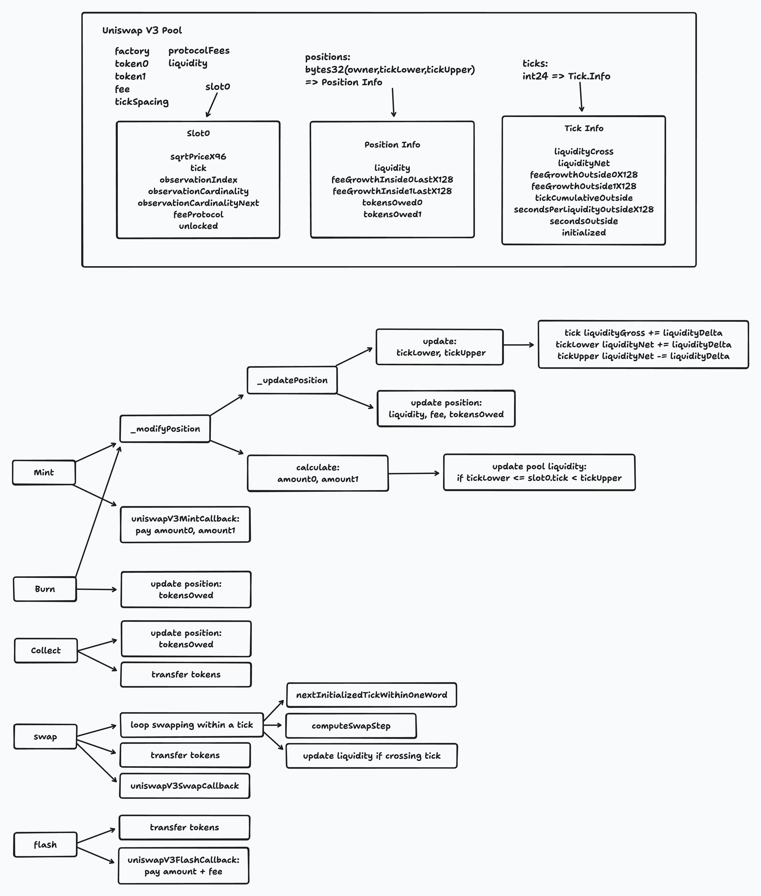
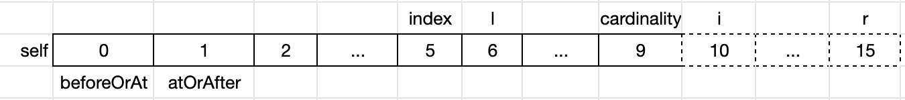

[English](./README.md) | [中文](./README_zh.md)

# 深入理解 Uniswap v3 智能合约 （一）

###### tags: `uniswap` `solidity` `logarithm` `uniswap-v3` `tick` `core`

## 概述

与Uniswap v2一样，Uniswap v3的合约也分为两类：

* [Uniswap-v3-core](#Uniswap-v3-core)
    - Uniswap v3的核心代码，实现了协议定义的所有功能，外部合约可直接与core合约交互
* [Uniswap-v3-periphery](https://hackmd.io/cTPg4x2TR4WthYEF8anLug)
    - 基于使用场景封装接口，如头寸（Position）管理、多路径代币交换等功能，Uniswap界面即与periphery合约交互

如果你希望以用户场景角度阅读本文，请直接从[Uniswap-v3-periphery](https://hackmd.io/cTPg4x2TR4WthYEF8anLug)开始，它包含了创建头寸、修改头寸流动性、交换代币等常用功能。

如果你希望从底层核心模块开始阅读，请从[Uniswap-v3-core](#Uniswap-v3-core)开始。

## Uniswap-v3-core

### UniswapV3Factory.sol

工厂合约主要包含三个功能：

* [createPool](#createPool)：创建交易对池子
* [setOwner](#setOwner)：设置工厂合约Owner
* [enableFeeAmount](#enableFeeAmount)：添加手续费等级

#### createPool

创建一个Uniswap v3交易对池子，注意，由于Uniswap v3支持不同手续费等级，如0.05%、0.30%、1.00%等，因此一个交易对合约由`tokenA`、`tokenB`和`fee`（手续费）唯一确定。

> 计算交易对合约还需要：factory工厂合约地址、合约初始化代码的hash。

```solidity
/// @inheritdoc IUniswapV3Factory
function createPool(
    address tokenA,
    address tokenB,
    uint24 fee
) external override noDelegateCall returns (address pool) {
    require(tokenA != tokenB);
    (address token0, address token1) = tokenA < tokenB ? (tokenA, tokenB) : (tokenB, tokenA);
    require(token0 != address(0));
    int24 tickSpacing = feeAmountTickSpacing[fee];
    require(tickSpacing != 0);
    require(getPool[token0][token1][fee] == address(0));
    pool = deploy(address(this), token0, token1, fee, tickSpacing);
    getPool[token0][token1][fee] = pool;
    // populate mapping in the reverse direction, deliberate choice to avoid the cost of comparing addresses
    getPool[token1][token0][fee] = pool;
    emit PoolCreated(token0, token1, fee, tickSpacing, pool);
}
```

因为传入的`tokenA`和`tokenB`是无序的，首先对`tokenA`、`tokenB`排序，确保`tokenA < tokenB`。

通过手续费等级获取对应的`tickSpacing`：

```solidity
int24 tickSpacing = feeAmountTickSpacing[fee];
```

我们在《深入理解Uniswap v3白皮书》中介绍过`tickSpacing`的作用，每个手续费等级对应一个`tickSpacing`，只有被`tickSpacing`整除的`tick`才允许被初始化，`tickSpacing`越大，每个`tick`流动性越多，`tick`之间滑点越大，但会节省跨`tick`操作的gas。这里作为`Pool`的参数保存起来。

确认该交易对对应的手续费等级没有创建过：

```solidity
require(getPool[token0][token1][fee] == address(0));
```

创建（部署）交易对合约：

```solidity
pool = deploy(address(this), token0, token1, fee, tickSpacing);
```

deploy代码如下：

```solidity
/// @dev Deploys a pool with the given parameters by transiently setting the parameters storage slot and then
/// clearing it after deploying the pool.
/// @param factory The contract address of the Uniswap V3 factory
/// @param token0 The first token of the pool by address sort order
/// @param token1 The second token of the pool by address sort order
/// @param fee The fee collected upon every swap in the pool, denominated in hundredths of a bip
/// @param tickSpacing The spacing between usable ticks
function deploy(
    address factory,
    address token0,
    address token1,
    uint24 fee,
    int24 tickSpacing
) internal returns (address pool) {
    parameters = Parameters({factory: factory, token0: token0, token1: token1, fee: fee, tickSpacing: tickSpacing});
    pool = address(new UniswapV3Pool{salt: keccak256(abi.encode(token0, token1, fee))}());
    delete parameters;
}
```

我们在Uniswap v2中提到，为了确保交易对合约地址的可计算性和唯一性，Uniswap v2使用`CREATE2`操作码创建交易对合约；从Solidity 0.6.2版本开始（[Github PR](https://github.com/ethereum/solidity/pull/8177)），支持在`new`方法中传递`salt`参数实现`CREATE2`功能；`salt`参数确保了合约地址的唯一性和可计算性。从代码可知，Uniswap v3交易对合约使用token0、token1、fee唯一确定一个交易对合约，比如，根据ETH-USDC 0.05%手续费（以及工厂合约地址、初始化代码hash）等信息，可计算交易对合约地址。

最后，保存交易对合约地址到`getPool`变量中：

```solidity
getPool[token0][token1][fee] = pool;
// populate mapping in the reverse direction, deliberate choice to avoid the cost of comparing addresses
getPool[token1][token0][fee] = pool;
```

#### setOwner

设置工厂合约owner，owner具有以下权限：

* [setOwner](#setOwner)：修改owner
* [enableFeeAmount](#enableFeeAmount)：添加手续费等级
* [setFeeProtocol](#setFeeProtocol)：修改某个交易对的协议手续费比例
* [collectProtocol](#collectProtocol)：收集某个交易对的协议手续费

首先判断请求由当前owner发起，确认后修改owner：

```solidity
/// @inheritdoc IUniswapV3Factory
function setOwner(address _owner) external override {
    require(msg.sender == owner);
    emit OwnerChanged(owner, _owner);
    owner = _owner;
}
```

#### enableFeeAmount

Uniswap v3默认支持三种手续费等级：0.05%、0.30%和1.00%，对应的fee值分别为500、3000和10000；fee的基本单位是百分之一基点，即0.01 bp = $10^{-6}$。

手续费百分比计算公式为：

$$
f_{ratio} = \frac{fee}{1,000,000}
$$

```solidity
/// @inheritdoc IUniswapV3Factory
function enableFeeAmount(uint24 fee, int24 tickSpacing) public override {
    require(msg.sender == owner);
    require(fee < 1000000);
    // tick spacing is capped at 16384 to prevent the situation where tickSpacing is so large that
    // TickBitmap#nextInitializedTickWithinOneWord overflows int24 container from a valid tick
    // 16384 ticks represents a >5x price change with ticks of 1 bips
    require(tickSpacing > 0 && tickSpacing < 16384);
    require(feeAmountTickSpacing[fee] == 0);

    feeAmountTickSpacing[fee] = tickSpacing;
    emit FeeAmountEnabled(fee, tickSpacing);
}
```

### UniswapV3Pool.sol

这是Uniswap v3的主要代码，定义了交易对池子的功能：

* [initialize](#initialize)：初始化交易对
* [mint](#mint)：添加流动性
* [burn](#burn)：移除流动性
* [swap](#swap)：交换代币
* [flash](#flash)：闪电贷
* [collect](#collect)：取回代币
* [increaseObservationCardinalityNext](#increaseObservationCardinalityNext)：扩展预言机空间
* [observe](#observe)：获取预言机数据

此外，factory（工厂合约）owner还可以调用以下两个方法：

* [setFeeProtocol](#setFeeProtocol)：修改某个交易对的协议手续费比例
* [collectProtocol](#collectProtocol)：收集某个交易对的协议手续费



#### initialize

创建完交易对后，需要调用`initialize`方法初始化合约，才能正常使用交易对功能。

该方法初始化`slot0`变量：

```solidity
/// @inheritdoc IUniswapV3PoolActions
/// @dev not locked because it initializes unlocked
function initialize(uint160 sqrtPriceX96) external override {
    require(slot0.sqrtPriceX96 == 0, 'AI');

    int24 tick = TickMath.getTickAtSqrtRatio(sqrtPriceX96);

    (uint16 cardinality, uint16 cardinalityNext) = observations.initialize(_blockTimestamp());

    slot0 = Slot0({
        sqrtPriceX96: sqrtPriceX96,
        tick: tick,
        observationIndex: 0,
        observationCardinality: cardinality,
        observationCardinalityNext: cardinalityNext,
        feeProtocol: 0,
        unlocked: true
    });

    emit Initialize(sqrtPriceX96, tick);
}
```

`slot0`定义如下：

* `sqrtPriceX96`：交易对当前的开根号价格 $\sqrt{P}$
* `tick`：当前 $\sqrt{P}$ 对应的tick，使用[getTickAtSqrtRatio](#getTickAtSqrtRatio)计算得出
* `observationIndex`：最近更新的（预言机）观测点数组序号
* `observationCardinality`：（预言机）观测点数组容量，最大65536，初始时为1
* `observationCardinalityNext`：下一个（预言机）观测点数组容量，如果手动扩容容量，会更新这个值，初始时为1
* `feeProtocol`：协议手续费比例，可以分别为`token0`和`token1`设置交易手续费中分给协议的比例
* `unlocked`：当前交易对合约是否非锁定状态

#### mint

该方法实现添加流动性功能。实际上，首次添加流动性和后续增加流动性，都会使用该方法。

`mint`方法参数如下：

* `recipient`：头寸接收者（owner）
* `tickLower`：流动性区间低点
* `tickUpper`：流动性区间高点
* `amount`：流动性数量
* `data`：回调参数

```solidity
/// @inheritdoc IUniswapV3PoolActions
/// @dev noDelegateCall is applied indirectly via _modifyPosition
function mint(
    address recipient,
    int24 tickLower,
    int24 tickUpper,
    uint128 amount,
    bytes calldata data
) external override lock returns (uint256 amount0, uint256 amount1) {
    require(amount > 0);
    (, int256 amount0Int, int256 amount1Int) =
        _modifyPosition(
            ModifyPositionParams({
                owner: recipient,
                tickLower: tickLower,
                tickUpper: tickUpper,
                liquidityDelta: int256(amount).toInt128()
            })
        );

    amount0 = uint256(amount0Int);
    amount1 = uint256(amount1Int);

    uint256 balance0Before;
    uint256 balance1Before;
    if (amount0 > 0) balance0Before = balance0();
    if (amount1 > 0) balance1Before = balance1();
    IUniswapV3MintCallback(msg.sender).uniswapV3MintCallback(amount0, amount1, data);
    if (amount0 > 0) require(balance0Before.add(amount0) <= balance0(), 'M0');
    if (amount1 > 0) require(balance1Before.add(amount1) <= balance1(), 'M1');

    emit Mint(msg.sender, recipient, tickLower, tickUpper, amount, amount0, amount1);
}
```

`mint`方法主要的逻辑都在[_modifyPosition](#_modifyPosition)中，其返回的`amount0Int`和`amount1Int`表示:如果添加`amount`数量的流动性，则需要分别向交易对合约转入的`token0`和`token1`的代币数量。

调用方需在`uniswapV3MintCallback`完成代币的转入操作；调用`mint`方法的合约需要实现`IUniswapV3MintCallback`接口，Uniswap v3在[periphery](https://hackmd.io/cTPg4x2TR4WthYEF8anLug)合约的`NonfungiblePositionManager.sol`实现该接口。

> 因为`mint`调用方需要实现接口方法，因此个人ETH账户（EOA）无法调用该方法。

```solidity
IUniswapV3MintCallback(msg.sender).uniswapV3MintCallback(amount0, amount1, data);
```

##### _modifyPosition

继续来看`_modifyPosition`：

```solidity
/// @dev Effect some changes to a position
/// @param params the position details and the change to the position's liquidity to effect
/// @return position a storage pointer referencing the position with the given owner and tick range
/// @return amount0 the amount of token0 owed to the pool, negative if the pool should pay the recipient
/// @return amount1 the amount of token1 owed to the pool, negative if the pool should pay the recipient
function _modifyPosition(ModifyPositionParams memory params)
    private
    noDelegateCall
    returns (
        Position.Info storage position,
        int256 amount0,
        int256 amount1
    )
{
    checkTicks(params.tickLower, params.tickUpper);

    Slot0 memory _slot0 = slot0; // SLOAD for gas optimization

    position = _updatePosition(
        params.owner,
        params.tickLower,
        params.tickUpper,
        params.liquidityDelta,
        _slot0.tick
    );
```

先通过[_updatePosition](#_updatePosition)更新头寸信息，我们在下一节会具体介绍。

```solidity
    if (params.liquidityDelta != 0) {
        if (_slot0.tick < params.tickLower) {
            // current tick is below the passed range; liquidity can only become in range by crossing from left to
            // right, when we'll need _more_ token0 (it's becoming more valuable) so user must provide it
            amount0 = SqrtPriceMath.getAmount0Delta(
                TickMath.getSqrtRatioAtTick(params.tickLower),
                TickMath.getSqrtRatioAtTick(params.tickUpper),
                params.liquidityDelta
            );
        } else if (_slot0.tick < params.tickUpper) {
            // current tick is inside the passed range
            uint128 liquidityBefore = liquidity; // SLOAD for gas optimization

            // write an oracle entry
            (slot0.observationIndex, slot0.observationCardinality) = observations.write(
                _slot0.observationIndex,
                _blockTimestamp(),
                _slot0.tick,
                liquidityBefore,
                _slot0.observationCardinality,
                _slot0.observationCardinalityNext
            );

            amount0 = SqrtPriceMath.getAmount0Delta(
                _slot0.sqrtPriceX96,
                TickMath.getSqrtRatioAtTick(params.tickUpper),
                params.liquidityDelta
            );
            amount1 = SqrtPriceMath.getAmount1Delta(
                TickMath.getSqrtRatioAtTick(params.tickLower),
                _slot0.sqrtPriceX96,
                params.liquidityDelta
            );

            liquidity = LiquidityMath.addDelta(liquidityBefore, params.liquidityDelta);
        } else {
            // current tick is above the passed range; liquidity can only become in range by crossing from right to
            // left, when we'll need _more_ token1 (it's becoming more valuable) so user must provide it
            amount1 = SqrtPriceMath.getAmount1Delta(
                TickMath.getSqrtRatioAtTick(params.tickLower),
                TickMath.getSqrtRatioAtTick(params.tickUpper),
                params.liquidityDelta
            );
        }
    }
}
```

代码的下半部分则主要通过[getAmount0Delta](#getAmount0Delta)和[getAmount1Delta](#getAmount1Delta)计算该流动性需要分别提供的`token0`和`token1`的数量，即`amount0`和`amount1`。

具体地，当你提供流动性的区间大于当前`tick` $i_c$ 时，因为`tick`大小与 $\sqrt{P}$（即 $\sqrt{\frac{y}{x}}$ ）成正比，意味着在大于 $i_c$ 的区间， $x$ 的价值更高（需要更少的 $x$ ），因此添加流动性时需在该部分提供 $x$ 代币，即`amount0`数量的`token0`；反之，则提供 $y$ 代币，即`amount1`的`token1`。

如下所示：

$$
\begin{cases}i_c, ..., \overbrace{i_l, ..., i_u}^{amount0} & \text{$i_c < i_l$}\\
\overbrace{i_l, ...}^{amount1}, i_c, \overbrace{..., i_u}^{amount0} & \text{$i_l \leq i_c < i_u$}\\
\overbrace{i_l, ..., i_u}^{amount1}, ..., i_c & \text{$i_u \leq i_c$}\end{cases}
$$

其中， $i_l$ ,  $i_u$ 为提供流动性价格区间的边界， $i_c$ 为当前价格对应的`tick`。

如果当前价格在区间中，即 $i_l \leq i_c < i_u$ 时，`_modifyPosition`会记录一次（预言机）观测点数据，因为此时区间的流动性发生了变化，需要记录每流动性的持续时间`secondsPerLiquidityCumulativeX128`：

```solidity
// write an oracle entry
(slot0.observationIndex, slot0.observationCardinality) = observations.write(
    _slot0.observationIndex,
    _blockTimestamp(),
    _slot0.tick,
    liquidityBefore,
    _slot0.observationCardinality,
    _slot0.observationCardinalityNext
);
```

在计算`amount0`和`amount1`后，更新当前交易对的全局活跃流动性`liquidity`：

```solidity
liquidity = LiquidityMath.addDelta(liquidityBefore, params.liquidityDelta);
```

这个全局流动性会在[swap](#swap)时用到。

##### _updatePosition

`_modifyPosition`中的`_updatePosition`代码如下：

```solidity
/// @dev Gets and updates a position with the given liquidity delta
/// @param owner the owner of the position
/// @param tickLower the lower tick of the position's tick range
/// @param tickUpper the upper tick of the position's tick range
/// @param tick the current tick, passed to avoid sloads
function _updatePosition(
    address owner,
    int24 tickLower,
    int24 tickUpper,
    int128 liquidityDelta,
    int24 tick
) private returns (Position.Info storage position) {
    position = positions.get(owner, tickLower, tickUpper);

    uint256 _feeGrowthGlobal0X128 = feeGrowthGlobal0X128; // SLOAD for gas optimization
    uint256 _feeGrowthGlobal1X128 = feeGrowthGlobal1X128; // SLOAD for gas optimization

    // if we need to update the ticks, do it
    bool flippedLower;
    bool flippedUpper;
    if (liquidityDelta != 0) {
        uint32 time = _blockTimestamp();
        (int56 tickCumulative, uint160 secondsPerLiquidityCumulativeX128) =
            observations.observeSingle(
                time,
                0,
                slot0.tick,
                slot0.observationIndex,
                liquidity,
                slot0.observationCardinality
            );
```

`observations.observeSingle`计算从最后一次观测点到现在的累积tick`tickCumulative`和累积每份流动性的持续时间`secondsPerLiquidityCumulativeX128`。

```solidity
        flippedLower = ticks.update(
            tickLower,
            tick,
            liquidityDelta,
            _feeGrowthGlobal0X128,
            _feeGrowthGlobal1X128,
            secondsPerLiquidityCumulativeX128,
            tickCumulative,
            time,
            false,
            maxLiquidityPerTick
        );
        flippedUpper = ticks.update(
            tickUpper,
            tick,
            liquidityDelta,
            _feeGrowthGlobal0X128,
            _feeGrowthGlobal1X128,
            secondsPerLiquidityCumulativeX128,
            tickCumulative,
            time,
            true,
            maxLiquidityPerTick
        );
        if (flippedLower) {
            tickBitmap.flipTick(tickLower, tickSpacing);
        }
        if (flippedUpper) {
            tickBitmap.flipTick(tickUpper, tickSpacing);
        }
    }
```

接着使用`ticks.update`分别更新`tickLower`（价格区间低点）和`tickUpper`（价格区间高点）的状态，具体请参考[Tick.update](#update)。

如果对应`tick`的流动性从从0到有，或从有到0，则表示该`tick`需要被翻转。如果该`tick`未被标记为初始化，则标记为初始化；否则，将其取消初始化；这里用到`tickBitmap.flipTick`方法，请参考[TickBitmap.flipTick](#flipTick)。

```solidity
    (uint256 feeGrowthInside0X128, uint256 feeGrowthInside1X128) =
        ticks.getFeeGrowthInside(tickLower, tickUpper, tick, _feeGrowthGlobal0X128, _feeGrowthGlobal1X128);
```

接着，计算该价格区间的累积每流动性手续费。

```solidity
    position.update(liquidityDelta, feeGrowthInside0X128, feeGrowthInside1X128);
```

更新头寸（Position）信息，这里主要更新了头寸的应收手续费`tokensOwed0`和`tokensOwed1`，以及头寸流动性`liquidity`，请参考[Position.update](#update1)。

```solidity
    // clear any tick data that is no longer needed
    if (liquidityDelta < 0) {
        if (flippedLower) {
            ticks.clear(tickLower);
        }
        if (flippedUpper) {
            ticks.clear(tickUpper);
        }
    }
}
```

如果是移除流动性，并且`tick`被翻转，则调用[clear](#Tick.clear)清空`tick`状态。

最后，回到`mint`方法，调用者需要确保在`uniswapV3MintCallback`方法中，将这里计算出的`amount0`和`amount1`数量的`token0`和`token1`代币转入交易对合约。

总结`mint`方法的主要工作如下：

1. 更新价格区间端点（lower, upper）的信息：`ticks.update`
2. 如果Tick状态翻转，则更新位图的标识位，设置为“已初始化”或“未初始化”：`tickBitmap.flipTick`
3. 更新头寸（Position）信息：`positions.update`
4. 如果当前tick位于价格区间中，则：
    - 写入一次预言机观测点：`observations.write`
    - 更新全局活跃流动性：`liquidity`
5. 调用方向交易对合约转账：`uniswapV3MintCallback`

#### burn

销毁流动性（`burn`）的逻辑与添加流动性（`mint`）几乎完全一样，唯一的区别是`liquidityDelta`是负的。

```solidity
/// @inheritdoc IUniswapV3PoolActions
/// @dev noDelegateCall is applied indirectly via _modifyPosition
function burn(
    int24 tickLower,
    int24 tickUpper,
    uint128 amount
) external override lock returns (uint256 amount0, uint256 amount1) {
    (Position.Info storage position, int256 amount0Int, int256 amount1Int) =
        _modifyPosition(
            ModifyPositionParams({
                owner: msg.sender,
                tickLower: tickLower,
                tickUpper: tickUpper,
                liquidityDelta: -int256(amount).toInt128()
            })
        );

    amount0 = uint256(-amount0Int);
    amount1 = uint256(-amount1Int);

    if (amount0 > 0 || amount1 > 0) {
        (position.tokensOwed0, position.tokensOwed1) = (
            position.tokensOwed0 + uint128(amount0),
            position.tokensOwed1 + uint128(amount1)
        );
    }

    emit Burn(msg.sender, tickLower, tickUpper, amount, amount0, amount1);
}
```

这里与`mint`使用同一个[_modifyPosition](#_modifyPosition)方法。

需注意，当销毁（部分）流动性后，代币并没有转回到调用方，而是以未领取代币的形式记在头寸（Position）上。

#### swap

`swap`方法是Uniswap v3代码的核心，该方法实现两个代币的交换，从`token0`交换到`token1`，或者相反。

相比Uniswap v2的同质化流动性，我们重点关注在`swap`过程中，价格如何变化，以及如何影响流动性的。

先来看`swap`方法的几个参数：

* `recipient`：交易后的代币接收者
* `zeroForOne`：如果从`token0`交换`token1`则为`true`，从`token1`交换`token0`则为`false`
* `amountSpecified`: 指定的代币数量，如果为正，表示希望输入的代币数量；如果为负，则表示希望输出的代币数量
* `sqrtPriceLimitX96`：能够承受的价格上限（或下限），格式为`Q64.96`；如果从`token0`到`token1`，则表示`swap`过程中的价格下限；如果从`token1`到`token0`，则表示价格上限；如果价格超过该值，则`swap`失败
* `data`：回调参数

```solidity
/// @inheritdoc IUniswapV3PoolActions
function swap(
    address recipient,
    bool zeroForOne,
    int256 amountSpecified,
    uint160 sqrtPriceLimitX96,
    bytes calldata data
) external override noDelegateCall returns (int256 amount0, int256 amount1) {
    require(amountSpecified != 0, 'AS');

    Slot0 memory slot0Start = slot0;

    require(slot0Start.unlocked, 'LOK');
    require(
        zeroForOne
            ? sqrtPriceLimitX96 < slot0Start.sqrtPriceX96 && sqrtPriceLimitX96 > TickMath.MIN_SQRT_RATIO
            : sqrtPriceLimitX96 > slot0Start.sqrtPriceX96 && sqrtPriceLimitX96 < TickMath.MAX_SQRT_RATIO,
        'SPL'
    );

    slot0.unlocked = false;

    SwapCache memory cache =
        SwapCache({
            liquidityStart: liquidity,
            blockTimestamp: _blockTimestamp(),
            feeProtocol: zeroForOne ? (slot0Start.feeProtocol % 16) : (slot0Start.feeProtocol >> 4),
            secondsPerLiquidityCumulativeX128: 0,
            tickCumulative: 0,
            computedLatestObservation: false
        });

    bool exactInput = amountSpecified > 0;

    SwapState memory state =
        SwapState({
            amountSpecifiedRemaining: amountSpecified,
            amountCalculated: 0,
            sqrtPriceX96: slot0Start.sqrtPriceX96,
            tick: slot0Start.tick,
            feeGrowthGlobalX128: zeroForOne ? feeGrowthGlobal0X128 : feeGrowthGlobal1X128,
            protocolFee: 0,
            liquidity: cache.liquidityStart
        });
```

上面代码主要是初始化状态相关的。

因为 $\sqrt{P} = \sqrt{\frac{y}{x}}$ ，当`zeroForOne = true`，即从`token0`到`token1`时，swap过程中 Pool 的 $x$ 变多， $y$ 变少，因此 $\sqrt{P}$ 逐渐减小，所以指定的价格极限`sqrtPriceLimitX96`需要小于当前市场价格`sqrtPriceX96`。

另外，需要注意几个关键数据：

* 初始交易价格`state.sqrtPriceX96`为：`slot0.sqrtPriceX96`
    - 这里并没有使用`slot0.tick`计算初始价格，因为计算出来的值与`slot0.sqrtPriceX96`可能不一致，我们在后面代码会看到，`slot0.tick`不能作为当前价格
* 初始可用流动性`state.liquidity`为：`liquidity`，也就是我们在[mint](#mint)或[burn](#burn)时更新的全局可用流动性

根据`zeroForOne`和`exactInput`，可以有四种`swap`组合：

|zeroForOne|exactInput|swap|
|---|---|---|
|true|true|输入固定数量`token0`，输出最大数量`token1`|
|true|false|输入最小数量`token0`，输出固定数量`token1`|
|false|true|输入固定数量`token1`，输出最大数量`token0`|
|false|false|输入最小数量`token1`，输出固定数量`token0`|

一个完整的`swap`可以由多个`step`组成，代码如下：

```solidity
// continue swapping as long as we haven't used the entire input/output and haven't reached the price limit
while (state.amountSpecifiedRemaining != 0 && state.sqrtPriceX96 != sqrtPriceLimitX96) {
    StepComputations memory step;

    step.sqrtPriceStartX96 = state.sqrtPriceX96;

    (step.tickNext, step.initialized) = tickBitmap.nextInitializedTickWithinOneWord(
        state.tick,
        tickSpacing,
        zeroForOne
    );

    // ensure that we do not overshoot the min/max tick, as the tick bitmap is not aware of these bounds
    if (step.tickNext < TickMath.MIN_TICK) {
        step.tickNext = TickMath.MIN_TICK;
    } else if (step.tickNext > TickMath.MAX_TICK) {
        step.tickNext = TickMath.MAX_TICK;
    }

    // get the price for the next tick
    step.sqrtPriceNextX96 = TickMath.getSqrtRatioAtTick(step.tickNext);

    // compute values to swap to the target tick, price limit, or point where input/output amount is exhausted
    (state.sqrtPriceX96, step.amountIn, step.amountOut, step.feeAmount) = SwapMath.computeSwapStep(
        state.sqrtPriceX96,
        (zeroForOne ? step.sqrtPriceNextX96 < sqrtPriceLimitX96 : step.sqrtPriceNextX96 > sqrtPriceLimitX96)
            ? sqrtPriceLimitX96
            : step.sqrtPriceNextX96,
        state.liquidity,
        state.amountSpecifiedRemaining,
        fee
    );

    if (exactInput) {
        state.amountSpecifiedRemaining -= (step.amountIn + step.feeAmount).toInt256();
        state.amountCalculated = state.amountCalculated.sub(step.amountOut.toInt256());
    } else {
        state.amountSpecifiedRemaining += step.amountOut.toInt256();
        state.amountCalculated = state.amountCalculated.add((step.amountIn + step.feeAmount).toInt256());
    }

    // if the protocol fee is on, calculate how much is owed, decrement feeAmount, and increment protocolFee
    if (cache.feeProtocol > 0) {
        uint256 delta = step.feeAmount / cache.feeProtocol;
        step.feeAmount -= delta;
        state.protocolFee += uint128(delta);
    }

    // update global fee tracker
    if (state.liquidity > 0)
        state.feeGrowthGlobalX128 += FullMath.mulDiv(step.feeAmount, FixedPoint128.Q128, state.liquidity);

    // shift tick if we reached the next price
    if (state.sqrtPriceX96 == step.sqrtPriceNextX96) {
        // if the tick is initialized, run the tick transition
        if (step.initialized) {
            // check for the placeholder value, which we replace with the actual value the first time the swap
            // crosses an initialized tick
            if (!cache.computedLatestObservation) {
                (cache.tickCumulative, cache.secondsPerLiquidityCumulativeX128) = observations.observeSingle(
                    cache.blockTimestamp,
                    0,
                    slot0Start.tick,
                    slot0Start.observationIndex,
                    cache.liquidityStart,
                    slot0Start.observationCardinality
                );
                cache.computedLatestObservation = true;
            }
            int128 liquidityNet =
                ticks.cross(
                    step.tickNext,
                    (zeroForOne ? state.feeGrowthGlobalX128 : feeGrowthGlobal0X128),
                    (zeroForOne ? feeGrowthGlobal1X128 : state.feeGrowthGlobalX128),
                    cache.secondsPerLiquidityCumulativeX128,
                    cache.tickCumulative,
                    cache.blockTimestamp
                );
            // if we're moving leftward, we interpret liquidityNet as the opposite sign
            // safe because liquidityNet cannot be type(int128).min
            if (zeroForOne) liquidityNet = -liquidityNet;

            state.liquidity = LiquidityMath.addDelta(state.liquidity, liquidityNet);
        }

        state.tick = zeroForOne ? step.tickNext - 1 : step.tickNext;
    } else if (state.sqrtPriceX96 != step.sqrtPriceStartX96) {
        // recompute unless we're on a lower tick boundary (i.e. already transitioned ticks), and haven't moved
        state.tick = TickMath.getTickAtSqrtRatio(state.sqrtPriceX96);
    }
}
```

整理成伪代码（pseudo code）如下：

```python
loop if 剩余代币 != 0 and 当前价格 != 最小（或最大）价格:
    // step
    初始价格 := 上一个step的价格
    下一个tick := 根据当前tick，寻找最近的已初始化的tick，或者本组最后一个未初始化的tick
    目标价格 := 根据下一个tick计算的价格
    交换后的价格, 消耗的输入代币数量, 得到的输出代币数量, 交易手续费 := 完成一步交换(初始价格, 目标价格, 可用流动性, 剩余代币)

    更新 剩余代币
    更新 协议手续费

    if 交换后价格 == 目标价格:
        if tick已初始化：
            价格穿越该tick，更新tick相关字段
            更新 可用流动性

        当前tick := 下一个tick - 1
    else if 交换后价格 != 初始价格:
        当前tick := 根据交换后价格计算tick
```

首先需要根据当前`tick`寻找下一个`tick`，即`tickNext`，具体逻辑可参考：[tickBitmap.nextInitializedTickWithinOneWord](#nextInitializedTickWithinOneWord)。

计算当前step的目标价格：

```solidity
// get the price for the next tick
step.sqrtPriceNextX96 = TickMath.getSqrtRatioAtTick(step.tickNext);
```

计算本次（step）交换的输入输出（即执行一次交换）：

```solidity
// compute values to swap to the target tick, price limit, or point where input/output amount is exhausted
(state.sqrtPriceX96, step.amountIn, step.amountOut, step.feeAmount) = SwapMath.computeSwapStep(
    state.sqrtPriceX96,
    (zeroForOne ? step.sqrtPriceNextX96 < sqrtPriceLimitX96 : step.sqrtPriceNextX96 > sqrtPriceLimitX96)
        ? sqrtPriceLimitX96
        : step.sqrtPriceNextX96,
    state.liquidity,
    state.amountSpecifiedRemaining,
    fee
);
```

`SwapMath.computeSwapStep`将根据当前价格、目标价格、可用流动性、可用输入代币等数据，计算本次交换能最多成交的输入代币数量（`amountIn`），输出代币数量（`amountOut`），手续费（`feeAmount`）和成交后价格（`sqrtRatioNextX96`）。请参考[computeSwapStep](#computeSwapStep)。

保存本次交易的`amountIn`和`amountOut`：

```solidity
if (exactInput) {
    state.amountSpecifiedRemaining -= (step.amountIn + step.feeAmount).toInt256();
    state.amountCalculated = state.amountCalculated.sub(step.amountOut.toInt256());
} else {
    state.amountSpecifiedRemaining += step.amountOut.toInt256();
    state.amountCalculated = state.amountCalculated.add((step.amountIn + step.feeAmount).toInt256());
}
```

* 如果是指定输入代币数量（`token0`或`token1`）
    - `amountSpecifiedRemaining`表示（扣除手续费后）剩余可用输入代币数量
    - `amountCalculated`表示已输出代币数量（注意，这里是负值）
* 如果是指定输出代币数量（`token0`或`token1`）
    - `amountSpecifiedRemaining`表示剩余需要输出的代币数量（初始为负值，因此每次交换后需要`+= step.amountOut`），直到为0
    - `amountCalculated`表示（加入手续费后）已使用的输入代币数量

计算协议手续费：

```solidity
// if the protocol fee is on, calculate how much is owed, decrement feeAmount, and increment protocolFee
if (cache.feeProtocol > 0) {
    uint256 delta = step.feeAmount / cache.feeProtocol;
    step.feeAmount -= delta;
    state.protocolFee += uint128(delta);
}
```

如果开启了协议手续费，则从交易手续费中拆出协议手续费。注意，协议手续费的值`feeProtocol`表示交易手续费的 $\frac{1}{n}$。

```solidity
// update global fee tracker
if (state.liquidity > 0)
    state.feeGrowthGlobalX128 += FullMath.mulDiv(step.feeAmount, FixedPoint128.Q128, state.liquidity);
```

计算（每流动性）全局累积手续费。

```solidity
// shift tick if we reached the next price
if (state.sqrtPriceX96 == step.sqrtPriceNextX96) {
    // if the tick is initialized, run the tick transition
    if (step.initialized) {
        // check for the placeholder value, which we replace with the actual value the first time the swap
        // crosses an initialized tick
        if (!cache.computedLatestObservation) {
            (cache.tickCumulative, cache.secondsPerLiquidityCumulativeX128) = observations.observeSingle(
                cache.blockTimestamp,
                0,
                slot0Start.tick,
                slot0Start.observationIndex,
                cache.liquidityStart,
                slot0Start.observationCardinality
            );
            cache.computedLatestObservation = true;
        }
        int128 liquidityNet =
            ticks.cross(
                step.tickNext,
                (zeroForOne ? state.feeGrowthGlobalX128 : feeGrowthGlobal0X128),
                (zeroForOne ? feeGrowthGlobal1X128 : state.feeGrowthGlobalX128),
                cache.secondsPerLiquidityCumulativeX128,
                cache.tickCumulative,
                cache.blockTimestamp
            );
        // if we're moving leftward, we interpret liquidityNet as the opposite sign
        // safe because liquidityNet cannot be type(int128).min
        if (zeroForOne) liquidityNet = -liquidityNet;

        state.liquidity = LiquidityMath.addDelta(state.liquidity, liquidityNet);
    }

    state.tick = zeroForOne ? step.tickNext - 1 : step.tickNext;
} else if (state.sqrtPriceX96 != step.sqrtPriceStartX96) {
    // recompute unless we're on a lower tick boundary (i.e. already transitioned ticks), and haven't moved
    state.tick = TickMath.getTickAtSqrtRatio(state.sqrtPriceX96);
}
```

* 如果本次交换后的价格达到目标价格（即根据寻找的下一个`tick`计算的价格）：
    * 如果该`tick`已经初始化，则：
        - 通过`ticks.cross`方法穿越该`tick`，反向设置相关`Outside`变量的数据
        - 使用`tick`净流动性`liquidityNet`更新可用流动性`state.liquidity`
            - 由于在[mint](#mint)初始化`tick`时，`tickLower`的`liquidityNet`是正的，即`liquidityDelta`；`tickUpper`的`liquidityNet`是负的，即`-liquidityDelta`；因此这里需要根据`zeroForOne`的值来调整`liquidityNet`的正负
            - 当`zeroForOne = true`时，随着交易的进行， Pool 中 $x$ 变多， $y$ 变少，价格 $\sqrt{P}$ 逐渐变小，`tick`朝 lower 方向移动，如果穿越了`tickLower`，意味着离开区间，因此需要减少流动性；反之，如果穿越了`tickUpper`，意味着进入区间，因此需要增加流动性；即都使用 `-liquidityNet`
            - 当`zeroForOne = false`时，随着交易的进行， Pool 中 $y$ 变多， $x$ 变少，价格 $\sqrt{P}$ 逐渐变大，`tick`朝 upper 方向移动，如果穿越了`tickUpper`，意味着离开区间，因此需要减少流动性；反之，如果穿越了`tickLower`，意味着进入区间，因此需要增加流动性；即都使用 `liquidityNet`
    * 移动当前`tick`到下一个`tick`
* 如果交换后的价格没有达到本次目标价格，但是又不等于初始价格，即表示此时交易结束：
    * 使用交换后的价格计算最新的`tick`值

重复上述step，直到交换完全结束。

完成交换后，更新全局状态：

```solidity
// update tick and write an oracle entry if the tick change
if (state.tick != slot0Start.tick) {
    (uint16 observationIndex, uint16 observationCardinality) =
        observations.write(
            slot0Start.observationIndex,
            cache.blockTimestamp,
            slot0Start.tick,
            cache.liquidityStart,
            slot0Start.observationCardinality,
            slot0Start.observationCardinalityNext
        );
    (slot0.sqrtPriceX96, slot0.tick, slot0.observationIndex, slot0.observationCardinality) = (
        state.sqrtPriceX96,
        state.tick,
        observationIndex,
        observationCardinality
    );
} else {
    // otherwise just update the price
    slot0.sqrtPriceX96 = state.sqrtPriceX96;
}
```

* 如果交换后的`tick`与交换前的`tick`不同：
    * 记录一次（预言机）观测点数据，因为`tickCumulative`发生了改变
    * 更新`slot0.sqrtPriceX96`, `slot0.tick`等值，注意此时`sqrtPriceX96`与`tick`并不一定对应，`sqrtPriceX96`才能准确反映当前价格
* 如果交换前后`tick`值相同，则只需要修改价格：
    * 更新`slot0.sqrtPriceX96`

同样，如果全局流动性发生改变，则更新`liquidity`：

```solidity
// update liquidity if it changed
if (cache.liquidityStart != state.liquidity) liquidity = state.liquidity;
```

更新累积手续费和协议手续费：

```solidity
// update fee growth global and, if necessary, protocol fees
// overflow is acceptable, protocol has to withdraw before it hits type(uint128).max fees
if (zeroForOne) {
    feeGrowthGlobal0X128 = state.feeGrowthGlobalX128;
    if (state.protocolFee > 0) protocolFees.token0 += state.protocolFee;
} else {
    feeGrowthGlobal1X128 = state.feeGrowthGlobalX128;
    if (state.protocolFee > 0) protocolFees.token1 += state.protocolFee;
}
```

注意，如果是从`token0`交换`token1`，则只能收取`token0`作为手续费；反之，只能收取`token1`作为手续费。

```solidity
(amount0, amount1) = zeroForOne == exactInput
    ? (amountSpecified - state.amountSpecifiedRemaining, state.amountCalculated)
    : (state.amountCalculated, amountSpecified - state.amountSpecifiedRemaining);
```

计算本次交换需要的具体`amount0`和`amount1`。

```solidity
// do the transfers and collect payment
if (zeroForOne) {
    if (amount1 < 0) TransferHelper.safeTransfer(token1, recipient, uint256(-amount1));

    uint256 balance0Before = balance0();
    IUniswapV3SwapCallback(msg.sender).uniswapV3SwapCallback(amount0, amount1, data);
    require(balance0Before.add(uint256(amount0)) <= balance0(), 'IIA');
} else {
    if (amount0 < 0) TransferHelper.safeTransfer(token0, recipient, uint256(-amount0));

    uint256 balance1Before = balance1();
    IUniswapV3SwapCallback(msg.sender).uniswapV3SwapCallback(amount0, amount1, data);
    require(balance1Before.add(uint256(amount1)) <= balance1(), 'IIA');
}

emit Swap(msg.sender, recipient, amount0, amount1, state.sqrtPriceX96, state.liquidity, state.tick);
slot0.unlocked = true;
```

合约将输出代币转账给`recipient`，同时，调用方需要在`uniswapV3SwapCallback`方法将输入代币转给交易对合约：

至此，整个`swap`流程就结束了。

#### flash

本方法实现Uniswap v3闪电贷功能。

方法参数：

* `recipient`：闪电贷接收者
* `amount0`：借出`token0`的数量
* `amount1`：借出`token1`的数量
* `data`：回调方法参数

```solidity
/// @inheritdoc IUniswapV3PoolActions
function flash(
    address recipient,
    uint256 amount0,
    uint256 amount1,
    bytes calldata data
) external override lock noDelegateCall {
    uint128 _liquidity = liquidity;
    require(_liquidity > 0, 'L');

    uint256 fee0 = FullMath.mulDivRoundingUp(amount0, fee, 1e6);
    uint256 fee1 = FullMath.mulDivRoundingUp(amount1, fee, 1e6);
```

闪电贷手续费与`swap`手续费相同，都是 $\frac{fee}{10^6}$。

```solidity
    uint256 balance0Before = balance0();
    uint256 balance1Before = balance1();

    if (amount0 > 0) TransferHelper.safeTransfer(token0, recipient, amount0);
    if (amount1 > 0) TransferHelper.safeTransfer(token1, recipient, amount1);

    IUniswapV3FlashCallback(msg.sender).uniswapV3FlashCallback(fee0, fee1, data);

    uint256 balance0After = balance0();
    uint256 balance1After = balance1();

    require(balance0Before.add(fee0) <= balance0After, 'F0');
    require(balance1Before.add(fee1) <= balance1After, 'F1');
```

向收款人转入贷出的代币数量，`flash`方法的调用方需实现`IUniswapV3FlashCallback.uniswapV3FlashCallback`接口方法，并在该方法中归还代币，包含手续费。

```solidity
    // sub is safe because we know balanceAfter is gt balanceBefore by at least fee
    uint256 paid0 = balance0After - balance0Before;
    uint256 paid1 = balance1After - balance1Before;

    if (paid0 > 0) {
        uint8 feeProtocol0 = slot0.feeProtocol % 16;
        uint256 fees0 = feeProtocol0 == 0 ? 0 : paid0 / feeProtocol0;
        if (uint128(fees0) > 0) protocolFees.token0 += uint128(fees0);
        feeGrowthGlobal0X128 += FullMath.mulDiv(paid0 - fees0, FixedPoint128.Q128, _liquidity);
    }
    if (paid1 > 0) {
        uint8 feeProtocol1 = slot0.feeProtocol >> 4;
        uint256 fees1 = feeProtocol1 == 0 ? 0 : paid1 / feeProtocol1;
        if (uint128(fees1) > 0) protocolFees.token1 += uint128(fees1);
        feeGrowthGlobal1X128 += FullMath.mulDiv(paid1 - fees1, FixedPoint128.Q128, _liquidity);
    }

    emit Flash(msg.sender, recipient, amount0, amount1, paid0, paid1);
}
```

根据收取的手续费，计算协议手续费（注意，`token0`和`token1`的协议手续费是单独设置的，参考：[setFeeProtocol](#setFeeProtocol)），最后更新`protocolFees`和`feeGrowthGlobal1X128`。

#### collect

该方法实现取回代币功能，包括销毁流动性记录的代币和手续费代币。

参数如下：

* `recipient`：代币接收者
* `tickLower`：头寸低点
* `tickUpper`：头寸高点
* `amount0Requested`：请求取回的`token0`数量
* `amount1Requested`：请求取回的`token1`数量

```solidity
/// @inheritdoc IUniswapV3PoolActions
function collect(
    address recipient,
    int24 tickLower,
    int24 tickUpper,
    uint128 amount0Requested,
    uint128 amount1Requested
) external override lock returns (uint128 amount0, uint128 amount1) {
    // we don't need to checkTicks here, because invalid positions will never have non-zero tokensOwed{0,1}
    Position.Info storage position = positions.get(msg.sender, tickLower, tickUpper);

    amount0 = amount0Requested > position.tokensOwed0 ? position.tokensOwed0 : amount0Requested;
    amount1 = amount1Requested > position.tokensOwed1 ? position.tokensOwed1 : amount1Requested;

    if (amount0 > 0) {
        position.tokensOwed0 -= amount0;
        TransferHelper.safeTransfer(token0, recipient, amount0);
    }
    if (amount1 > 0) {
        position.tokensOwed1 -= amount1;
        TransferHelper.safeTransfer(token1, recipient, amount1);
    }

    emit Collect(msg.sender, recipient, tickLower, tickUpper, amount0, amount1);
}
```

上述代码比较简单，这里不再展开。需要注意，如果希望取回所有代币，则需要指定比`tokensOwned`更大的数，比如可以使用`type(uint128).max`。

#### increaseObservationCardinalityNext

扩容预言机观测点的可写入空间，该方法调用`Oracle.sol`的[grow](#grow)方法实现扩容。

```solidity
/// @inheritdoc IUniswapV3PoolActions
function increaseObservationCardinalityNext(uint16 observationCardinalityNext)
    external
    override
    lock
    noDelegateCall
{
    uint16 observationCardinalityNextOld = slot0.observationCardinalityNext; // for the event
    uint16 observationCardinalityNextNew =
        observations.grow(observationCardinalityNextOld, observationCardinalityNext);
    slot0.observationCardinalityNext = observationCardinalityNextNew;
    if (observationCardinalityNextOld != observationCardinalityNextNew)
        emit IncreaseObservationCardinalityNext(observationCardinalityNextOld, observationCardinalityNextNew);
}
```

#### observe

批量获取指定时间的观测点数据，该方法调用`Oracle.sol`的[observe](#observe2)实现。

```solidity
/// @inheritdoc IUniswapV3PoolDerivedState
function observe(uint32[] calldata secondsAgos)
    external
    view
    override
    noDelegateCall
    returns (int56[] memory tickCumulatives, uint160[] memory secondsPerLiquidityCumulativeX128s)
{
    return
        observations.observe(
            _blockTimestamp(),
            secondsAgos,
            slot0.tick,
            slot0.observationIndex,
            liquidity,
            slot0.observationCardinality
        );
}
```

#### setFeeProtocol

设置协议手续费的比例，该方法仅允许工厂合约的owner执行。

注意，需要分别设置`token0`和`token1`的协议手续费比例，该比例是交易手续费的占比，合法值为0（不开启协议手续费）或者 $4 \leq n \leq 10$，也就是可以设置协议手续费为交易手续费的 $\frac{1}{n}$。

```solidity
/// @inheritdoc IUniswapV3PoolOwnerActions
function setFeeProtocol(uint8 feeProtocol0, uint8 feeProtocol1) external override lock onlyFactoryOwner {
    require(
        (feeProtocol0 == 0 || (feeProtocol0 >= 4 && feeProtocol0 <= 10)) &&
            (feeProtocol1 == 0 || (feeProtocol1 >= 4 && feeProtocol1 <= 10))
    );
    uint8 feeProtocolOld = slot0.feeProtocol;
    slot0.feeProtocol = feeProtocol0 + (feeProtocol1 << 4);
    emit SetFeeProtocol(feeProtocolOld % 16, feeProtocolOld >> 4, feeProtocol0, feeProtocol1);
}
```

`slot0.feeProtocol`类型为`uint8`，保存两种代币的协议手续费比例，高4位为`token1`，低4位为`token0`：

$$
slot0.feeProtocol = \overbrace{0000}^{fee1}\overbrace{0000}^{fee0}
$$

因此，`feeProtocolOld % 16`表示`token0`的协议手续费比例`fee0`，`feeProtocolOld >> 4`表示`token1`的协议手续费比例`fee1`。

#### collectProtocol

取回协议手续费，该方法仅允许工厂合约的owner执行。

协议手续费有两个来源：

* `swap`产生的交易手续费
* `flash`产生的闪电贷手续费

```solidity
/// @inheritdoc IUniswapV3PoolOwnerActions
function collectProtocol(
    address recipient,
    uint128 amount0Requested,
    uint128 amount1Requested
) external override lock onlyFactoryOwner returns (uint128 amount0, uint128 amount1) {
    amount0 = amount0Requested > protocolFees.token0 ? protocolFees.token0 : amount0Requested;
    amount1 = amount1Requested > protocolFees.token1 ? protocolFees.token1 : amount1Requested;

    if (amount0 > 0) {
        if (amount0 == protocolFees.token0) amount0--; // ensure that the slot is not cleared, for gas savings
        protocolFees.token0 -= amount0;
        TransferHelper.safeTransfer(token0, recipient, amount0);
    }
    if (amount1 > 0) {
        if (amount1 == protocolFees.token1) amount1--; // ensure that the slot is not cleared, for gas savings
        protocolFees.token1 -= amount1;
        TransferHelper.safeTransfer(token1, recipient, amount1);
    }

    emit CollectProtocol(msg.sender, recipient, amount0, amount1);
}
```

上述代码比较简单，此处不再展开。

### Tick.sol

Tick.sol管理Tick内部状态。

#### tickSpacingToMaxLiquidityPerTick

根据`tickSpacing`计算每个`tick`最大流动性，只有能够被`tickSpacing`整除的`tick`才能够存放流动性：

```solidity
/// @notice Derives max liquidity per tick from given tick spacing
/// @dev Executed within the pool constructor
/// @param tickSpacing The amount of required tick separation, realized in multiples of `tickSpacing`
///     e.g., a tickSpacing of 3 requires ticks to be initialized every 3rd tick i.e., ..., -6, -3, 0, 3, 6, ...
/// @return The max liquidity per tick
function tickSpacingToMaxLiquidityPerTick(int24 tickSpacing) internal pure returns (uint128) {
    int24 minTick = (TickMath.MIN_TICK / tickSpacing) * tickSpacing;
    int24 maxTick = (TickMath.MAX_TICK / tickSpacing) * tickSpacing;
    uint24 numTicks = uint24((maxTick - minTick) / tickSpacing) + 1;
    return type(uint128).max / numTicks;
}
```

#### getFeeGrowthInside

计算两个`tick`区间内部的每流动性累积手续费，该方法实现白皮书公式6.17-6.19:

$$
f_a(i) = \begin{cases} f_g - f_o(i) & \text{$i_c \geq i$}\\
f_o(i) & \text{$i_c < i$} \end{cases} \quad \text{(6.17)}
$$

$$
f_b(i) = \begin{cases} f_o(i) & \text{$i_c \geq i$}\\
f_g - f_o(i) & \text{$i_c < i$}\end{cases} \quad \text{(6.18)}
$$

$$
f_r = f_g - f_b(i_l) - f_a(i_u) \quad \text{(6.19)}
$$

代码如下：

```solidity
/// @notice Retrieves fee growth data
/// @param self The mapping containing all tick information for initialized ticks
/// @param tickLower The lower tick boundary of the position
/// @param tickUpper The upper tick boundary of the position
/// @param tickCurrent The current tick
/// @param feeGrowthGlobal0X128 The all-time global fee growth, per unit of liquidity, in token0
/// @param feeGrowthGlobal1X128 The all-time global fee growth, per unit of liquidity, in token1
/// @return feeGrowthInside0X128 The all-time fee growth in token0, per unit of liquidity, inside the position's tick boundaries
/// @return feeGrowthInside1X128 The all-time fee growth in token1, per unit of liquidity, inside the position's tick boundaries
function getFeeGrowthInside(
    mapping(int24 => Tick.Info) storage self,
    int24 tickLower,
    int24 tickUpper,
    int24 tickCurrent,
    uint256 feeGrowthGlobal0X128,
    uint256 feeGrowthGlobal1X128
) internal view returns (uint256 feeGrowthInside0X128, uint256 feeGrowthInside1X128) {
    Info storage lower = self[tickLower];
    Info storage upper = self[tickUpper];

    // calculate fee growth below
    uint256 feeGrowthBelow0X128;
    uint256 feeGrowthBelow1X128;
    if (tickCurrent >= tickLower) {
        feeGrowthBelow0X128 = lower.feeGrowthOutside0X128;
        feeGrowthBelow1X128 = lower.feeGrowthOutside1X128;
    } else {
        feeGrowthBelow0X128 = feeGrowthGlobal0X128 - lower.feeGrowthOutside0X128;
        feeGrowthBelow1X128 = feeGrowthGlobal1X128 - lower.feeGrowthOutside1X128;
    }

    // calculate fee growth above
    uint256 feeGrowthAbove0X128;
    uint256 feeGrowthAbove1X128;
    if (tickCurrent < tickUpper) {
        feeGrowthAbove0X128 = upper.feeGrowthOutside0X128;
        feeGrowthAbove1X128 = upper.feeGrowthOutside1X128;
    } else {
        feeGrowthAbove0X128 = feeGrowthGlobal0X128 - upper.feeGrowthOutside0X128;
        feeGrowthAbove1X128 = feeGrowthGlobal1X128 - upper.feeGrowthOutside1X128;
    }

    feeGrowthInside0X128 = feeGrowthGlobal0X128 - feeGrowthBelow0X128 - feeGrowthAbove0X128;
    feeGrowthInside1X128 = feeGrowthGlobal1X128 - feeGrowthBelow1X128 - feeGrowthAbove1X128;
}
```

首先根据当前`tickCurrent`，分别计算`tickLower`和`tickUpper`的 $f_a$ ,  $f_b$ ，最后计算出区间内手续费 $f_r$：

$$
\underbrace{\overbrace{..., i_l - 1}^{f_b(i_l)}, \overbrace{i_l, i_l + 1, ..., i_u - 1, i_u}^{f_r}, \overbrace{i_u + 1, ...}^{f_a(i_u)}}_{f_g}
$$

为什么需要计算区间内每流动性累计手续费呢？因为每个头寸（Position）会在`mint`/`burn`时根据该值计算自己的应收手续费：

$$
liquidityDelta \cdot (feeGrowthInside - feeGrowthInsideLast)
$$

#### update

更新`tick`状态，并返回该`tick`是否翻转`flipped`：

```solidity
/// @notice Updates a tick and returns true if the tick was flipped from initialized to uninitialized, or vice versa
/// @param self The mapping containing all tick information for initialized ticks
/// @param tick The tick that will be updated
/// @param tickCurrent The current tick
/// @param liquidityDelta A new amount of liquidity to be added (subtracted) when tick is crossed from left to right (right to left)
/// @param feeGrowthGlobal0X128 The all-time global fee growth, per unit of liquidity, in token0
/// @param feeGrowthGlobal1X128 The all-time global fee growth, per unit of liquidity, in token1
/// @param secondsPerLiquidityCumulativeX128 The all-time seconds per max(1, liquidity) of the pool
/// @param tickCumulative The tick * time elapsed since the pool was first initialized
/// @param time The current block timestamp cast to a uint32
/// @param upper true for updating a position's upper tick, or false for updating a position's lower tick
/// @param maxLiquidity The maximum liquidity allocation for a single tick
/// @return flipped Whether the tick was flipped from initialized to uninitialized, or vice versa
function update(
    mapping(int24 => Tick.Info) storage self,
    int24 tick,
    int24 tickCurrent,
    int128 liquidityDelta,
    uint256 feeGrowthGlobal0X128,
    uint256 feeGrowthGlobal1X128,
    uint160 secondsPerLiquidityCumulativeX128,
    int56 tickCumulative,
    uint32 time,
    bool upper,
    uint128 maxLiquidity
) internal returns (bool flipped) {
    Tick.Info storage info = self[tick];

    uint128 liquidityGrossBefore = info.liquidityGross;
    uint128 liquidityGrossAfter = LiquidityMath.addDelta(liquidityGrossBefore, liquidityDelta);

    require(liquidityGrossAfter <= maxLiquidity, 'LO');

    flipped = (liquidityGrossAfter == 0) != (liquidityGrossBefore == 0);
```

如果`tick`从无流动性到有流动性，或者从有流动性变成无流动性，则表示`tick`需要翻转`flipped`。

```solidity
    if (liquidityGrossBefore == 0) {
        // by convention, we assume that all growth before a tick was initialized happened _below_ the tick
        if (tick <= tickCurrent) {
            info.feeGrowthOutside0X128 = feeGrowthGlobal0X128;
            info.feeGrowthOutside1X128 = feeGrowthGlobal1X128;
            info.secondsPerLiquidityOutsideX128 = secondsPerLiquidityCumulativeX128;
            info.tickCumulativeOutside = tickCumulative;
            info.secondsOutside = time;
        }
        info.initialized = true;
    }
```

如果`tick`之前没有流动性，则进行初始化；对于小于当前`tickCurrent`的`tick`，设置`Outside`等变量。

```solidity
    info.liquidityGross = liquidityGrossAfter;
```

`liquidityGross`表示总流动性，用于判断`tick`是否需要初始化：

* 如果`mint`，则增加流动性；如果`burn`，则减少流动性
* 该变量与`tick`在不同头寸中是否作为边界低点或高点无关，只与`mint`或`burn`操作有关
* 如果一个`tick`同时被用作`tickLower`和`tickUpper`，则其`liquidityNet`可能是0，但`liquidityGross`仍然会大于0，因此不需要再次初始化

```solidity
    // when the lower (upper) tick is crossed left to right (right to left), liquidity must be added (removed)
    info.liquidityNet = upper
        ? int256(info.liquidityNet).sub(liquidityDelta).toInt128()
        : int256(info.liquidityNet).add(liquidityDelta).toInt128();
}
```

`liquidityNet`表示净流动性，当`swap`穿越`tick`时，用于更新全局可用流动性`liquidity`：

* 如果作为`tickLower`，即边界低点（左边界点），则增加`liquidityDelta`（`mint`时为正，`burn`时为负）
* 如果作为`tickUpper`，即边界高点（右边界点），则减少`liquidityDelta`（`mint`时为正，`burn`时为负）

#### clear

当`tick`翻转后，如果没有流动性关联该`tick`，即`liquidityGross = 0`，则清空`tick`状态：

```solidity
/// @notice Clears tick data
/// @param self The mapping containing all initialized tick information for initialized ticks
/// @param tick The tick that will be cleared
function clear(mapping(int24 => Tick.Info) storage self, int24 tick) internal {
    delete self[tick];
}
```

#### cross

当`tick`被穿越时，需要翻转`Outside`等变量的方向，如白皮书公式6.20:

$$
f_o(i) := f_g - f_o(i) \quad \text{(6.20)}
$$

这些变量在[getFeeGrowthInside](#getFeeGrowthInside)等方法被用到。

```solidity
/// @notice Transitions to next tick as needed by price movement
/// @param self The mapping containing all tick information for initialized ticks
/// @param tick The destination tick of the transition
/// @param feeGrowthGlobal0X128 The all-time global fee growth, per unit of liquidity, in token0
/// @param feeGrowthGlobal1X128 The all-time global fee growth, per unit of liquidity, in token1
/// @param secondsPerLiquidityCumulativeX128 The current seconds per liquidity
/// @param tickCumulative The tick * time elapsed since the pool was first initialized
/// @param time The current block.timestamp
/// @return liquidityNet The amount of liquidity added (subtracted) when tick is crossed from left to right (right to left)
function cross(
    mapping(int24 => Tick.Info) storage self,
    int24 tick,
    uint256 feeGrowthGlobal0X128,
    uint256 feeGrowthGlobal1X128,
    uint160 secondsPerLiquidityCumulativeX128,
    int56 tickCumulative,
    uint32 time
) internal returns (int128 liquidityNet) {
    Tick.Info storage info = self[tick];
    info.feeGrowthOutside0X128 = feeGrowthGlobal0X128 - info.feeGrowthOutside0X128;
    info.feeGrowthOutside1X128 = feeGrowthGlobal1X128 - info.feeGrowthOutside1X128;
    info.secondsPerLiquidityOutsideX128 = secondsPerLiquidityCumulativeX128 - info.secondsPerLiquidityOutsideX128;
    info.tickCumulativeOutside = tickCumulative - info.tickCumulativeOutside;
    info.secondsOutside = time - info.secondsOutside;
    liquidityNet = info.liquidityNet;
}
```

### TickMath.sol

TickMath主要包含两个方法：

* [getSqrtRatioAtTick](#getsqrtratioattick)：根据tick计算开根号价格 $\sqrt{P}$
* [getTickAtSqrtRatio](#gettickatsqrtratio)：根据开根号价格 $\sqrt{P}$ 计算tick

#### getSqrtRatioAtTick

该方法对应白皮书公式6.2:

$$
\sqrt{p}(i) = \sqrt{1.0001}^i = 1.0001^{\frac{i}{2}}
$$

其中， $i$ 即为`tick`。

因为Uniswap v3支持的价格（ $\frac{token1}{token0}$ ）区间为 $[2^{-128}, 2^{128}]$ ，根据白皮书公式6.1:

$$
p(i) = 1.0001^i
$$

因此，对应的最大tick（MAX_TICK）为：

$$
i = \lfloor log_{1.0001}{p(i)} \rfloor = \lfloor log_{1.0001}{2^{128}} \rfloor = \lfloor 887272.7517970635 \rfloor = 887272
$$

最小tick（MIN_TICK）为：

$$
i = \lceil log_{1.0001}{2^{-128}} \rceil = \lceil -887272.7517970635 \rceil = -887272
$$


假设 $i$ $\geq 0$，对于一个给定的tick $i$，它总可以表示为二进制，因此以下式子总是成立：

$$
\begin{cases} i = \sum_{n=0}^{19}{(x_n \cdot 2^n)} = x_0 \cdot 1 + x_1 \cdot 2 + x_2 \cdot 4 + ... + x_{19}\cdot 524288 \\
\forall x_n \in \{0, 1\} \end{cases} \quad \text{(1.1)}
$$

其中， $x_n$ 为 $i$ 的二进制位。如 $i=6$ ，其对应的二进制为：`000000000000000000000110`，则 $x_1 = 1, x_2 = 1$ ，其余 $x_n$ 均为0。

同样可以推出 $i < 0$ 也可以用类似的公式表示。

我们先看 $i < 0$ 的情况：

如果 $i < 0$，则：

$$
\sqrt{p}(i) = 1.0001^{\frac{i}{2}} = 1.0001^{-\frac{|i|}{2}} = \frac{1}{1.0001^{\frac{|i|}{2}}} = \frac{1}{1.0001^{\frac{1}{2}(\sum_{n=0}^{19}{(x_n \cdot 2^n)})}} \\
= \frac{1}{1.0001^{\frac{1}{2} \cdot x_0}} \cdot \frac{1}{1.0001^{\frac{2}{2} \cdot x_1}} \cdot \frac{1}{1.0001^{\frac{4}{2} \cdot x_2}} \cdot ... \cdot \frac{1}{1.0001^{\frac{524288}{2} \cdot x_{19}}}
$$

根据二进制位 $x_n$ 的值，可以总结如下：

$$
\frac{1}{1.0001^{\frac{x_n \cdot 2^n}{2}}} \begin{cases} = 1 & \text{$x_n = 0, n \geq 0, i < 0$}\\
< 1 & \text{$x_n = 1, n \geq 0, i < 0$}
\end{cases}
$$

为了最小化精度误差，在计算过程中，使用`Q128.128`（128位定点数）表示中间价格，对于每一个价格 $p$ ，均需要左移128位。由于 $i < 0, x_n = 1$ 时， $\frac{1}{1.0001^{\frac{x_n \cdot 2^n}{2}}} < 1$ ，因此在连续乘积过程中不会有溢出问题。

可以总结计算 $\sqrt{p}(i)$ 的方法：

* 初始值为1，从第0位开始，从低位到高位（从右往左）循环遍历 $i$ 的二进制比特位
* 如果该位不为0，则乘以对应的 $\frac{2^{128}}{1.0001^{\frac{2^n}{2}}}$ ，其中 $2^{128}$ 表示左移128位
* 如果该位为0，则乘以1，可以省略


```solidity
/// @notice Calculates sqrt(1.0001^tick) * 2^96
/// @dev Throws if |tick| > max tick
/// @param tick The input tick for the above formula
/// @return sqrtPriceX96 A Fixed point Q64.96 number representing the sqrt of the ratio of the two assets (token1/token0)
/// at the given tick
function getSqrtRatioAtTick(int24 tick) internal pure returns (uint160 sqrtPriceX96) {
    uint256 absTick = tick < 0 ? uint256(-int256(tick)) : uint256(int256(tick));
    require(absTick <= uint256(MAX_TICK), 'T');

    // 如果第0位非0，则ratio = 0xfffcb933bd6fad37aa2d162d1a594001 ，即：2^128 / 1.0001^0.5
    uint256 ratio = absTick & 0x1 != 0 ? 0xfffcb933bd6fad37aa2d162d1a594001 : 0x100000000000000000000000000000000;
    // 如果第1位非0，则乘以 0xfff97272373d413259a46990580e213a ，即：2^128 / 1.0001^1，因为两个乘数均为Q128.128，最终结果多乘了2^128，因此需要右移128
    if (absTick & 0x2 != 0) ratio = (ratio * 0xfff97272373d413259a46990580e213a) >> 128;
    // 如果第2位非0，则乘以 0xfff2e50f5f656932ef12357cf3c7fdcc ，即：2^128 / 1.0001^2，
    if (absTick & 0x4 != 0) ratio = (ratio * 0xfff2e50f5f656932ef12357cf3c7fdcc) >> 128;
    // 以此类推
    if (absTick & 0x8 != 0) ratio = (ratio * 0xffe5caca7e10e4e61c3624eaa0941cd0) >> 128;
    if (absTick & 0x10 != 0) ratio = (ratio * 0xffcb9843d60f6159c9db58835c926644) >> 128;
    if (absTick & 0x20 != 0) ratio = (ratio * 0xff973b41fa98c081472e6896dfb254c0) >> 128;
    if (absTick & 0x40 != 0) ratio = (ratio * 0xff2ea16466c96a3843ec78b326b52861) >> 128;
    if (absTick & 0x80 != 0) ratio = (ratio * 0xfe5dee046a99a2a811c461f1969c3053) >> 128;
    if (absTick & 0x100 != 0) ratio = (ratio * 0xfcbe86c7900a88aedcffc83b479aa3a4) >> 128;
    if (absTick & 0x200 != 0) ratio = (ratio * 0xf987a7253ac413176f2b074cf7815e54) >> 128;
    if (absTick & 0x400 != 0) ratio = (ratio * 0xf3392b0822b70005940c7a398e4b70f3) >> 128;
    if (absTick & 0x800 != 0) ratio = (ratio * 0xe7159475a2c29b7443b29c7fa6e889d9) >> 128;
    if (absTick & 0x1000 != 0) ratio = (ratio * 0xd097f3bdfd2022b8845ad8f792aa5825) >> 128;
    if (absTick & 0x2000 != 0) ratio = (ratio * 0xa9f746462d870fdf8a65dc1f90e061e5) >> 128;
    if (absTick & 0x4000 != 0) ratio = (ratio * 0x70d869a156d2a1b890bb3df62baf32f7) >> 128;
    if (absTick & 0x8000 != 0) ratio = (ratio * 0x31be135f97d08fd981231505542fcfa6) >> 128;
    if (absTick & 0x10000 != 0) ratio = (ratio * 0x9aa508b5b7a84e1c677de54f3e99bc9) >> 128;
    if (absTick & 0x20000 != 0) ratio = (ratio * 0x5d6af8dedb81196699c329225ee604) >> 128;
    if (absTick & 0x40000 != 0) ratio = (ratio * 0x2216e584f5fa1ea926041bedfe98) >> 128;
    // 如果第19位非0，因为（2^19 = 0x80000=524288），则乘以 0x2216e584f5fa1ea926041bedfe98，即：2^128 / 1.0001^(524288/2)
    // tick的最大值为887272，因此其二进制最多只需要20位表示，从0开始计数，最后一位为第19位。
    if (absTick & 0x80000 != 0) ratio = (ratio * 0x48a170391f7dc42444e8fa2) >> 128;

    if (tick > 0) ratio = type(uint256).max / ratio;

    // this divides by 1<<32 rounding up to go from a Q128.128 to a Q128.96.
    // we then downcast because we know the result always fits within 160 bits due to our tick input constraint
    // we round up in the division so getTickAtSqrtRatio of the output price is always consistent
    sqrtPriceX96 = uint160((ratio >> 32) + (ratio % (1 << 32) == 0 ? 0 : 1));
}
```

假设 $i > 0$ 时：

$$
\sqrt{p_{Q128128}(i)} = 2^{128} \cdot \sqrt{p(i)} = 2^{128} \cdot 1.0001^{\frac{i}{2}} \\
= \frac{2^{128}}{1.0001^{-\frac{i}{2}}} = \frac{2^{256}}{2^{128} \cdot \sqrt{p(-i)}} = \frac{2^{256}}{\sqrt{p_{Q128128}(-i)}}
$$

因此，只需要算出 $i < 0$ 时的 ratio 值，使用 $2^{256}$ 除以ratio即可得出 $i > 0$ 时，使用`Q128.128`表示的ratio值：
```solidity
if (tick > 0) ratio = type(uint256).max / ratio;
```

代码最后一行将ratio右移32位，转化为`Q128.96`格式的定点数：

```solidity
sqrtPriceX96 = uint160((ratio >> 32) + (ratio % (1 << 32) == 0 ? 0 : 1));
```

这里算的是开根号价格 $\sqrt{p}$ ，由于价格 $p$ 最大为 $2^{128}$ ，因此 $\sqrt{p}$ 最大为 $2^{64}$ ，也就是整数部分最大只需要64位表示，因此最终的sqrtPriceX96一定可以用160位（64+96，即`Q64.96`格式的定点数）表示。

#### getTickAtSqrtRatio

该方法对应白皮书中的公式6.8：

$$
i_c = \lfloor \log_{\sqrt{1.0001}} \sqrt{P} \rfloor
$$

本方法涉及在Solidity中计算对数，根据对数公式，可以推出：

$$
\log_{\sqrt{1.0001}} \sqrt{P} = \frac{log_2{\sqrt{P}}}{log_2{\sqrt{1.0001}}} = log_2{\sqrt{P}}  \cdot log_{\sqrt{1.0001}}{2}
$$

由于 $log_{\sqrt{1.0001}}{2}$ 是一个常数，因此我们只需要计算 $log_2{\sqrt{P}}$ 即可。

将输入的参数为 $\sqrt{P}$ 看作 $x$ ，问题转化为求 $log_2{x}$。

把结果分为整数部分 $n$ 和小数部分 $m$ ，则：

$$
n \leq log_2{x} = n + m < n + 1
$$

##### 整数部分

对于 $n$ ，因为：

$$
2^n \leq x < 2^{n+1}
$$

可以通过二分查找找到 $n$ 值：

* 对于256位的数， $0 \leq n < 256$ ，可以用8位比特表示 $n$
* 从二进制表示的第8位（k=7）到第1位（k=0）（从最高位到最低位），依次比较 $x$ 是否大于 $2^{2^{k}} - 1$ ，如果大于则标记该位为1，并右移 $2^k$ 位；否则标记0
* 最终标记后的8位二进制即为 $n$ 值

使用Python代码描述如下：

```python
def find_msb(x):
    msb = 0
    for k in reversed(range(8)): // k = 7, 6, 5. 4, 3, 2, 1, 0
        if x > 2 ** (2 ** k) - 1:
            msb += 2 ** k // 标记该位为1，即加上 2 ** k
            x /= 2 ** (2 ** k) // 右移 2 ** k 位
    return msb
```

Uniswap v3中的Solidity代码如下（请参考代码中注释）：

```solidity
/// @notice Calculates the greatest tick value such that getRatioAtTick(tick) <= ratio
/// @dev Throws in case sqrtPriceX96 < MIN_SQRT_RATIO, as MIN_SQRT_RATIO is the lowest value getRatioAtTick may
/// ever return.
/// @param sqrtPriceX96 The sqrt ratio for which to compute the tick as a Q64.96
/// @return tick The greatest tick for which the ratio is less than or equal to the input ratio
function getTickAtSqrtRatio(uint160 sqrtPriceX96) internal pure returns (int24 tick) {
    // second inequality must be < because the price can never reach the price at the max tick
    require(sqrtPriceX96 >= MIN_SQRT_RATIO && sqrtPriceX96 < MAX_SQRT_RATIO, 'R');
    uint256 ratio = uint256(sqrtPriceX96) << 32; // 左移32位，转化为Q128.128格式

    uint256 r = ratio;
    uint256 msb = 0;

    assembly {
        // 如果大于2 ** (2 ** 7) - 1，则保存临时变量：2 ** 7
        let f := shl(7, gt(r, 0xFFFFFFFFFFFFFFFFFFFFFFFFFFFFFFFF))
        // msb += 2 ** 7
        msb := or(msb, f)
        // r /= (2 ** (2 ** 7))，即右移 2 ** 7
        r := shr(f, r)
    }
    assembly {
        let f := shl(6, gt(r, 0xFFFFFFFFFFFFFFFF))
        msb := or(msb, f)
        r := shr(f, r)
    }
    assembly {
        let f := shl(5, gt(r, 0xFFFFFFFF))
        msb := or(msb, f)
        r := shr(f, r)
    }
    assembly {
        let f := shl(4, gt(r, 0xFFFF))
        msb := or(msb, f)
        r := shr(f, r)
    }
    assembly {
        let f := shl(3, gt(r, 0xFF))
        msb := or(msb, f)
        r := shr(f, r)
    }
    assembly {
        let f := shl(2, gt(r, 0xF))
        msb := or(msb, f)
        r := shr(f, r)
    }
    assembly {
        let f := shl(1, gt(r, 0x3))
        msb := or(msb, f)
        r := shr(f, r)
    }
    assembly {
        let f := gt(r, 0x1)
        msb := or(msb, f)
    }
```

##### 小数部分

对于小数部分 $m$：

$$
0 \leq m = log_2{x} - n = log_2{\frac{x}{2^n}} < 1 \quad \text{(1.2)}
$$

其中， $n$ 为上文算出的msb，即整数部分。

我们先将 $\frac{x}{2^n}$ 看做一个整体 $r$，则：

$$
0 \leq log_2{r} < 1
$$

$$
1 \leq r = \frac{x}{2^n} < 2
$$

这里我们希望求出 $log_2{r}$ ，如果能够将 $log_2{r}$ 表示成一个不断收敛的数列，当小数位足够多时，就可以近似求出 $log_2{r}$ 的值。

根据对数公式，我们可以推导以下两个等式：

$$
log_2{r} = \frac{2 \cdot log_2{r}}{2} = \frac{log_2{r^2}}{2} \quad \text{(1.3)}
$$

$$
log_2{r} = log_2{2 \cdot \frac{r}{2}} = 1 + log_2{\frac{r}{2}} \quad \text{(1.4)}
$$

我们循环套用上述两个公式，可以整理以下方法：

1. 因为初始时 $log_2{r} < 1$，因此先应用公式1.3，将问题转化为求 $log_2{r^2}$ ，注意此时基数为 $\frac{1}{2}$ ；
    - 事实上，每一次进入步骤1，新的基数都是上一次基数的 $\frac{1}{2}$ ，比如第二次进入步骤1的基数为 $\frac{1}{4}$ ，以此类推。
2. 如果 $r^2$ >= 2 ，则应用公式1.4，分离出1，并将问题转化为求 $log_2{\frac{r^2}{2}}$ ；
    - 因为公式1.4是在公式1.3之后判断，因此这里的1需要乘以上一次步骤1的基数，如果是第一次则记录 $\frac{1}{2}$ ，第二次则记录 $\frac{1}{4}$ ，以此类推；
    - 因为 $1 \leq r < 2$ ，且 $2 \leq r^2 < 4$ ，因此 $1 \leq \frac{r^2}{2} < 2$ ，将 $\frac{r^2}{2}$ 看做一个整体 $r$ ，又回到步骤1求解 $log_2{r}$ ，并且 $1 \leq r < 2$ 。
3. 如果 $r^2 < 2$ ，则回到步骤1继续。

可以将上述步骤总结为以下公式：

$$
log_2{r} = m_1 \cdot \frac{1}{2} + m_2 \cdot \frac{1}{4} + ... + m_n \cdot \frac{1}{2^n} = \sum^{\infty}_{i=1}(m_i \cdot \frac{1}{2^i}) \quad \text{(1.5)}
$$

其中， $\forall m_i \in \{0, 1\}$。

这其实就是小数的二进制表示法，小数的二进制第一位表示为 $2^{-1}$ ，第二位为 $2^{-2}$ ，以此类推。而在我们上述计算 $log_2{r}$ 的步骤中，如果进入步骤2，则相当于标记该位为1；如果进入步骤3，则相当于标记该位为0。

重复以上步骤的过程，即为确认小数部分二进制位从高位到低位（从左到右）每一位的值，每一个循环确认一位。循环次数越多，计算得出的 $log_2{r}$ 精度越高。

我们继续看 Uniswap v3 中计算小数部分的代码：

```solidity
        if (msb >= 128) r = ratio >> (msb - 127);
        else r = ratio << (127 - msb);
```

这里msb即为整数部分 $n$ 。因为ratio是`Q128.128`，如果`msb >= 128`则表示`ratio >= 1`，因此需要右移整数位数得到小数部分`ratio >> msb`；`-127`表示左移127位，使用`Q129.127`表示小数部分；同样，如果`msb < 128`，则表示`ratio < 1`，其本身就只有小数部分，因此通过左移`127 - msb`位，将小数部分凑齐127位，也用`Q129.127`表示小数部分。

实际上，`ratio >> msb`即为公式1.2中的 $\frac{x}{2^n}$ ，也就是步骤1中的 $r$ ，在后续迭代算法（步骤1-3）中需要用到。

```solidity
    int256 log_2 = (int256(msb) - 128) << 64;
```
因为msb是基于`Q128.128`的ratio计算的，`int256(msb) - 128`表示 $n$ 的真正值。`<< 64`使用`Q192.64`表示 $n$ 。
这一行代码实际上是使用`Q192.64`保存整数部分的值。

下面代码循环计算二进制表示的小数部分的前14位小数：

```solidity
    assembly {
        // 根据步骤1，计算r^2，右移127位是因为两个r都是Q129.127
        r := shr(127, mul(r, r))
        // 因为1 <= r^2 < 4，仅需2位表示r^2的整数，
        // 因此从右往左数第129和128位表示r^2的整数部分，
        // 右移128位，仅剩129位，
        // 该值为1，则表示r >= 2；该值为0，则表示r < 2
        let f := shr(128, r)
        // 如果f == 1，则log_2 += Q192.64的1/2
        log_2 := or(log_2, shl(63, f))
        // 根据步骤2（即公式1.4），如果r >= 2（即f == 1），则r /= 2；否则不操作，即步骤3
        r := shr(f, r)
    }
    // 重复进行上述过程
    assembly {
        r := shr(127, mul(r, r))
        let f := shr(128, r)
        log_2 := or(log_2, shl(62, f))
        r := shr(f, r)
    }
    assembly {
        r := shr(127, mul(r, r))
        let f := shr(128, r)
        log_2 := or(log_2, shl(61, f))
        r := shr(f, r)
    }
    assembly {
        r := shr(127, mul(r, r))
        let f := shr(128, r)
        log_2 := or(log_2, shl(60, f))
        r := shr(f, r)
    }
    assembly {
        r := shr(127, mul(r, r))
        let f := shr(128, r)
        log_2 := or(log_2, shl(59, f))
        r := shr(f, r)
    }
    assembly {
        r := shr(127, mul(r, r))
        let f := shr(128, r)
        log_2 := or(log_2, shl(58, f))
        r := shr(f, r)
    }
    assembly {
        r := shr(127, mul(r, r))
        let f := shr(128, r)
        log_2 := or(log_2, shl(57, f))
        r := shr(f, r)
    }
    assembly {
        r := shr(127, mul(r, r))
        let f := shr(128, r)
        log_2 := or(log_2, shl(56, f))
        r := shr(f, r)
    }
    assembly {
        r := shr(127, mul(r, r))
        let f := shr(128, r)
        log_2 := or(log_2, shl(55, f))
        r := shr(f, r)
    }
    assembly {
        r := shr(127, mul(r, r))
        let f := shr(128, r)
        log_2 := or(log_2, shl(54, f))
        r := shr(f, r)
    }
    assembly {
        r := shr(127, mul(r, r))
        let f := shr(128, r)
        log_2 := or(log_2, shl(53, f))
        r := shr(f, r)
    }
    assembly {
        r := shr(127, mul(r, r))
        let f := shr(128, r)
        log_2 := or(log_2, shl(52, f))
        r := shr(f, r)
    }
    assembly {
        r := shr(127, mul(r, r))
        let f := shr(128, r)
        log_2 := or(log_2, shl(51, f))
        r := shr(f, r)
    }
    assembly {
        r := shr(127, mul(r, r))
        let f := shr(128, r)
        log_2 := or(log_2, shl(50, f))
    }
```

上述计算的log_2即为`Q192.64`表示的 $log_2{\sqrt{P}}$ ，精度为 $2^{-14}$ 。

```solidity
    int256 log_sqrt10001 = log_2 * 255738958999603826347141; // 128.128 number
```
因为：

$$
\log_{\sqrt{1.0001}} \sqrt{P} = \frac{log_2{\sqrt{P}}}{log_2{\sqrt{1.0001}}} = log_2{\sqrt{P}}  \cdot log_{\sqrt{1.0001}}{2}
$$

这里`255738958999603826347141`即为 $log_{\sqrt{1.0001}}{2} \cdot 2^{64}$ ，两个`Q192.64`乘以的结果为`Q128.64`（不会发生溢出）。

由于这里算出的 $log_2{\sqrt{P}}$ 精度为 $2^{-14}$ ，乘以`255738958999603826347141`后误差进一步放大，因此需要修正并确保结果是最接近给定价格的tick。

```solidity
    int24 tickLow = int24((log_sqrt10001 - 3402992956809132418596140100660247210) >> 128);
    int24 tickHi = int24((log_sqrt10001 + 291339464771989622907027621153398088495) >> 128);

    tick = tickLow == tickHi ? tickLow : getSqrtRatioAtTick(tickHi) <= sqrtPriceX96 ? tickHi : tickLow;
```

其中，`3402992956809132418596140100660247210`表示`0.01000049749154292 << 128`，`291339464771989622907027621153398088495`表示`0.8561697375276566 << 128`。

参考[abdk的这篇文章](https://hackmd.io/@abdk/SkVJeHK9v)，当精度为 $2^{-14}$ 时，tick的最小误差为 $−
0.85617$ ，最大误差为 $0.0100005$ 。同时，这篇文章也从理论上证明了，只有当精度等于（或高于） $2^{-14}$ 时，只需要一次计算即可得出所需的tick值。

我们的目的是寻找满足当前条件的最大tick，使得tick对应的 $\sqrt{P}$ 小于等于传入的值。因此如果补偿后的tickHi满足要求，则优先使用tickHi；否则使用tickLow。

以下是本节参考文章，有兴趣的朋友请扩展阅读：

* [Solidity中的对数计算](https://liaoph.com/logarithm-in-solidity/)
* [Math in Solidity](https://medium.com/coinmonks/math-in-solidity-part-5-exponent-and-logarithm-9aef8515136e)
* [Logarithm Approximation Precision](https://hackmd.io/@abdk/SkVJeHK9v)

### TickBitmap.sol

TickBitmap使用Bitmap（位图）保存Tick的初始化状态，提供以下几个方法：

* [position](#position)：根据tick返回位图索引数据
* [flipTick](#flipTick)：翻转tick状态
* [nextInitializedTickWithinOneWord](#nextInitializedTickWithinOneWord)：寻找同组内下一个初始化的tick

#### position

```solidity
/// @notice Computes the position in the mapping where the initialized bit for a tick lives
/// @param tick The tick for which to compute the position
/// @return wordPos The key in the mapping containing the word in which the bit is stored
/// @return bitPos The bit position in the word where the flag is stored
function position(int24 tick) private pure returns (int16 wordPos, uint8 bitPos) {
    wordPos = int16(tick >> 8);
    bitPos = uint8(tick % 256);
}
```

只有能被`tickSpacing`整除的`tick`才能记录在位图中，因此此处的参数： $tick = \frac{tick}{tickSpacing}$。

`tick`类型为`int24`，其二进制从右到左，从低位到高位，前8位表示`bitPos`，后16位表示`wordPos`，如下图所示：

$$
\overbrace{23,...,8}^{wordPos},\overbrace{7,...,0}^{bitPos}
$$

`tick`的bitmap表示为：`self[wordPos] ^= 1 << bitPos`。

#### flipTick

当`tick`翻转初始化状态时，如果其位图的值为0，则需要修改为1；否则，修改为0；即对该位“取反”。

```solidity
/// @notice Flips the initialized state for a given tick from false to true, or vice versa
/// @param self The mapping in which to flip the tick
/// @param tick The tick to flip
/// @param tickSpacing The spacing between usable ticks
function flipTick(
    mapping(int16 => uint256) storage self,
    int24 tick,
    int24 tickSpacing
) internal {
    require(tick % tickSpacing == 0); // ensure that the tick is spaced
    (int16 wordPos, uint8 bitPos) = position(tick / tickSpacing);
    uint256 mask = 1 << bitPos;
    self[wordPos] ^= mask;
}
```

首先获取`tick`对应的`wordPos`和`bitPos`，由于最后针对`bitPos`执行按位“异或”操作：

> 因为1与任何值b（0或1）异或等于~b；0与任何值b（0或1）异或等于b。

* 对于`tick`对应的位（bit），mask为1
    - 如果旧值为1，`1^1=0`，因此`tick`状态由“初始化”变成“未初始化”；
    - 如果旧值为0，`0^1=1`，因此`tick`状态由“未初始化”变成“初始化”
* 对于非`tick`对应的位，mask为0
    - 如果旧值为1，`1^0=1`，因此状态不变
    - 如果旧值为0，`0^0=0`，因此状态不变

所以，上述代码实现了`tick`位取反的效果。

#### nextInitializedTickWithinOneWord

根据参数`tick`，寻找位图上最近一个已初始化的`tick`，如未找到，返回本组最后一个未初始化的tick。

```solidity
/// @notice Returns the next initialized tick contained in the same word (or adjacent word) as the tick that is either
/// to the left (less than or equal to) or right (greater than) of the given tick
/// @param self The mapping in which to compute the next initialized tick
/// @param tick The starting tick
/// @param tickSpacing The spacing between usable ticks
/// @param lte Whether to search for the next initialized tick to the left (less than or equal to the starting tick)
/// @return next The next initialized or uninitialized tick up to 256 ticks away from the current tick
/// @return initialized Whether the next tick is initialized, as the function only searches within up to 256 ticks
function nextInitializedTickWithinOneWord(
    mapping(int16 => uint256) storage self,
    int24 tick,
    int24 tickSpacing,
    bool lte
) internal view returns (int24 next, bool initialized) {
    int24 compressed = tick / tickSpacing;
    if (tick < 0 && tick % tickSpacing != 0) compressed--; // round towards negative infinity

    if (lte) {
        (int16 wordPos, uint8 bitPos) = position(compressed);
        // all the 1s at or to the right of the current bitPos
        uint256 mask = (1 << bitPos) - 1 + (1 << bitPos);
        uint256 masked = self[wordPos] & mask;

        // if there are no initialized ticks to the right of or at the current tick, return rightmost in the word
        initialized = masked != 0;
        // overflow/underflow is possible, but prevented externally by limiting both tickSpacing and tick
        next = initialized
            ? (compressed - int24(bitPos - BitMath.mostSignificantBit(masked))) * tickSpacing
            : (compressed - int24(bitPos)) * tickSpacing;
    } else {
        // start from the word of the next tick, since the current tick state doesn't matter
        (int16 wordPos, uint8 bitPos) = position(compressed + 1);
        // all the 1s at or to the left of the bitPos
        uint256 mask = ~((1 << bitPos) - 1);
        uint256 masked = self[wordPos] & mask;

        // if there are no initialized ticks to the left of the current tick, return leftmost in the word
        initialized = masked != 0;
        // overflow/underflow is possible, but prevented externally by limiting both tickSpacing and tick
        next = initialized
            ? (compressed + 1 + int24(BitMath.leastSignificantBit(masked) - bitPos)) * tickSpacing
            : (compressed + 1 + int24(type(uint8).max - bitPos)) * tickSpacing;
    }
}
```

如果`lte == true`，即寻找小于等于当前`tick`的值，因此问题转化为：寻找低比特位上是否有`1`。

```solidity
if (lte) {
    (int16 wordPos, uint8 bitPos) = position(compressed);
    // all the 1s at or to the right of the current bitPos
    uint256 mask = (1 << bitPos) - 1 + (1 << bitPos);
    uint256 masked = self[wordPos] & mask;
}
```

其中，mask的值为所有小于等于`bitPos`的位全部置1，比如`bitPos = 7`，则`mask二进制 = 1111111`；masked保留位图中小于等于`bitPos`的位值，比如`self[wordPos] = 110101011`，则`masked = 110101011 & 1111111 = 000101011`。

如果`masked != 0`，则表示当前方向（`lte`）该`wordPos`上有初始化的`tick`；否则，则表示该方向都是未初始化的tick。

```solidity
// if there are no initialized ticks to the right of or at the current tick, return rightmost in the word
initialized = masked != 0;
```

如果存在已初始化的`tick`，则需要定位到`masked`中最高位的1；如果不存在，则返回当前方向最后一个`tick`。

```solidity
// overflow/underflow is possible, but prevented externally by limiting both tickSpacing and tick
next = initialized
    ? (compressed - int24(bitPos - BitMath.mostSignificantBit(masked))) * tickSpacing
    : (compressed - int24(bitPos)) * tickSpacing;
```

`BitMath.mostSignificantBit(masked)`通过二分查找法找到`masked`最高位的1，关于该算法的具体说明，可参考本文[TickMath对数计算部分](#整数部分)。简单而言，`mostSignificantBit(masked)`会返回一个数`n`，使得：

$$
2^n \leq masked < 2^{n+1}
$$

比如，如果`masked = 000101011`，`mostSignificantBit`将返回5，因为最高位的1在（从0开始）第5位：000`1`01011。

`compressed - int24(bitPos)`表示当前`wordPos`第一个`tick`，`compressed - int24(bitPos - BitMath.mostSignificantBit(masked))`表示该最高位`bitPos`对应的`tick`；`* tickSpacing`将恢复到原始`tick`值，因为保存位图时，`tick`需要先除以`tickSpacing`。

同样，如果向大于当前`tick`方向寻找第一个已初始化的`tick`时，方法和上述类似，只是`mostSignificantBit`需要换成`leastSignificantBit`，即从`tick`比特位开始（不含），往高位寻找第一个`bitPos`位为1的`tick`。

```solidity
else {
    // start from the word of the next tick, since the current tick state doesn't matter
    (int16 wordPos, uint8 bitPos) = position(compressed + 1);
    // all the 1s at or to the left of the bitPos
    uint256 mask = ~((1 << bitPos) - 1);
    uint256 masked = self[wordPos] & mask;

    // if there are no initialized ticks to the left of the current tick, return leftmost in the word
    initialized = masked != 0;
    // overflow/underflow is possible, but prevented externally by limiting both tickSpacing and tick
    next = initialized
        ? (compressed + 1 + int24(BitMath.leastSignificantBit(masked) - bitPos)) * tickSpacing
        : (compressed + 1 + int24(type(uint8).max - bitPos)) * tickSpacing;
}
```

### Position.sol

`Position.sol`管理头寸相关信息，包括以下方法：

* [get](#get)：获取头寸对象
* [update](#update1)：更新头寸

一个头寸（Position）可由“所有者”`owner`、“区间低点”`tickLower`和“区间高点”`tickUpper`唯一确定，对于同一个交易对池子，每个用户可以创建多个不同价格区间的头寸，但只能创建一个相同价格区间的头寸；不同用户可以创建相同价格区间的头寸。

#### get

根据`owner`、`tickLower`和`tickUpper`返回一个头寸对象：

```solidity
/// @notice Returns the Info struct of a position, given an owner and position boundaries
/// @param self The mapping containing all user positions
/// @param owner The address of the position owner
/// @param tickLower The lower tick boundary of the position
/// @param tickUpper The upper tick boundary of the position
/// @return position The position info struct of the given owners' position
function get(
    mapping(bytes32 => Info) storage self,
    address owner,
    int24 tickLower,
    int24 tickUpper
) internal view returns (Position.Info storage position) {
    position = self[keccak256(abi.encodePacked(owner, tickLower, tickUpper))];
}
```

#### update

更新头寸的流动性和可取回代币，注意，该方法只会在`mint`和`burn`时被触发，`swap`并不会更新头寸信息。

```solidity
/// @notice Credits accumulated fees to a user's position
/// @param self The individual position to update
/// @param liquidityDelta The change in pool liquidity as a result of the position update
/// @param feeGrowthInside0X128 The all-time fee growth in token0, per unit of liquidity, inside the position's tick boundaries
/// @param feeGrowthInside1X128 The all-time fee growth in token1, per unit of liquidity, inside the position's tick boundaries
function update(
    Info storage self,
    int128 liquidityDelta,
    uint256 feeGrowthInside0X128,
    uint256 feeGrowthInside1X128
) internal {
    Info memory _self = self;

    uint128 liquidityNext;
    if (liquidityDelta == 0) {
        require(_self.liquidity > 0, 'NP'); // disallow pokes for 0 liquidity positions
        liquidityNext = _self.liquidity;
    } else {
        liquidityNext = LiquidityMath.addDelta(_self.liquidity, liquidityDelta);
    }
```

更新流动性：

* 如果是`mint`，则`liquidityDelta > 0`
* 如果是`burn`，则`liquidityDelta < 0`

```solidity
    // calculate accumulated fees
    uint128 tokensOwed0 =
        uint128(
            FullMath.mulDiv(
                feeGrowthInside0X128 - _self.feeGrowthInside0LastX128,
                _self.liquidity,
                FixedPoint128.Q128
            )
        );
    uint128 tokensOwed1 =
        uint128(
            FullMath.mulDiv(
                feeGrowthInside1X128 - _self.feeGrowthInside1LastX128,
                _self.liquidity,
                FixedPoint128.Q128
            )
        );
```

根据头寸区间自上一次更新后的每流动性手续费增长值，分别计算`token0`和`token1`的应收手续费。

```solidity
    // update the position
    if (liquidityDelta != 0) self.liquidity = liquidityNext;
    self.feeGrowthInside0LastX128 = feeGrowthInside0X128;
    self.feeGrowthInside1LastX128 = feeGrowthInside1X128;
    if (tokensOwed0 > 0 || tokensOwed1 > 0) {
        // overflow is acceptable, have to withdraw before you hit type(uint128).max fees
        self.tokensOwed0 += tokensOwed0;
        self.tokensOwed1 += tokensOwed1;
    }
}
```

更新头寸流动性、本次每流动性手续费和可取回代币数。

### SwapMath.sol

#### computeSwapStep

SwapMath只有一个方法，即`computeSwapStep`，计算单步交换的输入输出。

该方法实际上实现的是白皮书6.2.3小节：在一个Tick内交易。在该场景下，流动性 $L$ 不变，仅价格 $\sqrt{P}$ 发生变化。

参数如下：

* `sqrtRatioCurrentX96`：当前价格
* `sqrtRatioTargetX96`：目标价格
* `liquidity`：可用流动性
* `amountRemaining`：剩余输入代币
* `feePips`：手续费

返回值：

* `sqrtRatioNextX96`：交换后价格
* `amountIn`：本次交换消耗的输入代币
* `amountOut`：本次交换消耗的输出代币
* `feeAmount`：交易手续费（含协议手续费）

```solidity
function computeSwapStep(
    uint160 sqrtRatioCurrentX96,
    uint160 sqrtRatioTargetX96,
    uint128 liquidity,
    int256 amountRemaining,
    uint24 feePips
)
    internal
    pure
    returns (
        uint160 sqrtRatioNextX96,
        uint256 amountIn,
        uint256 amountOut,
        uint256 feeAmount
    )
{
    bool zeroForOne = sqrtRatioCurrentX96 >= sqrtRatioTargetX96;
    bool exactIn = amountRemaining >= 0;
```

我们在[swap](#swap)章节提到，对于一个交换操作，根据`zeroForOne`和`exactIn`的值，有四种组合：

|zeroForOne|exactInput|swap|
|---|---|---|
|true|true|输入固定数量`token0`，输出最大数量`token1`|
|true|false|输入最小数量`token0`，输出固定数量`token1`|
|false|true|输入固定数量`token1`，输出最大数量`token0`|
|false|false|输入最小数量`token1`，输出固定数量`token0`|

```solidity
if (exactIn) {
    uint256 amountRemainingLessFee = FullMath.mulDiv(uint256(amountRemaining), 1e6 - feePips, 1e6);
    amountIn = zeroForOne
        ? SqrtPriceMath.getAmount0Delta(sqrtRatioTargetX96, sqrtRatioCurrentX96, liquidity, true)
        : SqrtPriceMath.getAmount1Delta(sqrtRatioCurrentX96, sqrtRatioTargetX96, liquidity, true);
    if (amountRemainingLessFee >= amountIn) sqrtRatioNextX96 = sqrtRatioTargetX96;
    else
        sqrtRatioNextX96 = SqrtPriceMath.getNextSqrtPriceFromInput(
            sqrtRatioCurrentX96,
            liquidity,
            amountRemainingLessFee,
            zeroForOne
        );
}
```

如果是输入固定数量，则交易手续费需要从输入代币中扣除。

因为`feePips`的单位是百分之一基点，即 $\frac{1}{10^6}$ ，因此，按照如下公式扣除手续费：

$$
amountRemaining \cdot (1 - \frac{feePips}{10^6})
$$

使用[getAmount0Delta](#getAmount0Delta)或[getAmount1Delta](#getAmount1Delta)，根据当前价格、目标价格和可用流动性计算所需的输入代币数量`amountIn`：

* 如果从`token0`交换`token1`，则输入代币为`token0`，因此计算`amount0`
* 如果从`token1`交换`token0`，则输入代币为`token1`，因此计算`amount1`

注意，方法的最后一个参数`roundUp`，当计算`amountIn`时需要设置`roundUp = true`，也就是合约只能多收钱，而不能少收，否则合约资金将出现损失；同样，当计算`amountOut`时设置`roundUp = false`，也就是合约可以少付钱，而不能多付。

* 如果可用代币数量大于`amountIn`，则表示该步交易可以完成，因此交换后的价格等于目标价格
* 否则，根据当前价格，可用流动性和可用代币`amountRemainingLessFee`，计算交换后价格，我们在[SqrtPriceMath.getNextSqrtPriceFromInput](#getNextSqrtPriceFromInput)会具体介绍计算方法

```solidity
else {
    amountOut = zeroForOne
        ? SqrtPriceMath.getAmount1Delta(sqrtRatioTargetX96, sqrtRatioCurrentX96, liquidity, false)
        : SqrtPriceMath.getAmount0Delta(sqrtRatioCurrentX96, sqrtRatioTargetX96, liquidity, false);
    if (uint256(-amountRemaining) >= amountOut) sqrtRatioNextX96 = sqrtRatioTargetX96;
    else
        sqrtRatioNextX96 = SqrtPriceMath.getNextSqrtPriceFromOutput(
            sqrtRatioCurrentX96,
            liquidity,
            uint256(-amountRemaining),
            zeroForOne
        );
}
```

如果不是输入固定数量，也就是输出固定数量，需要将`amountRemaining`作为输出代币数量使用：

* 如果从`token0`交换`token1`，则输出代币为`token1`，因此计算`amount1`
* 如果从`token1`交换`token0`，则输出代币为`token0`，因此计算`amount0`

首先根据当前价格、目标价格和可用流动性，计算可产生的输出代币数量`amountOut`，注意，这里与上面相反，如果是`token0`交换`token1`，需要计算`token1`的数量，需使用`SqrtPriceMath.getAmount1Delta`方法。

当表示固定输出代币时，传入的参数`amountRemaining`是负值：

* 如果`amountOut`的绝对值小于应输出代币数量，则表示可完全交换，交换后价格等于目标价格
* 否则，根据可用输出`amountRemaining`，计算交换后价格

```solidity
    bool max = sqrtRatioTargetX96 == sqrtRatioNextX96;
```

如果交换后价格等于目标价格，则表示完全交换。

```solidity
// get the input/output amounts
if (zeroForOne) {
    amountIn = max && exactIn
        ? amountIn
        : SqrtPriceMath.getAmount0Delta(sqrtRatioNextX96, sqrtRatioCurrentX96, liquidity, true);
    amountOut = max && !exactIn
        ? amountOut
        : SqrtPriceMath.getAmount1Delta(sqrtRatioNextX96, sqrtRatioCurrentX96, liquidity, false);
} else {
    amountIn = max && exactIn
        ? amountIn
        : SqrtPriceMath.getAmount1Delta(sqrtRatioCurrentX96, sqrtRatioNextX96, liquidity, true);
    amountOut = max && !exactIn
        ? amountOut
        : SqrtPriceMath.getAmount0Delta(sqrtRatioCurrentX96, sqrtRatioNextX96, liquidity, false);
}
```

计算本次交换所需输入`amountIn`和所得输出`amountOut`：

* 如果从`token0`交换`token1`
    - 所需输入`amountIn`
        - 如果完全交换，并且固定输入，则所需输入即为`amountIn`
        - 否则（非完全交换，或者固定输出），则使用`getAmount0Delta`，根据价格区间和流动性计算所需输入
    - 所得输出`amountOut`
        - 如果完全交换，并且固定输出，则所得输出即为`amountOut`
        - 否则（非完全交换，或者固定输入），则使用`getAmount1Delta`，根据价格区间和流动性计算所得输出
* 如果从`token1`交换`token1`
    - 所需输入`amountIn`
        - 如果完全交换，并且固定输入，则所需输入即为`amountIn`
        - 否则（非完全交换，或者固定输出），则使用`getAmount1Delta`，根据价格区间和流动性计算所需输入
    - 所得输出`amountOut`
        - 如果完全交换，并且固定输出，则所得输出即为`amountOut`
        - 否则（非完全交换，或者固定输入），则使用`getAmount0Delta`，根据价格区间和流动性计算所得输出

```solidity
// cap the output amount to not exceed the remaining output amount
if (!exactIn && amountOut > uint256(-amountRemaining)) {
    amountOut = uint256(-amountRemaining);
}
```

确认所得输出没有超过指定输出。

```solidity
if (exactIn && sqrtRatioNextX96 != sqrtRatioTargetX96) {
    // we didn't reach the target, so take the remainder of the maximum input as fee
    feeAmount = uint256(amountRemaining) - amountIn;
} else {
    feeAmount = FullMath.mulDivRoundingUp(amountIn, feePips, 1e6 - feePips);
}
```

计算交易手续费（包括协议手续费）：

* 如果固定输入，并且没有达到目标价格，相当于是最后一次交换，则原始输入代币`amountRemaining`扣除本次交换所需输入`amountIn`，即为手续费；
* 否则，需要根据`amountIn`计算手续费；注意，除了上述最后一次交换外，这里的`amountIn`和`amountOut`都是不包括手续费的，因此计算手续费需要除以`1e6 - feePips`，而非`1e6`。


### SqrtPriceMath.sol

#### getNextSqrtPriceFromAmount0RoundingUp

根据当前价格、`liquidity`和 $\Delta{x}$ ，计算目标价格。

根据白皮书公式6.16:

$$
\Delta{x} = \Delta{\frac{1}{\sqrt{P}}} \cdot L
$$

假设 $\sqrt{P_a} > \sqrt{P_b}$ ，则 $x_a < x_b$ ：

$$
\Delta{x} = x_b - x_a
$$

如果已知 $\sqrt{P_a}$ 计算 $\sqrt{P_b}$ ，则：

$$
\frac{1}{\sqrt{P_b}} = \frac{\Delta{x}}{L} + \frac{1}{\sqrt{P_a}} = \frac{1}{L} \cdot (\Delta{x} + \frac{L}{\sqrt{P_a}}) \quad \text{(1.1)}
$$

$$
\sqrt{P_b} = \frac{L}{\Delta{x} + \frac{L}{\sqrt{P_a}}} \quad \text{(1.2)}
$$

$$
{\sqrt{P_b}} = \frac{L \cdot \sqrt{P_a}}{L + \Delta{x} \cdot \sqrt{P_a}}  \quad \text{(1.3)}
$$

如果已知 $\sqrt{P_b}$ 计算 $\sqrt{P_a}$ ，则：

$$
\frac{1}{\sqrt{P_a}} = \frac{1}{\sqrt{P_b}} - \frac{\Delta{x}}{L}  \quad \text{(1.4)}
$$

$$
{\sqrt{P_a}} = \frac{L \cdot \sqrt{P_b}}{L - \Delta{x} \cdot \sqrt{P_b}}  \quad \text{(1.5)}
$$

```solidity
/// @notice Gets the next sqrt price given a delta of token0
/// @dev Always rounds up, because in the exact output case (increasing price) we need to move the price at least
/// far enough to get the desired output amount, and in the exact input case (decreasing price) we need to move the
/// price less in order to not send too much output.
/// The most precise formula for this is liquidity * sqrtPX96 / (liquidity +- amount * sqrtPX96),
/// if this is impossible because of overflow, we calculate liquidity / (liquidity / sqrtPX96 +- amount).
/// @param sqrtPX96 The starting price, i.e. before accounting for the token0 delta
/// @param liquidity The amount of usable liquidity
/// @param amount How much of token0 to add or remove from virtual reserves
/// @param add Whether to add or remove the amount of token0
/// @return The price after adding or removing amount, depending on add
function getNextSqrtPriceFromAmount0RoundingUp(
    uint160 sqrtPX96,
    uint128 liquidity,
    uint256 amount,
    bool add
) internal pure returns (uint160) {
    // we short circuit amount == 0 because the result is otherwise not guaranteed to equal the input price
    if (amount == 0) return sqrtPX96;
    uint256 numerator1 = uint256(liquidity) << FixedPoint96.RESOLUTION;

    if (add) {
        uint256 product;
        if ((product = amount * sqrtPX96) / amount == sqrtPX96) {
            uint256 denominator = numerator1 + product;
            if (denominator >= numerator1)
                // always fits in 160 bits
                return uint160(FullMath.mulDivRoundingUp(numerator1, sqrtPX96, denominator));
        }

        return uint160(UnsafeMath.divRoundingUp(numerator1, (numerator1 / sqrtPX96).add(amount)));
    } else {
        uint256 product;
        // if the product overflows, we know the denominator underflows
        // in addition, we must check that the denominator does not underflow
        require((product = amount * sqrtPX96) / amount == sqrtPX96 && numerator1 > product);
        uint256 denominator = numerator1 - product;
        return FullMath.mulDivRoundingUp(numerator1, sqrtPX96, denominator).toUint160();
    }
}
```

* 当`add = true`时，即已知 $\sqrt{P_a}$ 计算 $\sqrt{P_b}$
    - 如果 $\Delta{x} \cdot \sqrt{P_a}$ 没有发生溢出，则使用公式1.3计算 $\sqrt{P_b}$ ，因为这种方式精度最高
    - 否则，使用公式1.2计算 $\sqrt{P_b}$
* 当`add = false`时，即已知 $\sqrt{P_b}$ ，根据上述公式1.5计算 $\sqrt{P_a}$

#### getNextSqrtPriceFromAmount1RoundingDown

根据当前价格、`liquidity`和 $\Delta{y}$ ，计算目标价格。

根据白皮书公式6.13:

$$
\Delta{\sqrt{P}} = \frac{\Delta{y}}{L} \quad \text{(6.13)}
$$

假设 $\sqrt{P_a} > \sqrt{P_b}$ ，则 $y_a > y_b$：

$$
\Delta{y} = y_a - y_b
$$

如果已知 $\sqrt{P_b}$ 计算 $\sqrt{P_a}$ ，则：

$$
\sqrt{P_a} = \sqrt{P_b} + \frac{\Delta{y}}{L} \quad \text{(1.6)}
$$

如果已知 $\sqrt{P_a}$ 计算 $\sqrt{P_b}$ ，则：

$$
\sqrt{P_b} = \sqrt{P_a} - \frac{\Delta{y}}{L} \quad \text{(1.7)}
$$

```solidity
/// @notice Gets the next sqrt price given a delta of token1
/// @dev Always rounds down, because in the exact output case (decreasing price) we need to move the price at least
/// far enough to get the desired output amount, and in the exact input case (increasing price) we need to move the
/// price less in order to not send too much output.
/// The formula we compute is within <1 wei of the lossless version: sqrtPX96 +- amount / liquidity
/// @param sqrtPX96 The starting price, i.e., before accounting for the token1 delta
/// @param liquidity The amount of usable liquidity
/// @param amount How much of token1 to add, or remove, from virtual reserves
/// @param add Whether to add, or remove, the amount of token1
/// @return The price after adding or removing `amount`
function getNextSqrtPriceFromAmount1RoundingDown(
    uint160 sqrtPX96,
    uint128 liquidity,
    uint256 amount,
    bool add
) internal pure returns (uint160) {
    // if we're adding (subtracting), rounding down requires rounding the quotient down (up)
    // in both cases, avoid a mulDiv for most inputs
    if (add) {
        uint256 quotient =
            (
                amount <= type(uint160).max
                    ? (amount << FixedPoint96.RESOLUTION) / liquidity
                    : FullMath.mulDiv(amount, FixedPoint96.Q96, liquidity)
            );

        return uint256(sqrtPX96).add(quotient).toUint160();
    } else {
        uint256 quotient =
            (
                amount <= type(uint160).max
                    ? UnsafeMath.divRoundingUp(amount << FixedPoint96.RESOLUTION, liquidity)
                    : FullMath.mulDivRoundingUp(amount, FixedPoint96.Q96, liquidity)
            );

        require(sqrtPX96 > quotient);
        // always fits 160 bits
        return uint160(sqrtPX96 - quotient);
    }
}
```

* 当`add = true`时，即按照公式1.6，根据 $\sqrt{P_b}$ 计算 $\sqrt{P_a}$
* 当`add = false`时，按照公式1.7，根据 $\sqrt{P_a}$ 计算 $\sqrt{P_b}$

#### getNextSqrtPriceFromInput

根据输入代币计算下一个价格，即添加`amountIn`数量的代币后的价格：

```solidity
/// @notice Gets the next sqrt price given an input amount of token0 or token1
/// @dev Throws if price or liquidity are 0, or if the next price is out of bounds
/// @param sqrtPX96 The starting price, i.e., before accounting for the input amount
/// @param liquidity The amount of usable liquidity
/// @param amountIn How much of token0, or token1, is being swapped in
/// @param zeroForOne Whether the amount in is token0 or token1
/// @return sqrtQX96 The price after adding the input amount to token0 or token1
function getNextSqrtPriceFromInput(
    uint160 sqrtPX96,
    uint128 liquidity,
    uint256 amountIn,
    bool zeroForOne
) internal pure returns (uint160 sqrtQX96) {
    require(sqrtPX96 > 0);
    require(liquidity > 0);

    // round to make sure that we don't pass the target price
    return
        zeroForOne
            ? getNextSqrtPriceFromAmount0RoundingUp(sqrtPX96, liquidity, amountIn, true)
            : getNextSqrtPriceFromAmount1RoundingDown(sqrtPX96, liquidity, amountIn, true);
}
```

#### getNextSqrtPriceFromOutput

根据输出代币计算下一个价格，即移除`amountOut`数量的代币后的价格：

```solidity
/// @notice Gets the next sqrt price given an output amount of token0 or token1
/// @dev Throws if price or liquidity are 0 or the next price is out of bounds
/// @param sqrtPX96 The starting price before accounting for the output amount
/// @param liquidity The amount of usable liquidity
/// @param amountOut How much of token0, or token1, is being swapped out
/// @param zeroForOne Whether the amount out is token0 or token1
/// @return sqrtQX96 The price after removing the output amount of token0 or token1
function getNextSqrtPriceFromOutput(
    uint160 sqrtPX96,
    uint128 liquidity,
    uint256 amountOut,
    bool zeroForOne
) internal pure returns (uint160 sqrtQX96) {
    require(sqrtPX96 > 0);
    require(liquidity > 0);

    // round to make sure that we pass the target price
    return
        zeroForOne
            ? getNextSqrtPriceFromAmount1RoundingDown(sqrtPX96, liquidity, amountOut, false)
            : getNextSqrtPriceFromAmount0RoundingUp(sqrtPX96, liquidity, amountOut, false);
}
```

#### getAmount0Delta

该方法计算白皮书中的公式6.16：

$$
\Delta{x} = \Delta{\frac{1}{\sqrt{P}}} \cdot L
$$

展开公式为：

$$
amount0 = x_b - x_a = L \cdot (\frac{1}{\sqrt{P_b}} - \frac{1}{\sqrt{P_a}}) = L \cdot (\frac{\sqrt{P_a} - \sqrt{P_b}}{\sqrt{P_a} \cdot \sqrt{P_b}})
$$

```solidity
/// @notice Gets the amount0 delta between two prices
/// @dev Calculates liquidity / sqrt(lower) - liquidity / sqrt(upper),
/// i.e. liquidity * (sqrt(upper) - sqrt(lower)) / (sqrt(upper) * sqrt(lower))
/// @param sqrtRatioAX96 A sqrt price
/// @param sqrtRatioBX96 Another sqrt price
/// @param liquidity The amount of usable liquidity
/// @param roundUp Whether to round the amount up or down
/// @return amount0 Amount of token0 required to cover a position of size liquidity between the two passed prices
function getAmount0Delta(
    uint160 sqrtRatioAX96,
    uint160 sqrtRatioBX96,
    uint128 liquidity,
    bool roundUp
) internal pure returns (uint256 amount0) {
    if (sqrtRatioAX96 > sqrtRatioBX96) (sqrtRatioAX96, sqrtRatioBX96) = (sqrtRatioBX96, sqrtRatioAX96);

    uint256 numerator1 = uint256(liquidity) << FixedPoint96.RESOLUTION;
    uint256 numerator2 = sqrtRatioBX96 - sqrtRatioAX96;

    require(sqrtRatioAX96 > 0);

    return
        roundUp
            ? UnsafeMath.divRoundingUp(
                FullMath.mulDivRoundingUp(numerator1, numerator2, sqrtRatioBX96),
                sqrtRatioAX96
            )
            : FullMath.mulDiv(numerator1, numerator2, sqrtRatioBX96) / sqrtRatioAX96;
}
```

#### getAmount1Delta

同样，该方法计算白皮书公式6.7：

$$
L = \frac{\Delta{Y}}{\Delta{\sqrt{P}}}
$$

展开公式为：

$$
amount1 = y_b - y_a = L \cdot \Delta{\sqrt{P}} = L \cdot (\sqrt{P_b} - \sqrt{P_a})
$$

```solidity
/// @notice Gets the amount1 delta between two prices
/// @dev Calculates liquidity * (sqrt(upper) - sqrt(lower))
/// @param sqrtRatioAX96 A sqrt price
/// @param sqrtRatioBX96 Another sqrt price
/// @param liquidity The amount of usable liquidity
/// @param roundUp Whether to round the amount up, or down
/// @return amount1 Amount of token1 required to cover a position of size liquidity between the two passed prices
function getAmount1Delta(
    uint160 sqrtRatioAX96,
    uint160 sqrtRatioBX96,
    uint128 liquidity,
    bool roundUp
) internal pure returns (uint256 amount1) {
    if (sqrtRatioAX96 > sqrtRatioBX96) (sqrtRatioAX96, sqrtRatioBX96) = (sqrtRatioBX96, sqrtRatioAX96);

    return
        roundUp
            ? FullMath.mulDivRoundingUp(liquidity, sqrtRatioBX96 - sqrtRatioAX96, FixedPoint96.Q96)
            : FullMath.mulDiv(liquidity, sqrtRatioBX96 - sqrtRatioAX96, FixedPoint96.Q96);
```

### Oracle.sol

本合约定义预言机相关方法。

在交易对合约创建时，默认初始化长度为1的数组用于存储观测点数据；任何用户都可以调用`UniswapV3Pool.sol`的[increaseObservationCardinalityNext](#increaseObservationCardinalityNext)方法扩展预言机的观测点空间，但需要承担扩展空间带来的手续费。

一个预言机观测点包括以下内容：

* `blockTimestamp`：该观测点写入时的时间
* `tickCumulative`：截止该观测点时间的累计`tick`
* `secondsPerLiquidityCumulativeX128`：截止该观测点的累计每流动性持续时间
* `initialized`：观测点是否初始化

观测点结构定义如下：

```solidity
struct Observation {
    // the block timestamp of the observation
    uint32 blockTimestamp;
    // the tick accumulator, i.e. tick * time elapsed since the pool was first initialized
    int56 tickCumulative;
    // the seconds per liquidity, i.e. seconds elapsed / max(1, liquidity) since the pool was first initialized
    uint160 secondsPerLiquidityCumulativeX128;
    // whether or not the observation is initialized
    bool initialized;
}
```

本合约包含以下方法：

* [transform](#transform)：基于上一个观测点，返回新观测点对象（但是不写入观测点）
* [initialize](#initialize2)：初始化观测点数组
* [write](#write)：写入一个观测点
* [grow](#grow)：扩展预言机观测点空间
* [lte](#lte)：判断两个timestamp大小
* [binarySearch](#binarySearch)：二分查找指定时间的观测点边界
* [getSurroundingObservations](#getSurroundingObservations)：获取指定时间的观测点边界
* [observeSingle](#observeSingle)：获取指定时间的观测点数据
* [observe](#observe)：批量获取指定时间的观测点数据

#### transform

基于上一个观测点，返回临时观测点对象，但是不写入观测点。

```solidity
function transform(
    Observation memory last,
    uint32 blockTimestamp,
    int24 tick,
    uint128 liquidity
) private pure returns (Observation memory) {
    uint32 delta = blockTimestamp - last.blockTimestamp;
    return
        Observation({
            blockTimestamp: blockTimestamp,
            tickCumulative: last.tickCumulative + int56(tick) * delta,
            secondsPerLiquidityCumulativeX128: last.secondsPerLiquidityCumulativeX128 +
                ((uint160(delta) << 128) / (liquidity > 0 ? liquidity : 1)),
            initialized: true
        });
}
```

首先，计算当前时间与上一个观测点的时间差：`delta = blockTimestamp - last.blockTimestamp`。

接着主要计算`tickCumulative`和`secondsPerLiquidityCumulativeX128`,

其中：`tickCumulative: last.tickCumulative + int56(tick) * delta`。

根据白皮书公式5.3-5.5：

$$
\log_{1.0001}(P_{t_1,t_2}) = \frac{\sum_{i=t_1}^{t_2} \log_{1.0001}(P_i)}{t_2 - t_1} \quad \text{(5.3)}
$$

$$
\log_{1.0001}(P_{t_1,t_2}) = \frac{a_{t_2} - a_{t_1}}{t_2 - t_1} \quad \text{(5.4)}
$$

$$
P_{t_1,t_2} = 1.0001^{\frac{a_{t_2} - a_{t_1}}{t_2 - t_1}} \quad \text{(5.5)}
$$

这里保存的`tickCumulative`即为 $a_{t_n}$ ，其对应的公式为：

$$
tickCumulative = \sum_{i=0}^{t_n} \log_{1.0001}(P_i)
$$

同样，每流动性持续时间`secondsPerLiquidityCumulative`为：

$$
secondsPerLiquidityCumulative = \sum_{i=0}^{n} \frac{t_i}{L_i}
$$

#### initialize

初始化预言机存储空间，设置第一个`slot`。

```solidity
/// @notice Initialize the oracle array by writing the first slot. Called once for the lifecycle of the observations array
/// @param self The stored oracle array
/// @param time The time of the oracle initialization, via block.timestamp truncated to uint32
/// @return cardinality The number of populated elements in the oracle array
/// @return cardinalityNext The new length of the oracle array, independent of population
function initialize(Observation[65535] storage self, uint32 time)
    internal
    returns (uint16 cardinality, uint16 cardinalityNext)
{
    self[0] = Observation({
        blockTimestamp: time,
        tickCumulative: 0,
        secondsPerLiquidityCumulativeX128: 0,
        initialized: true
    });
    return (1, 1);
}
```

默认返回的`cardinality`和`cardinalityNext`都为1，即仅能存放一个观测点数据。

该方法只能被调用一次，实际上是在`UniswapV3Pool.sol`的[initialize](#initialize)方法中调用：

```solidity
(uint16 cardinality, uint16 cardinalityNext) = observations.initialize(_blockTimestamp());
```

#### write

写入一次观测点数据。根据之前的描述，只有在`UniswapV3Pool`发生`mint`、`burn`和`swap`操作时，才可能触发写入操作。

可以将预言机观测点数组看作一个循环列表，可写入空间由`cardinality`和`cardinalityNext`决定；当数组空间写满以后，会继续从0位置开始覆盖写。

本方法的参数如下：

* `self`：预言机观测点数组
* `index`：最后一次写入的观测点索引，从0开始
* `blockTimestamp`：待添加观测点的时间
* `tick`：待添加观测点的`tick`
* `liquidity`：待添加观测点时间的全局可用流动性
* `cardinality`：观测点数组当前长度（可写入空间）
* `cardinalityNext`：观测点数组（扩展后的）最新长度

```solidity
function write(
    Observation[65535] storage self,
    uint16 index,
    uint32 blockTimestamp,
    int24 tick,
    uint128 liquidity,
    uint16 cardinality,
    uint16 cardinalityNext
) internal returns (uint16 indexUpdated, uint16 cardinalityUpdated) {
    Observation memory last = self[index];

    // early return if we've already written an observation this block
    if (last.blockTimestamp == blockTimestamp) return (index, cardinality);
```

如果新观测点时间与最后一次观测点时间相同，则直接返回，确保每个区块最多只能写入一次观测点。

```solidity
    // if the conditions are right, we can bump the cardinality
    if (cardinalityNext > cardinality && index == (cardinality - 1)) {
        cardinalityUpdated = cardinalityNext;
    } else {
        cardinalityUpdated = cardinality;
    }
```

* 如果`cardinalityNext > cardinality`，则表示预言机数组被扩容过；如果`index == (cardinality - 1)`即上一次写入的位置是最后一个观测点，则本次需要继续写入扩容后的空间，因此`cardinalityUpdated`使用扩容后的数组长度`cardinalityNext`；
* 否则继续使用旧的数组长度`cardinality`，因为还未写满。

```solidity
    indexUpdated = (index + 1) % cardinalityUpdated;
```

更新本次写入观测点数组的索引`indexUpdated`，`% cardinalityUpdated`是为了计算循环写的索引。

```solidity
    self[indexUpdated] = transform(last, blockTimestamp, tick, liquidity);
```

调用[transform](#transform)方法计算最新的观测点数据，并写入观测点数组的`indexUpdated`位置。

#### grow

扩容观测点数组，增加可写入的观测点数量。由于合约默认只能保存1个观测点，为了能够支持更多观测点，任何用户都可以手动调用合约以扩容观测点数组。

> 注意，`grow`方法使用`internal`修饰，用户实际上是通过`UniswapV3Pool.sol`的[increaseObservationCardinalityNext](#increaseObservationCardinalityNext)方法进行扩容。

扩容方法会触发`SSTORE`操作，因此调用该方法的用户需要支付由此带来的gas开销。

```solidity
/// @notice Prepares the oracle array to store up to `next` observations
/// @param self The stored oracle array
/// @param current The current next cardinality of the oracle array
/// @param next The proposed next cardinality which will be populated in the oracle array
/// @return next The next cardinality which will be populated in the oracle array
function grow(
    Observation[65535] storage self,
    uint16 current,
    uint16 next
) internal returns (uint16) {
    require(current > 0, 'I');
    // no-op if the passed next value isn't greater than the current next value
    if (next <= current) return current;
    // store in each slot to prevent fresh SSTOREs in swaps
    // this data will not be used because the initialized boolean is still false
    for (uint16 i = current; i < next; i++) self[i].blockTimestamp = 1;
    return next;
}
```

#### lte

比较两个时间戳的大小。

由于合约使用`uint32`类型表示时间戳，其最大值 $2^{32}-1 = 4294967295$，对应的时间为`February 7, 2106 6:28:15 AM GMT+00:00`，如果两个时间`a`和`b`（ $a < b$ ）正好位于`uint32`最大值的两边，`b`由于溢出，因此 $a > b$，直接比较数值会导致错误的结果，因此需要统一时间。

> 注：实际上每136年左右就会有溢出问题。

方法接受3个参数：`time`、`a`和`b`；其中，`time`为基准时间，`a`和`b`在逻辑（时间）上小于等于`time`；方法返回一个`bool`，表示`a`是否在逻辑时间点上小于等于`b`。

```solidity
/// @notice comparator for 32-bit timestamps
/// @dev safe for 0 or 1 overflows, a and b _must_ be chronologically before or equal to time
/// @param time A timestamp truncated to 32 bits
/// @param a A comparison timestamp from which to determine the relative position of `time`
/// @param b From which to determine the relative position of `time`
/// @return bool Whether `a` is chronologically <= `b`
function lte(
    uint32 time,
    uint32 a,
    uint32 b
) private pure returns (bool) {
    // if there hasn't been overflow, no need to adjust
    if (a <= time && b <= time) return a <= b;

    uint256 aAdjusted = a > time ? a : a + 2**32;
    uint256 bAdjusted = b > time ? b : b + 2**32;

    return aAdjusted <= bAdjusted;
}
```

* 如果`a`和`b`都小于等于`time`，则表示没有发生溢出，因此直接返回`a <= b`
* 由于`a`和`b`在时间线上均小于等于`time`
  * 如果 $a > time$ ，则表示发生溢出，`aAdjusted`为补齐`2**32`后的时间`a`
  * 同理，`bAdjusted`为补齐后的时间`b`
  * 最后比较两个补齐后的时间`aAdjusted`和`bAdjusted`

因此，该方法在`a`、`b`与`time`存在0到1个 $2^{32}$ 的时间差时是溢出安全的。

> 不能跨越两个 $2^{32} - 1$ 。

#### binarySearch

二分查找指定目标时间的观测点。

参数如下：

* `self`：观测点数组
* `time`：当前区块时间
* `target`：目标时间
* `index`：最后一次写入的观测点索引
* `cardinality`：观测点数组当前长度（可写入空间）

```solidity
/// @notice Fetches the observations beforeOrAt and atOrAfter a target, i.e. where [beforeOrAt, atOrAfter] is satisfied.
/// The result may be the same observation, or adjacent observations.
/// @dev The answer must be contained in the array, used when the target is located within the stored observation
/// boundaries: older than the most recent observation and younger, or the same age as, the oldest observation
/// @param self The stored oracle array
/// @param time The current block.timestamp
/// @param target The timestamp at which the reserved observation should be for
/// @param index The index of the observation that was most recently written to the observations array
/// @param cardinality The number of populated elements in the oracle array
/// @return beforeOrAt The observation recorded before, or at, the target
/// @return atOrAfter The observation recorded at, or after, the target
function binarySearch(
    Observation[65535] storage self,
    uint32 time,
    uint32 target,
    uint16 index,
    uint16 cardinality
) private view returns (Observation memory beforeOrAt, Observation memory atOrAfter) {
```

对于二分查找算法，首先需要确认左右边界点。

```solidity
    uint256 l = (index + 1) % cardinality; // oldest observation
    uint256 r = l + cardinality - 1; // newest observation
```

由于最后一次索引为`index`，因此循环继续右移一位（并取模）即为左边界点`l`（最老的索引，如果已写满一轮的话）；右边界点为`l + cardinality - 1`，注意，右边界点`r`没有取模，因为在二分查找中右边节点一定不能小于左边节点。

```solidity
    uint256 i;
    while (true) {
        i = (l + r) / 2;

        beforeOrAt = self[i % cardinality];

        // we've landed on an uninitialized tick, keep searching higher (more recently)
        if (!beforeOrAt.initialized) {
            l = i + 1;
            continue;
        }

        atOrAfter = self[(i + 1) % cardinality];
```

如果计算的中点未初始化（即此时数组空间未写满），则使用右半部分区间（往时间点更近的方向）继续进行二分查找。

`atOrAfter`为右侧紧邻的观测点。

```solidity
        bool targetAtOrAfter = lte(time, beforeOrAt.blockTimestamp, target);

        // check if we've found the answer!
        if (targetAtOrAfter && lte(time, target, atOrAfter.blockTimestamp)) break;

        if (!targetAtOrAfter) r = i - 1;
        else l = i + 1;
    }
}
```

* 如果目标时间`target`位于`beforeOrAt`与`atOrAfter`时间之间，则退出二分查找，返回`beforeOrAt`与`atOrAfter`两个观测点
* 否则：
  * 如果`beforeOrAt`时间大于目标时间`target`，则继续在左半部分（往更小的时间）进行二分查找
  * 如果目标时间`target`大于`atOrAfter`时间，则继续往右半部分（往更大的时间）进行二分查找

假设`cardinality`为10，`index`为5，我们可以画出几个变量的逻辑关系如下：



#### getSurroundingObservations

获取目标时间`target`的观测点数据`beforeOrAt`和`atOrAfter`，满足`target`位于`[beforeOrAt, atOrAfter]`之间。

```solidity
/// @notice Fetches the observations beforeOrAt and atOrAfter a given target, i.e. where [beforeOrAt, atOrAfter] is satisfied
/// @dev Assumes there is at least 1 initialized observation.
/// Used by observeSingle() to compute the counterfactual accumulator values as of a given block timestamp.
/// @param self The stored oracle array
/// @param time The current block.timestamp
/// @param target The timestamp at which the reserved observation should be for
/// @param tick The active tick at the time of the returned or simulated observation
/// @param index The index of the observation that was most recently written to the observations array
/// @param liquidity The total pool liquidity at the time of the call
/// @param cardinality The number of populated elements in the oracle array
/// @return beforeOrAt The observation which occurred at, or before, the given timestamp
/// @return atOrAfter The observation which occurred at, or after, the given timestamp
function getSurroundingObservations(
    Observation[65535] storage self,
    uint32 time,
    uint32 target,
    int24 tick,
    uint16 index,
    uint128 liquidity,
    uint16 cardinality
) private view returns (Observation memory beforeOrAt, Observation memory atOrAfter) {
    // optimistically set before to the newest observation
    beforeOrAt = self[index];

    // if the target is chronologically at or after the newest observation, we can early return
    if (lte(time, beforeOrAt.blockTimestamp, target)) {
        if (beforeOrAt.blockTimestamp == target) {
            // if newest observation equals target, we're in the same block, so we can ignore atOrAfter
            return (beforeOrAt, atOrAfter);
        } else {
            // otherwise, we need to transform
            return (beforeOrAt, transform(beforeOrAt, target, tick, liquidity));
        }
    }
```

首先将`beforeOrAt`设置为最近一次的观测点：

如果`beforeOrAt`时间小于等于目标时间`target`：
  * 如果等于目标时间，则直接返回`beforeOrAt`，忽略`atOrAfter`
  * 如果小于目标时间，则使用[transform](#transform)基于`beforeOrAt`和`target`临时生成一个观测点作为`atOrAfter`

```solidity
    // now, set before to the oldest observation
    beforeOrAt = self[(index + 1) % cardinality];
    if (!beforeOrAt.initialized) beforeOrAt = self[0];
```

否则，可以确认最后（最晚）一个观测点的时间大于`target`。

设置`beforeOrAt`为循环右移一个位置的观测点，即最老的观测点；如果该观测点未初始化，则表示数组没有写满，因此最早的一定是索引为0的观测点。

```solidity
    // ensure that the target is chronologically at or after the oldest observation
    require(lte(time, beforeOrAt.blockTimestamp, target), 'OLD');
```

确认`target`时间大于等于最早的观测点时间，因此此时`target`一定位于最早的和最晚观测点的时间区间内，可以使用[binarySearch](#binarySearch)进行二分查找。

```solidity
    // if we've reached this point, we have to binary search
    return binarySearch(self, time, target, index, cardinality);
}
```

#### observeSingle

获取指定时间的观测点数据。

方法的参数如下：

* `self`：预言机观测点数组
* `time`：当前区块时间
* `secondsAgo`：距离当前时间多少秒以前的指定时间，根据该时间寻找观测点
* `tick`：目标时间的`tick`（价格）
* `index`：最后一次写入的观测点索引
* `liquidity`：当前全局可用流动性
* `cardinality`：预言机数组当前长度（可写入空间）

返回：

* `tickCumulative`：从交易对池子创建以来，截止到`secondsAgo`的累计`tick`
* `secondsPerLiquidityCumulativeX128`：从交易对池子创建以来，截止到`secondsAgo`的累计每流动性持续时间

```solidity
/// @dev Reverts if an observation at or before the desired observation timestamp does not exist.
/// 0 may be passed as `secondsAgo' to return the current cumulative values.
/// If called with a timestamp falling between two observations, returns the counterfactual accumulator values
/// at exactly the timestamp between the two observations.
/// @param self The stored oracle array
/// @param time The current block timestamp
/// @param secondsAgo The amount of time to look back, in seconds, at which point to return an observation
/// @param tick The current tick
/// @param index The index of the observation that was most recently written to the observations array
/// @param liquidity The current in-range pool liquidity
/// @param cardinality The number of populated elements in the oracle array
/// @return tickCumulative The tick * time elapsed since the pool was first initialized, as of `secondsAgo`
/// @return secondsPerLiquidityCumulativeX128 The time elapsed / max(1, liquidity) since the pool was first initialized, as of `secondsAgo`
function observeSingle(
    Observation[65535] storage self,
    uint32 time,
    uint32 secondsAgo,
    int24 tick,
    uint16 index,
    uint128 liquidity,
    uint16 cardinality
) internal view returns (int56 tickCumulative, uint160 secondsPerLiquidityCumulativeX128) {
    if (secondsAgo == 0) {
        Observation memory last = self[index];
        if (last.blockTimestamp != time) last = transform(last, time, tick, liquidity);
        return (last.tickCumulative, last.secondsPerLiquidityCumulativeX128);
    }
```

如果`secondsAgo == 0`，表示取当前时间的观测点。如果当前时间不等于最后一次写入的观测点时间，则使用[transform](#transform)生成一个临时观测点（注意，这里没有写入该观测点），并返回相关数据。

```solidity
    uint32 target = time - secondsAgo;

    (Observation memory beforeOrAt, Observation memory atOrAfter) =
        getSurroundingObservations(self, time, target, tick, index, liquidity, cardinality);
```

根据`secondsAgo`计算目标时间`target`，使用[getSurroundingObservations](#getSurroundingObservations)方法寻找距离目标时间最近的观测点边界`beforeOrAt`和`atOrAfter`。

```solidity
    if (target == beforeOrAt.blockTimestamp) {
        // we're at the left boundary
        return (beforeOrAt.tickCumulative, beforeOrAt.secondsPerLiquidityCumulativeX128);
    } else if (target == atOrAfter.blockTimestamp) {
        // we're at the right boundary
        return (atOrAfter.tickCumulative, atOrAfter.secondsPerLiquidityCumulativeX128);
    } else {
        // we're in the middle
        uint32 observationTimeDelta = atOrAfter.blockTimestamp - beforeOrAt.blockTimestamp;
        uint32 targetDelta = target - beforeOrAt.blockTimestamp;
        return (
            beforeOrAt.tickCumulative +
                ((atOrAfter.tickCumulative - beforeOrAt.tickCumulative) / observationTimeDelta) *
                targetDelta,
            beforeOrAt.secondsPerLiquidityCumulativeX128 +
                uint160(
                    (uint256(
                        atOrAfter.secondsPerLiquidityCumulativeX128 - beforeOrAt.secondsPerLiquidityCumulativeX128
                    ) * targetDelta) / observationTimeDelta
                )
        );
    }
```

根据[getSurroundingObservations](#getSurroundingObservations)方法，需要优先使用左边界点`beforeOrAt`：

* 如果目标时间等于`beforeOrAt`时间，则直接返回该观测点的相关数据
* 如果目标时间等于`atOrAfter`时间，则也返回相关数据
* 如果目标时间介于`beforeOrAt`和`atOrAfter`之间，则需要根据时间比例计算相关值：
  * `observationTimeDelta`为`beforeOrAt`和`atOrAfter`的时间差值（下面用 $\Delta{t}$ 表示），`targetDelta`为`beforeOrAt`和`target`的时间差值
  * 因为 $\Delta{tickCumulative} = tick \cdot \Delta{t}$，则截止到`target`的值应为： $\frac{\Delta{tickCumulative}}{\Delta{t}} \cdot targetDelta$
  * 同样， $\Delta{secondsPerLiquidityCumulativeX128} = \frac{\Delta{t}}{liquidity}$，则截止到`target`的值应为： $\frac{\Delta{secondsPerLiquidityCumulativeX128}}{\Delta{t}} \cdot targetDelta$

#### observe

批量获取指定时间的观测点数据。

该方法主要调用[observeSingle](#observeSingle)获取单个指定时间的观测点数据，然后批量返回。

```solidity
/// @notice Returns the accumulator values as of each time seconds ago from the given time in the array of `secondsAgos`
/// @dev Reverts if `secondsAgos` > oldest observation
/// @param self The stored oracle array
/// @param time The current block.timestamp
/// @param secondsAgos Each amount of time to look back, in seconds, at which point to return an observation
/// @param tick The current tick
/// @param index The index of the observation that was most recently written to the observations array
/// @param liquidity The current in-range pool liquidity
/// @param cardinality The number of populated elements in the oracle array
/// @return tickCumulatives The tick * time elapsed since the pool was first initialized, as of each `secondsAgo`
/// @return secondsPerLiquidityCumulativeX128s The cumulative seconds / max(1, liquidity) since the pool was first initialized, as of each `secondsAgo`
function observe(
    Observation[65535] storage self,
    uint32 time,
    uint32[] memory secondsAgos,
    int24 tick,
    uint16 index,
    uint128 liquidity,
    uint16 cardinality
) internal view returns (int56[] memory tickCumulatives, uint160[] memory secondsPerLiquidityCumulativeX128s) {
    require(cardinality > 0, 'I');

    tickCumulatives = new int56[](secondsAgos.length);
    secondsPerLiquidityCumulativeX128s = new uint160[](secondsAgos.length);
    for (uint256 i = 0; i < secondsAgos.length; i++) {
        (tickCumulatives[i], secondsPerLiquidityCumulativeX128s[i]) = observeSingle(
            self,
            time,
            secondsAgos[i],
            tick,
            index,
            liquidity,
            cardinality
        );
    }
}
```
