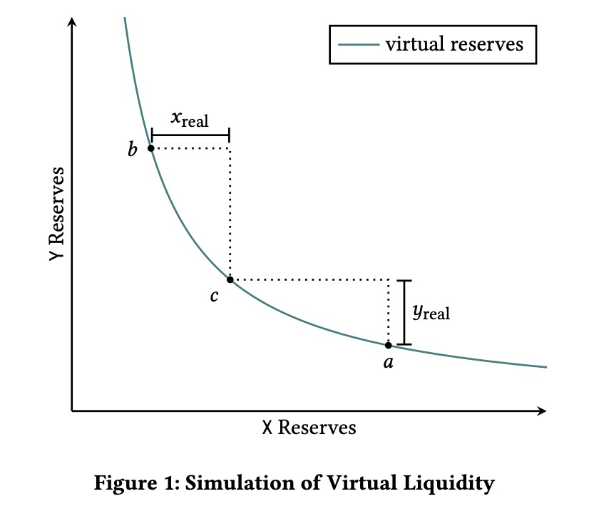
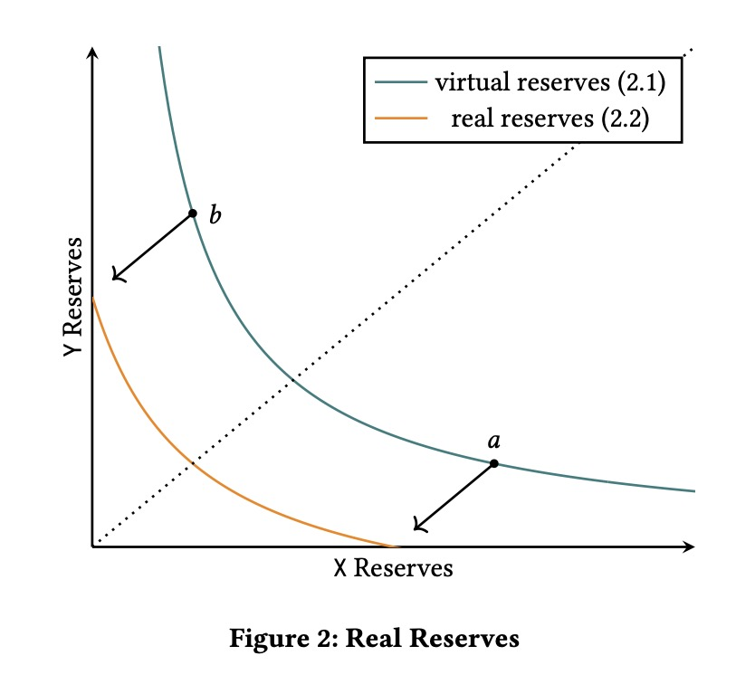
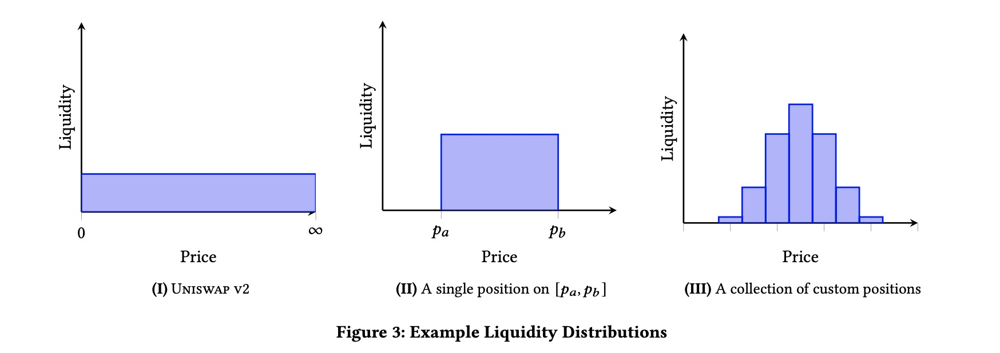
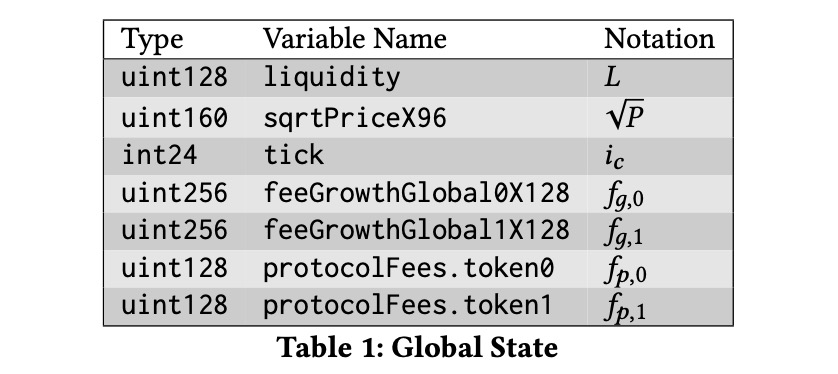
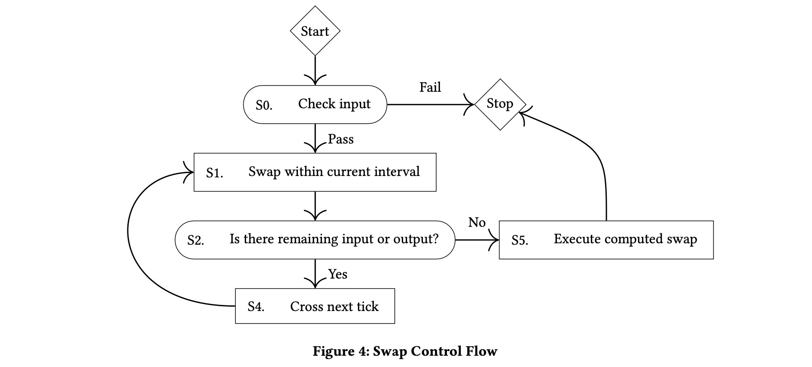
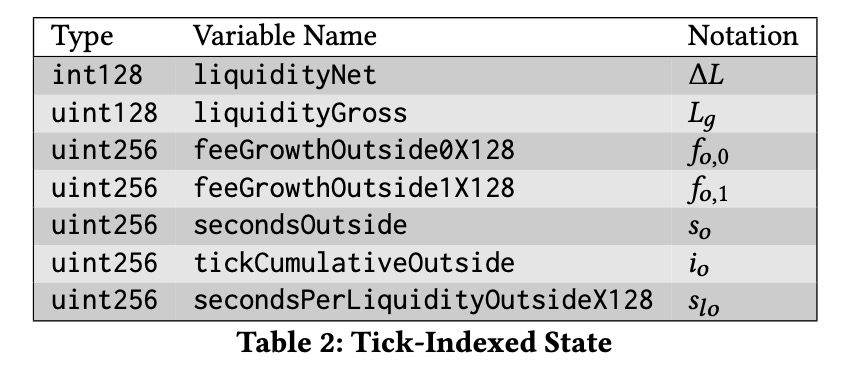
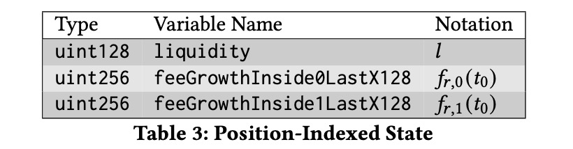

[English](./README.md) | [中文](./README_zh.md)

# Deep Dive into Uniswap v3 Whitepaper

###### tags: `uniswap` `uniswap-v3` `whitepaper`

## Overview

Uniswap v3 is an unregulated automated market maker (AMM) implemented on the Ethereum Virtual Machine (EVM). Compared to previous versions, Uniswap v3 improves capital efficiency, gives liquidity providers more control, enhances the accuracy and convenience of the price oracle, and introduces a more flexible fee structure.

## 1 Introduction

Automated market makers (AMMs) are agents that pool liquidity and make it available to traders based on algorithms. Constant function market makers (CFMMs), a common category of AMMs that includes Uniswap, have been widely adopted in decentralized finance. They are typically implemented as smart contracts for trading tokens on permissionless blockchains.

Most existing CFMMs suffer from low capital efficiency. In the constant product market maker formula used by Uniswap v1/v2, only a fraction of the pool's funds are used for making markets at any given price. This is inefficient, especially when tokens trade within a narrow price range.

> Note: Take stablecoins as an example, the price fluctuation range of USDC/USDT is extremely small. According to the v2 formula, liquidity providers essentially distribute funds across the price range (0, ∞), even though these prices will almost never be utilized. Thus, in Uniswap v1/v2 versions, capital efficiency is low, also leading to relatively higher slippage.

Products like Curve and YieldSpace have attempted to address the issue of capital utilization by establishing pools using different functions to describe the relationship between tokens. This requires all liquidity providers in the pool to follow the same formula, leading to liquidity fragmentation if they wish to provide liquidity in different price ranges.

This paper introduces Uniswap v3, a new AMM that allows liquidity providers more control over the price ranges where their capital is used, reducing the impact of liquidity fragmentation and gas consumption. This design does not rely on any assumptions about token price behavior. Uniswap v3 still utilizes the constant function curve from previous versions ($x \cdot y = k$) but introduces several new features:

* *Concentrated liquidity*: Liquidity providers (LPs) can concentrate liquidity within any price range. This improves pool capital efficiency and allows LPs to simulate their preferred price curves while providing efficient aggregated liquidity with the remaining funds. This feature and its implementation are described in sections 2 and 6, respectively.

* *Flexible fees*: Transaction fees are no longer fixed at 0.30%. Instead, the fee tier is set at the initialization of each pool, with multiple tiers (pools) available for each trading pair. Default supported fee tiers are 0.05%, 0.30%, and 1%. New fee tiers can be added through UNI governance.
  
  > Note: The [9th UNI proposal](https://app.uniswap.org/#/vote/2/9?chain=mainnet) to introduce a new fee tier of 0.01% has been implemented. The 0.01% fee tier is suitable for stablecoin trading scenarios, offering lower slippage and allowing Uniswap to compete directly with market leaders like Curve in the stablecoin trading domain.

* *Protocol fee governance*: UNI governance can flexibly set the protocol's share of transaction fees (see section 6.2.2).

* *Improved price oracle*: Uniswap v3 provides a way to query recent cumulative prices, avoiding manual recording of cumulative prices at the start and end of the period for calculating TWAP (time-weighted average price).

* *Liquidity oracle*: The contract offers a time-weighted average liquidity oracle (see section 5.3).

Uniswap v2 core contracts were designed to be non-upgradable, thus Uniswap v3 is implemented on a set of brand new contracts. Like v2, Uniswap v3 contracts are non-upgradable but allow some parameters to be modified by governance, as discussed in section 4.

## 2 Concentrated Liquidity

The central idea of Uniswap v3 is *concentrated liquidity*: limiting liquidity to a specific price range.

In previous versions, liquidity was evenly distributed along the following curve:

$$
x \cdot y = k \quad \text{(2.1)}
$$

where $x$ and $y$ are the balances of two tokens $X$ and $Y$, and $k$ is a constant. In other words, previous versions were designed to provide liquidity across the entire price range $(0, \infty)$. While this approach is easy to implement and allows for effective aggregation of liquidity, it means that many assets (liquidity) in the pool will never be utilized.

> Note: For instance, in the case of stablecoin trading pairs, the price fluctuates minimally most of the time. If, like in Uniswap v2, liquidity is dispersed across all price ranges $(0, \infty)$, it leads to low capital utilization since most of the liquidity's price range will never be utilized.

Considering this, allowing LPs to concentrate their liquidity within narrower price ranges, rather than $(0, \infty)$, seems reasonable. We refer to liquidity concentrated within a finite range as a "position". A position only needs to maintain enough token balance to support trades within its range, thus it behaves like a constant function pool (within that price range) with a larger token balance (which we refer to as virtual balances).

> Note: A v3 pool's range can be thought of as a part of a v2 pool.



Specifically, a position only needs to hold enough of token $X$ to support price movement to its upper limit, as $X$ tokens are consumed when the price moves upwards. Similarly, it only needs to hold enough of token $Y$ to support movement to its lower limit. Figure 1 describes the relationship between a position in the price range $\left[p_a, p_b\right]$ and the current price $p_c \in \left[ p_a, p_b \right]$. $x_{real}$ and $y_{real}$ represent the real token balances of the position.

When the price moves out of the position's range, its liquidity becomes inactive, and it no longer earns fees. At this point, liquidity consists entirely of one token, as the other has been depleted. If the price re-enters the range, liquidity becomes active again.

> Note: Figure 1 shows that the movement of market prices in a Uniswap constant function pool is achieved through the increase and decrease of the balances of the two tokens in the pool. When the price (too high or too low) leaves the position's range, it means one of the tokens has been completely replaced by the other, leaving only one token remaining in the range at that time.

The amount of liquidity can be measured by $L$, equivalent to $\sqrt{k}$. The real token balances of a position can be described by the following curve:

$$
(x + \frac{L}{\sqrt(p_b)})(y + L \sqrt{p_a}) = L^2 \quad \text{(2.2)}
$$

This curve is a variation of equation 2.1, with positions only having the ability to pay out within their range (Figure 2).



> Note: Below, we derive equation 2.2:
>
> From Figure 2, the v3 liquidity curve (the real reserves curve in the diagram) is actually obtained by translating the v2 liquidity curve (the virtual reserves curve in the diagram). Assuming the token balances (reserves) at points $a$ and $b$ are $(x_a, y_a)$ and $(x_b, y_b)$, respectively, the v2 curve needs to be translated along the x-axis by $-x_b$ and along the y-axis by $-y_a$.
>
> Given the v2 curve:
>
> $$x \cdot y = k$$
> 
> The translated v3 curve is:
>
> $$(x + x_b) \cdot (y + y_a) = k \quad \text{(2.2.0)}$$
> 
> The prices at points $a$ and $b$ are:
>
> $$p_a = \frac{y_a}{x_a} \quad \text{(2.2.1)}$$
>
> $$p_b = \frac{y_b}{x_b} \quad \text{(2.2.2)}$$
> 
> Also, given:
>
> $$x_a \cdot y_a = k \quad \text{(2.2.3)}$$
> 
> $$x_b \cdot y_b = k \quad \text{(2.2.4)}$$
>
> Therefore, from equations 2.2.1 and 2.2.3, we get:
>
> $$y^2_a = k \cdot p_a$$
>
> $$y_a = \sqrt{k} \cdot \sqrt{p_a} = L \sqrt{p_a}$$
>
> From equations 2.2.2 and 2.2.4, we get:
>
> $$x^2_b = \frac{k}{p_b}$$
>
> $$x_b = \frac{\sqrt{k}}{\sqrt{p_b}} = \frac{L}{\sqrt{p_b}}$$
>
> Since $L = \sqrt{k}$, thus $k = L^2$
>
> Substituting $x_b$ and $y_a$ into equation 2.2.0, we get:
>
> $$
> (x + \frac{L}{\sqrt{p_b}})(y + L\sqrt{p_a}) = k = L^2
> $$

Liquidity providers can freely create any number of positions, each with its price range. This way, LPs can simulate any liquidity distribution they deem necessary in the price space (Figure 3 illustrates some examples). Moreover, this approach allows the market to determine where liquidity should be allocated. Rational LPs can concentrate liquidity in narrow ranges near the current price to reduce capital costs, adjusting their positions as prices move to keep their liquidity active.



### 2.1 Range Orders

Positions in extremely narrow ranges resemble limit orders, transforming entirely from one asset to another (plus accumulated fees) if the price crosses the range. Range orders differ from traditional limit orders in two main ways:

* There is a minimum limit to the range of a position. If the price is exactly within the range, the limit order might only be partially executed.

* After being crossed, the position must be manually withdrawn. Otherwise, if the price returns to the range, the position will automatically trade in the reverse direction.

> Note: If the price repeatedly crosses a range order, the asset holdings in the position will automatically change, transitioning completely from one asset to another and then reversing, in a cyclic manner. Unlike CEX limit orders, which once fully executed, remain so even if prices later revert, completed orders do not roll back.
>
> Therefore, to achieve the effect of traditional exchange limit orders, liquidity providers need to manually perform a withdrawal operation after the price crosses the limit range, to fully obtain the other token. Alternatively, automatic withdrawal functions provided by third-party applications, such as [Gelato](https://www.gelato.network/), can be used to implement traditional limit order effects with Uniswap v3 range orders.

## 3 Architectural Changes

Uniswap v3 implements several architectural changes, some of which are necessary for concentrated liquidity, while others are independent improvements.

### 3.1 Multiple Pools Per Pair

In Uniswap v1 and v2, each trading pair corresponded to a separate liquidity pool, uniformly charging a 0.30% fee for all trades. Although historical data suggests the default fee level was reasonable for most tokens, it might have been too high for some pools (e.g., stablecoin pools) and too low for others (e.g., high volatility or niche tokens).

Uniswap v3 introduces multiple pools for each trading pair, allowing different transaction fees to be set separately. All pools are created using the same factory contract. Three default fee tiers are allowed: 0.05%, 0.30%, and 1%. Additional fee tiers can be added through UNI governance.

> Note: A new 0.01% fee tier has been introduced through voting, catering to stablecoin trading scenarios and offering lower slippage, allowing Uniswap to compete with leaders like Curve in the stablecoin trading market.

### 3.2 Non-Fungible Liquidity

*3.2.1 Non-compounding fees*. In previous versions, fee income was continuously deposited into the pool as liquidity. This meant that even without actively depositing, the pool's liquidity would grow over time, and fees could compound.

In Uniswap v3, due to the non-fungibility of positions, compounding becomes impossible. Instead, fees are accumulated separately and held in the form of the fee-paying tokens (see section 3.2.1).

> Note: Since each position in v3 has its price range, v3's liquidity no longer spreads across all price ranges like in v2, meaning v2's liquidity is fungible and thus can be represented by ERC-20 tokens. In contrast, v3's liquidity essentially becomes an NFT (non-fungible token), represented using [ERC-721](https://eips.ethereum.org/EIPS/eip-721).

*3.2.2 Removal of native liquidity tokens*. In Uniswap v1 and v2, the pool contract itself was an ERC-20 contract, and its tokens represented the pool's held liquidity. Although this representation was convenient, it was somewhat inconsistent with Uniswap v2's philosophy that anything not necessary to the core contract should be placed in a periphery contract. Using a "standard" ERC-20 implementation in the core contract prevented the creation of optimized versions of ERC-20 tokens in the future. Ideally, the ERC-20 token implementation should be placed in a periphery contract, then wrapped in a core contract as a liquidity position.

> Note: Since the ERC-20 implementation of the pair contract was in the core contract and was non-upgradable, if there was a bug in the ERC-20 implementation, it would affect the entire v2 liquidity. Therefore, a better approach is to place the ERC-20 implementation in the periphery contract and only have a wrapper reference in the core contract for future upgrades to new versions of the ERC-20 implementation.

The changes introduced in Uniswap v3 make fungible liquidity tokens impossible. With the feature of custom liquidity supply, fees are now collected and held by the pool in separate tokens, rather than automatically reinvested as the pool's liquidity.

Therefore, v3's pool contract does not implement the ERC-20 standard. Anyone can create an ERC-20 token contract in the periphery to make liquidity positions more interchangeable, but this requires additional logic to handle the distribution or reinvestment of fee income. Alternatively, anyone can create a periphery contract using an ERC-721 NFT token to represent individual liquidity positions (including accumulated fees).

## 4 Governance

The factory contract has an owner, initially controlled by UNI token holders. The owner has no authority to pause any operation of the core contract.

> Note: On the ETH mainnet, the factory contract address is [0x1F98431c8aD98523631AE4a59f267346ea31F984](https://etherscan.io/address/0x1f98431c8ad98523631ae4a59f267346ea31f984), with the owner being a TimeLock contract at [0x1a9C8182C09F50C8318d769245beA52c32BE35BC](https://etherscan.io/address/0x1a9c8182c09f50c8318d769245bea52c32be35bc).

Like Uniswap v2, Uniswap v3 also has a protocol fee that can be enabled by UNI governance. In Uniswap v3, UNI governance can set the protocol's share of transaction fees more flexibly, allowing the protocol fee to be set to $\frac{1}{N}$ of the transaction fees or 0, where $4 \leq N \leq 10$. This parameter can be set on a per-pool basis.

> Note: Uniswap v2 could only set the protocol fee on a global basis, whereas Uniswap v3 allows it to be set for each pool individually.

UNI governance can add additional transaction fee tiers. When adding a fee tier, the corresponding tickSpacing parameter can also be defined (see section 6.1). Once a fee tier is added to the factory contract, it cannot be removed (nor can tickSpacing be modified). The initial fee tiers and tickSpacing are 0.05% (tickSpacing of 10, approximately 0.10% between two initialized ticks), 0.30% (tickSpacing of 60, approximately 0.60%), and 1% (tickSpacing of 200, approximately 2.02%).

> Note: Regarding the concept of ticks and tick spacing, please refer to section 6.1.
>
> Simply put, each tick (point) corresponds to a price. To aggregate the liquidity of different positions, the price space is divided into ticks that can be initialized, with only ticks divisible by tickSpacing allowed to be initialized. Inside a tick, the trading mechanism is similar to v2; once the liquidity of that tick is consumed, the price moves to the next tick and repeats the process. Thus, smaller tickSpacing means more continuous liquidity and smaller slippage but also higher gas consumption.
>
> Therefore, each fee tier's tickSpacing is a trade-off value. Generally, higher fee tiers have larger tickSpacing because higher fees indicate greater volatility of the trading pair, and traders can tolerate larger slippage.
>
> The current fee configuration on the chain can be checked through the [factory contract](https://etherscan.io/address/0x1f98431c8ad98523631ae4a59f267346ea31f984#readContract): feeAmountTickSpacing, with the supported feeAmount and tickSpacing being: ```{100: 1, 500: 10, 3000: 60, 10000: 200}```.
>
> As mentioned in section 6.1, the minimum price difference between two adjacent ticks is 0.01%.

Finally, UNI governance has the right to transfer ownership to another address.

## 5 Oracle Upgrades

Uniswap v2 introduced the Time-Weighted Average Price (TWAP) oracle feature. Uniswap v3's TWAP includes three significant changes.

The most important change is that Uniswap v3 does not require oracle users to record historical cumulative prices externally. Uniswap v2 required users to manually record cumulative prices at the start and end of the period for calculating TWAP. Uniswap v3 moves the cumulative checkpoints to the core contract, allowing external contracts to directly calculate the recent on-chain TWAP without additional record-keeping.

Another change is that Uniswap v3 no longer calculates the arithmetic mean TWAP using the sum of cumulative prices; instead, it records the sum of $\log$ prices to calculate the geometric mean TWAP.

> Note: As mentioned in the "Dive into Uniswap v2 Whitepaper," compared to the arithmetic mean, the geometric mean is less influenced by extreme values and does not require separate cumulative price records for each token, as the geometric mean price of one token is the reciprocal of the other.

Lastly, in addition to price accumulators, Uniswap v3 adds a liquidity accumulator, accumulating $\frac{1}{L}$ (the reciprocal of liquidity) every second. The cumulative liquidity is useful for external contracts implementing liquidity mining on Uniswap v3. It can also be used by other contracts to determine which pool has the most reliable TWAP.

### 5.1 Oracle Observations

Similar to Uniswap v2, Uniswap v3 records cumulative prices at the start of each block, multiplied by the time (in seconds) since the last block.

Uniswap v2's pool only saves the latest value of cumulative prices, updated by the most recent transaction block. When calculating the average price in Uniswap v2, external callers are responsible for providing historical cumulative price data. If there are many external users, each must independently maintain a method to record historical cumulative prices or use a shared method to reduce costs. Moreover, there is no guarantee that every interactive block will affect the cumulative price.

In Uniswap v3, the pool saves a series of historical cumulative prices (and as described in section 5.3, including cumulative liquidity). During the first interaction with the pool in each block, the contract automatically records cumulative prices and cyclically overwrites the oldest value in the array with the new value, similar to a circular buffer. Although the array is initially allocated space for only one checkpoint, anyone can initialize additional storage slots to extend the array up to 65,536 checkpoints. Anyone extending the checkpoint space for a trading pair must pay a one-time gas cost to initialize additional storage slots for the array.

> Note: Expanding the checkpoint space is a one-time operation, paid by the initiator. For example, if someone wants the Uniswap v3 ETH-USDC trading pair to provide more historical price checkpoints (more checkpoints mean the oracle price calculated using on-chain data will be more reliable, as the cost for an attacker to manipulate these prices increases), they would call the ETH-USDC pair contract interface to expand the checkpoint space and pay the gas cost, as this operation allocates additional EVM storage slots for the trading pair.

The pool not only provides users with an array of historical observation data but also encapsulates a convenient function for finding the cumulative price at any point in the observation period.

### 5.2 Geometric Mean Price Oracle

Uniswap v2 maintains two cumulative prices, one for the price of token0 in terms of token1, and the other for the price of token1 in terms of token0. Users can calculate the time-weighted arithmetic mean price for any period by subtracting the cumulative price at the end of the period from the cumulative price at the beginning and dividing by the time (in seconds). Note that cumulative prices for token0 and token1 are tracked separately because the two arithmetic mean prices are not reciprocals of each other.

Uniswap v3 uses a time-weighted geometric mean price, eliminating the need to maintain separate cumulative prices for two tokens. The geometric mean of a set of ratios is the reciprocal of the geometric mean of their reciprocals.

> Note: Suppose the price of token0 in terms of token1 is $x$, then the price of token1 in terms of token0 is $\frac{1}{x}$.
>
> The geometric mean price of token0:
> $$P_0 = \sqrt[n]{x_1 \cdot x_2 \cdot ... \cdot x_n}$$
>
> The geometric mean price of token1:
> $$P_1 = \sqrt[n]{\frac{1}{x_1} \cdot \frac{1}{x_2} \cdot ... \cdot \frac{1}{x_n}} = \frac{1}{\sqrt[n]{x_1 \cdot x_2 \cdot ... \cdot x_n}} = \frac{1}{P_0}$$
>
> Thus, the geometric mean prices of two tokens are reciprocals of each other, and Uniswap v3's contract only needs to save the cumulative price of one token.

Implementing geometric mean prices in Uniswap v3 is relatively straightforward thanks to the custom liquidity supply mechanism (see section 6). Additionally, the accumulator can be represented with fewer bits because it only records $\log{P}$ instead of $P$, allowing a wider range of prices to be represented with the same precision. Lastly, theoretical proofs show that a time-weighted geometric mean price more accurately reflects the true average price.

> Note: To represent all possible prices with acceptable precision, Uniswap v2 used a 224-bit fixed-point number for price representation. Uniswap v3 only needs a 24-bit signed integer to represent $\log_{1.0001}{P}$, which can detect a price change of one basis point, 0.01%.
>
> As mentioned earlier, market prices themselves are a type of random Brownian motion. Theoretically, using a geometric mean is more accurate in tracking average prices because arithmetic means are more susceptible to distortion by extreme values.

Uniswap v3 records the cumulative sum of the current tick number ($\log_{1.0001}{P}$, the logarithm of price $P$ with base 1.0001, which can detect a price change of one basis point, 0.01%) instead of the cumulative price $P$. The cumulative count at any moment equals the sum of the logarithmic prices ( $\log_{1.0001}(P)$ ) per second up to that point:

$$
a_t = \sum_{i=1}^{t} \log_{1.0001}(P_i) \quad \text{(5.1)}
$$

> Note: Why can $\log_{1.0001}P$ detect a precision of price change as 0.01% (one basis point)?
>
> Since Uniswap v3 uses int24 (24-bit signed integer) to represent ticks, suppose the current tick is $i$, corresponding to price $P_1$; the next closest tick is $i + 1$, with corresponding price $P_2 = P_1 \cdot 1.0001$, its relative change in price to $P_1$ is:
>
> $$\frac{P_2 - P_1}{P_1} = \frac{P_1 \cdot 1.0001 - P_1}{P_1} = 1.0001 - 1 = 0.0001 = 0.01\%$$

The geometric mean price (time-weighted average price) $(p_{t_1,t_2})$ for any period from $t_1$ to $t_2$ is:

$$
P_{t_1,t_2} = \left(\prod^{t_2}_{i=t_1} P_i \right)^{\frac{1}{t_2 - t_1}} \quad \text{(5.2)}
$$

> Note: Here, we revisit the definition of the geometric mean:
>
> Geometric Mean:
>
> $$ G(x_1,...,x_n) = \sqrt[n]{x_1 ... x_n} $$
>
> It's evident that $P_{t_1,t_2}$ is the geometric mean price for the period from $t_1$ to $t_2$.

To calculate this value, you can look at the cumulative price at moments $t_1$ and $t_2$, subtract the former from the latter, divide by the time difference (in seconds), and finally calculate $1.0001^x$ to get the time-weighted geometric mean price:

$$
\log_{1.0001}(P_{t_1,t_2}) = \frac{\sum_{i=t_1}^{t_2} \log_{1.0001}(P_i)}{t_2 - t_1} \quad \text{(5.3)}
$$

$$
\log_{1.0001}(P_{t_1,t_2}) = \frac{a_{t_2} - a_{t_1}}{t_2 - t_1} \quad \text{(5.4)}
$$

$$
P_{t_1,t_2} = 1.0001^{\frac{a_{t_2} - a_{t_1}}{t_2 - t_1}} \quad \text{(5.5)}
$$

### 5.3 Liquidity Oracle

In addition to the weighted cumulative count of $\log_{1.0001}price$ per second, Uniswap v3 also records a weighted cumulative count of liquidity's reciprocal ($\frac{1}{L}$, the reciprocal of the virtual liquidity in the current range) per second: secondsPerLiquidityCumulative($s_{pl}$).

This count can be used by external liquidity mining contracts to distribute rewards fairly. If an external contract wishes to distribute rewards at an average rate of $R$ tokens per second across all active liquidity in the contract, assuming a position's active liquidity from $t_0$ to $t_1$ is $L$, the reward for that period should be: $R \cdot L \cdot (s_{pl}(t_1) - s_{pl}(t_0))$.

> Note: $s_{pl}(t)$ represents the total duration (in seconds) each unit of liquidity has persisted up to moment $t$.
>
> $(s_{pl}(t_1) - s_{pl}(t_0))$ represents the total duration (in seconds) each unit of liquidity has persisted during the period from $t_0$ to $t_1$.
>
> $R \cdot (s_{pl}(t_1) - s_{pl}(t_0))$ represents the reward for each unit of liquidity during the period from $t_0$ to $t_1$.
>
> Since the active liquidity of that position is $L$, the reward for the period from $t_0$ to $t_1$ is:
>
> $$R \cdot L \cdot (s_{pl}(t_1) - s_{pl}(t_0))$$

To extend this formula to only reward liquidity within a position's range, Uniswap v3 saves a checkpoint based on this value each time a tick is crossed, as described in section 6.3.

On-chain contracts can use this cumulative count to make their oracles more robust (e.g., to evaluate which fee tier pool is better suited as an oracle data source).

## 6 Implementing Concentrated Liquidity

The remaining sections of this paper will discuss the implementation mechanism of concentrated liquidity supply and its implementation in contracts.

### 6.1 Ticks and Ranges

To implement custom liquidity supply, the possible price space is discretized into ticks. Liquidity providers can supply liquidity between any two ticks (not necessarily adjacent).

Each range can be defined by a pair of tick indices (signed integers): a lower tick ($i_l$) and an upper tick ($i_u$). Ticks represent prices at which the contract's virtual liquidity can be modified. We assume prices are always expressed as the price of token0 in terms of token1. The assignment of token0 and token1 is arbitrary and does not affect the contract's logic (except for possible rounding errors).

Conceptually, a tick exists whenever the price $p$ equals an integer power of 1.0001. We use integer $i$ to represent a tick, such that the tick's price can be expressed as:

$$
p(i) = 1.0001^i \quad \text{(6.1)}
$$

By definition, the precision of price movement between two adjacent ticks is 0.01% (one basis point).

> Note: Refer to the derivation in section 5.2.

Due to technical reasons described in section 6.2.1, the pool contract actually tracks ticks using the square root of the price, $\sqrt{price}$, equal to an integer power of $\sqrt{1.0001}$. The equation above can be converted to an equivalent square root price form:

$$
\sqrt{p}(i) = \sqrt{1.0001}^i = 1.0001^{\frac{i}{2}} \quad \text{(6.2)}
$$

For example, $\sqrt{p}(0)$ (the square root price of tick 0) equals 1, $\sqrt{p}(1)$ equals $\sqrt{1.0001} \approx 1.00005$, and $\sqrt{p}(-1)$ equals $\frac{1}{\sqrt{1.0001}} \approx 0.99995$.

When liquidity is added to a range, if one or both ticks are not already used as boundaries by existing positions, that tick is initialized.

Not every tick can be initialized. Each pool pair is initialized with a parameter tickSpacing ($t_s$); only ticks whose indices are divisible by tickSpacing can be initialized. For example, if tickSpacing is 2, only even ticks (...-4, -2, 0, 2, 4...) can be initialized. Smaller tickSpacing allows for tighter and more precise ranges but may result in higher gas consumption per transaction (because crossing an initialized tick incurs a gas cost for the transactor).

Whenever the price crosses an initialized tick, virtual liquidity is added or removed. The gas cost incurred by crossing an initialized tick is fixed and independent of the number of positions adding or removing virtual liquidity at that tick.

To ensure the correct amount of liquidity is added and removed when the price crosses a tick and to ensure position holders receive their proportionate share of fees while within a price range, the pool contract needs to perform some accounting. The contract uses storage variables to record global (per pool), tick-level, and position-level states.

### 6.2 Global State

The contract's global state includes seven storage variables related to swapping and liquidity supply. (It also has other variables for the oracle, as described in section 5.)



#### 6.2.1 Price and Liquidity

In Uniswap v2, each pool contract recorded the current token balances of the pool: $x$ and $y$. In Uniswap v3, the contract can be thought of as having virtual balances of $x$ and $y$ used to describe the contract's behavior (within two adjacent ticks) as if it still follows the constant function.

> Note: In reality, v3 operates according to the constant function only within a specific price range.

The contract records two different values: liquidity ($L$) and the square root of the price (sqrtPrice), $\sqrt{P}$, instead of virtual balances. These two values can be calculated from the virtual balances as follows:

$$
L = \sqrt{xy} \quad \text{(6.3)}
$$

$$
\sqrt{P} = \sqrt{\frac{y}{x}} \quad \text{(6.4)}
$$

Conversely, the virtual balances of the two tokens can also be calculated using these two values:

$$
x = \frac{L}{\sqrt{P}} \quad \text{(6.5)}
$$

$$
y = L \cdot \sqrt{P} \quad \text{(6.6)}
$$

Using $L$ and $\sqrt{P}$ for calculation is convenient because at any given moment, only one of these values changes. When trading within a tick, only the price (i.e., $\sqrt{P}$) changes; when crossing a tick or minting/burning liquidity, only the liquidity ($L$) changes. This avoids the rounding error issues that might occur when recording virtual balances.

You might notice that the liquidity formula (based on the virtual balances of the tokens) is similar to the formula Uniswap v2 used for initializing the quantity of liquidity tokens (when no fee income has yet been accumulated). Liquidity can be considered as virtual liquidity tokens.

Similarly, liquidity can also be regarded as the proportion of the change in the number of token1 ($\Delta{Y}$) to the change in price $\sqrt{P}$:

$$
L = \frac{\Delta{Y}}{\Delta{\sqrt{P}}} \quad \text{(6.7)}
$$

> Note: Based on equation 6.6, suppose at moments $t_0$ and $t_1$, the corresponding $y_0$ and $y_1$ are:
>
> $y_0 = L \cdot \sqrt{P_0}$
>
> $y_1 = L \cdot \sqrt{P_1}$
>
> Thus:
>
> $y_1 - y_0 = L \cdot (\sqrt{P_1} - \sqrt{P_0})$
>
> We can get the equation 6.7:
>
> $$
> L = \frac{y_1 - y_0}{\sqrt{P_1} - \sqrt{P_0}} = \frac{\Delta{Y}}{\Delta{\sqrt{P}}}
> $$

We record $\sqrt{P}$ instead of $P$ in order to utilize the formula mentioned above, as described in Section 6.2.3, thereby avoiding any square root calculations during trading.

The global state records the current tick index as $tick(i_c)$, a signed integer representing the closest tick below the current price. This is an optimization strategy (and a way to avoid logarithmic precision issues) because at any moment, you need to be able to calculate the corresponding tick based on the current square root price $\sqrt{P}$. At any point, the following equation always holds:

$$
i_c = \lfloor \log_{\sqrt{1.0001}} \sqrt{P} \rfloor \quad \text{(6.8)}
$$

> Note: According to equation 6.2:
>
> $\sqrt{p}(i) = \sqrt{1.0001}^i$，
>
> Thus:
>
> $i = \log_{\sqrt{1.0001}} \sqrt{P}$
>
> Since $i$ is an integer, it needs to be rounded down.

#### 6.2.2 Fees

Each trading pair pool is initialized with an immutable transaction fee ($\gamma$), representing the fee traders need to pay, in hundredths of a basis point (0.0001%).

> Note: The default fee values are 500, 3000, and 10000, representing fees of 500 x 0.0001% = 0.05%, 3000 x 0.0001% = 0.30%, and 1000 x 0.0001% = 1%, respectively.

Another variable, the protocol fee ($\phi$), initially set to 0, can be modified by UNI governance. This number represents the portion of the transaction fees paid by traders that goes to the protocol rather than liquidity providers. $\phi$ is only allowed to be set to specific legal values: 0, 1/4, 1/5, 1/6, 1/7, 1/8, 1/9, or 1/10.

> Note: The protocol fee switch cannot be automatically turned on when creating the pair; it must be executed by UNI governance for specific pools and can be set differently for different pools.

The global state also records two values: feeGrowthGlobal0 ($f_{g,0}$) and feeGrowthGlobal1 ($f_{g,1}$). They represent the accumulated fees per unit of virtual liquidity ($L$) earned by the contract up to now. Think of them as the total fees that would have been earned by each unit of non-boundary liquidity added when the contract was first initialized. They are represented as unsigned fixed-point numbers (128x128 format). Note that in Uniswap v3, fees are collected in the form of native tokens, not liquidity tokens (refer to section 3.2.1).

Lastly, the global state records cumulative unclaimed protocol fees for each token: protocolFees0 ($f_{p,0}$) and protocolFees1 ($f_{p,1}$), represented as unsigned uint128 types. Cumulative protocol fees can be claimed by UNI governance through the collectProtocol method.

#### 6.2.3 Swapping Within a Single Tick

For small trades that do not cause the price to cross a tick, the contract operates like an $x \cdot y = k$ pool.

Suppose $\gamma$ is the transaction fee, such as 0.003, and $y_{in}$ is the amount of token1 being traded.

First, feeGrowthGlobal1 and protocolFees1 increase by:

$$
\Delta{f_{g,1}} = y_{in} \cdot \gamma \cdot (1 - \phi) \quad \text{(6.9)}
$$

$$
\Delta{f_{p,1}} = y_{in} \cdot \gamma \cdot \phi \quad \text{(6.10)}
$$

> Note: $\phi$ is the protocol fee as a percentage of the transaction fee, so the protocol fee proportion is: $\gamma \cdot \phi$, with the protocol fee income given by equation 6.10.
>
> The remaining fees are distributed to liquidity providers, which is the transaction fee minus the protocol fee, with its proportion being: $\gamma \cdot (1 - \phi)$, and the transaction fee income given by equation 6.9.

$\Delta y$ is the increase in $y$ (after deducting the fee).

$$
\Delta{y} = y_{in} \cdot (1 - \gamma) \quad \text{(6.11)}
$$

Using the virtual balances ($x$ and $y$) calculated for token0 and token1, the token0 amount after the trade can be calculated with the following formula:

$$
x_{end} = \frac{x \cdot y}{y + \Delta{y}} \quad \text{(6.12)}
$$

> Note: Because within a tick, the trade conforms to the $k$ constant function, i.e.,
>
> $$x_{end} \cdot y_{end} = x \cdot y$$
>
> Thus, it can be deduced:
>
> $$x_{end} = \frac{x \cdot y}{y_{end}} = \frac{x \cdot y}{y + \Delta{y}}$$

However, please note, in v3, the contract uses liquidity ($L$) and square root price ($\sqrt{P}$) instead of $x$ and $y$. We could use these two values to calculate $x$ and $y$ and then compute the transaction price. However, for a given $L$, we can derive a concise equation that describes the relationship between $\Delta{\sqrt{P}}$ and $\Delta{y}$ (which can be derived from equation 6.7):

$$
\Delta{\sqrt{P}} = \frac{\Delta{y}}{L} \quad \text{(6.13)}
$$

$$
\Delta{y} = \Delta{\sqrt{P}} \cdot L \quad \text{(6.14)}
$$

Similarly, we can derive the relationship between $\Delta{\frac{1}{\sqrt{P}}}$ and $\Delta{x}$:

$$
\Delta{\frac{1}{\sqrt{P}}} = \frac{\Delta{x}}{L} \quad \text{(6.15)}
$$

$$
\Delta{x} = \Delta{\frac{1}{\sqrt{P}}} \cdot L \quad \text{(6.16)}
$$

> Note: According to equation 6.5, suppose at moments $t_0$ and $t_1$, the corresponding $x_0$ and $x_1$ are:
>
> $x_0 = \frac{L}{\sqrt{P_0}}$
>
> $x_1 = \frac{L}{\sqrt{P_1}}$
>
> Thus:
>
> $x_1 - x_0 = L \cdot (\frac{1}{\sqrt{P_1}} - \frac{1}{\sqrt{P_0}})$
>
> Rearranging gives equation 6.16:
>
> $$
> \Delta{x} = L \cdot \Delta{\frac{1}{\sqrt{P}}}
> $$

When exchanging one token for another, the trading pair contract can first calculate the new square root price $\sqrt{P}$ using Formula 6.13 or 6.15, and then calculate the amount of token0 and token1 tokens to be transferred based on Formula 6.14 or 6.16.

For any trade, as long as the square root price $\sqrt{P}$ after the trade does not enter the price of the next initialized tick, the formulas above work well. If the calculated $\Delta{\sqrt{P}}$ will cause $\sqrt{P}$ to enter the next initialized tick, the contract will complete the current tick (only a portion of the trade) and then continue into the next tick to complete the remainder of the trade, as described in section 6.3.1.



#### 6.2.4 Initialized Tick Bitmap

Ticks that are not used as boundaries for liquidity positions (i.e., not initialized) can be skipped during trades.

To efficiently find the next initialized tick, the contract uses a bitmap, tickBitmap, to record initialized ticks. If a tick is initialized, the bit corresponding to that tick index in the bitmap is set to 1; otherwise, it is 0.

When a new position uses a tick as a boundary and it is not used by any other liquidity, it is initialized, and the corresponding bit in the bitmap is set to 1. When all liquidity associated with that tick is removed, the initialized tick reverts to uninitialized, and the corresponding bit in the bitmap is set to 0.

### 6.3 Tick-Indexed State

To keep track of the total liquidity to be added and removed when a tick is fully crossed and the fees earned while above and below that tick, the contract needs to store additional information for each tick.

The contract maintains a mapping from each tick index to the following seven variables:



Each tick records $\Delta{L}$, the total amount of liquidity to be added and removed when the tick is fully crossed. Ticks only need to record one signed integer: the liquidity to be injected into the tick when it moves from left to right (and negatively, when moving from right to left, indicating the removal of liquidity). This value does not need to be updated every time the price crosses a tick (only when a position using the tick as a boundary updates).

We want to be able to uninitialize a tick when there is no longer any liquidity referencing that tick. In addition to the net liquidity change $\Delta{L}$, the total liquidity associated with that tick, liquidityGross, is also recorded. This ensures that even if the net liquidity is zero, we know at least one position is associated with the tick, deciding whether to update the tick bitmap.

feeGrowthOutside{0, 1} tracks the total fees accumulated outside a given range. Since the formulas for collecting fees for token0 and token1 are the same, we will omit the (token0 and token1) subscript in the remaining formulas in this section.

Depending on whether the current price is inside the range, you can use one formula to calculate the fees accumulated above ($f_a$) and below ($f_b$) tick $i$ (based on whether the current tick index $i_c$ is greater than or equal to $i$):

$$
f_a(i) = \begin{cases} f_g - f_o(i) & \text{$i_c \geq i$}\\
f_o(i) & \text{$i_c < i$} \end{cases} \quad \text{(6.17)}
$$

$$
f_b(i) = \begin{cases} f_o(i) & \text{$i_c \geq i$}\\
f_g - f_o(i) & \text{$i_c < i$}\end{cases} \quad \text{(6.18)}
$$

> Note: First, let's recall what each variable means. $f_g$ is the global accumulated fees per liquidity; $f_o(i)$ is the accumulated fees outside a specified tick $i$, and it's important to note that this value changes its meaning of direction with the current tick $i_c$.
>
> When $i_c < i$,
>
> $$
> \underbrace{\overbrace{i_c, ..., i - 1}^{f_b(i) = f_g - f_o(i)}, i, \overbrace{i + 1, ...}^{f_a(i)=f_o(i)}}_{f_g}
> $$
>
> When $i_c \geq i$,
>
> $$
> \underbrace{\overbrace{..., i - 1}^{f_b(i) = f_o(i)}, i, \overbrace{i + 1, ..., i_c}^{f_a(i)=f_g - f_o(i)}}_{f_g}
> $$

Using the above functions, we can calculate the total fees accumulated for every liquidity unit between two ticks (the lower tick $i_l$ and the upper tick $i_u$) as $f_r$:

$$
f_r = f_g - f_b(i_l) - f_a(i_u) \quad \text{(6.19)}
$$

> Note: According to the above derivation, we can diagram several fee relationships as follows:
>
> $$
> \underbrace{\overbrace{..., i_l - 1}^{f_b(i_l)}, \overbrace{i_l, i_l + 1, ..., i_u - 1, i_u}^{f_r}, \overbrace{i_u + 1, ...}^{f_a(i_u)}}_{f_g}
> $$

$f_o$ needs to be updated every time a tick is crossed. Specifically, when a tick is crossed in the opposite direction, its corresponding $f_o$ (for both token0 and token1) needs to be updated as follows:

$$
f_o(i) := f_g - f_o(i) \quad \text{(6.20)}
$$

Only ticks used as boundary points by at least one position need $f_o$. Therefore, for efficiency, $f_o$ is not initialized (does not need to be updated when a tick is crossed) until a position using the tick as a boundary is created. When $f_o$ of tick $i$ is initialized, its initial value is set to assume all fees were collected while the tick was below the current tick:

$$
f_o := \begin{cases} f_g & \text{$i_c \geq i$}\\
0 & \text{$i_c < i$} \end{cases} \quad \text{(6.21)}
$$

Note that since $f_o$ for different ticks can be initialized at different times, comparing their $f_o$ values is meaningless, and it is not guaranteed that $f_o$ values remain constant. But this does not create a problem for each position, as described below, since all positions need to know how much $g$ has grown inside their range since the last interaction.

Lastly, the contract also saves for each tick secondsOutside ($s_o$), secondsPerLiquidityOutside, and tickCumulativeOutside. These variables are not used internally by the contract but help external contracts (such as those implementing liquidity mining based on v3) more easily obtain contract information.

These three variables are similar to the fee growth variables mentioned above. However, unlike feeGrowthOutside{0, 1} tracking feeGrowthGlobal{0, 1}, secondsOutside tracks the current timestamp, secondsPerLiquidityOutside tracks the cumulative count of ${1}/{L}$ described in section 5.3 (secondsPerLiquidityCumulative), and tickCumulativeOutside tracks the cumulative count of $\log_{1.0001}P$ described in section 5.2.

For example, for a given tick, depending on whether the current price is inside the range, $s_a$ and $s_b$ are the durations (in seconds) spent above and below tick $i$, respectively, and $s_r$ is the duration within the range, calculated as follows:

$$
t_a(i) = \begin{cases} t - t_o(i) & \text{$i_c \geq i$}\\
t_o(i) & \text{$i_c < i$} \end{cases} \quad \text{(6.22)}
$$

$$
t_b(i) = \begin{cases} t_o(i) & \text{$i_c \geq i$}\\
t - t_o(i) & \text{$i_c < i$}\end{cases} \quad \text{(6.23)}
$$

$$
t_r(i_l, i_u) = t - t_b(i_l) - t_a(i_u) \quad \text{(6.24)}
$$

The duration a position is within a price range from $t_1$ to $t_2$ can be determined by recording the $s_r(i_l, i_u)$ value at moments $t_1$ and $t_2$ and subtracting the former from the latter.

Like $f_o$, $s_o$ for ticks not used as boundary points is not recorded. Therefore, it is only initialized when a position using the tick as a boundary is created. For convenience, the initial default value is the number of seconds up to the current moment, assuming all durations occurred while the tick was below the current one:

$$
t_o(i) := \begin{cases} t & \text{$i_c \geq i$}\\
0 & \text{$i_c < i$} \end{cases} \quad \text{(6.25)}
$$

Similar to $f_o$, comparing $t_o$ values for different ticks is meaningless. $t_o$ is only meaningful when calculating the duration a specific price range's liquidity was active during a period (the start time must be after both ticks' $t_0$ initialization).

#### 6.3.1 Crossing a Tick

As described in section 6.2.3, when trading between initialized ticks, Uniswap v3 can operate like a $k$ constant function pool. However, when a trade crosses an initialized tick, the contract needs to add or remove liquidity to ensure no liquidity provider goes bankrupt. This means that $\Delta{L}$ is drawn from the tick and applied to the global $L$.

To record the fees accumulated inside the range while the tick serves as a boundary point during price movement (and the duration), the contract needs to update the tick's state. feeGrowthOutside{0, 1} and secondsOutside are updated to reflect current values when the direction of trade associated with the tick changes, updated as follows:

$$
f_o := f_g - f_o \quad \text{(6.26)}
$$

$$
t_o := t - t_o \quad \text{(6.27)}
$$

After a tick is crossed, as described in section 6.2.3, the trade continues until it encounters the next initialized tick.

### 6.4 Position-Indexed State

The contract maintains a mapping from the combination of user address, lower tick (left boundary, a tick index of type int24), and upper tick (right boundary, a tick index of type int24) to the details of a specific position. Each position records three values:



liquidity ($l$) represents the amount of virtual liquidity represented by the position at the time of the last update. Specifically, liquidity can be regarded as $\sqrt{x \cdot y}$, where $x$ and $y$ represent the liquidity added to the pool, as indicated by the virtual amounts of token0 and token1 when the position enters a price range at any given time. Unlike Uniswap v2, where each liquidity share grew over time due to fee income, v3's liquidity shares do not change because fees are accumulated separately; they always equal $\sqrt{x \cdot y}$, where $x$ and $y$ represent the amounts of token0 and token1, respectively.

The liquidity amount does not represent the fees accumulated since the last interaction with the contract; uncollected fees are used for this purpose. To calculate uncollected fees for a position, additional information is stored in the position, such as feeGrowthInside0Last ( $f_{r,0}(t_o)$ ) and feeGrowthInside1Last ( $f_{r,1}(t_0)$ ), as described below.

#### 6.4.1 setPosition

The setPosition method allows liquidity providers to update their positions.

The setPosition parameters, lowerTick and upperTick, combined with the caller msg.sender, form the identifier for the position.

An additional parameter, liquidityDelta, specifies the amount of virtual liquidity the user wants to add (or remove, if negative).

First, the method calculates the position's uncollected fees ($f_u$) (in both tokens). The fee income for the position owner, minus the user-added or removed virtual liquidity, constitutes the net income.

To calculate the uncollected fees for a token, it is necessary to know how much fee income $f_r$ has been accumulated for the position's range since the last fee collection (calculated using the range $i_l$, $i_r$ as described in section 6.3). From $t_0$ to $t_1$, the fee growth per liquidity unit within the range is $f_r(t_1) - f_r(t_0)$ (where $f_r(t_0)$ is stored in the position as feeGrowthInside{0, 1}Last, and $f_r(t_1)$ can be calculated from the current tick state). Multiplying this by the position's liquidity yields the uncollected fees in token0 for that position:

$$
f_u = l \cdot (f_r(t_1) - f_r(t_0)) \quad \text{(6.28)}
$$

Next, the method adds liquidityDelta to the position's liquidity. At the lower tick, it also adds liquidityDelta to liquidityNet (indicating adding liquidity as the tick moves from left to right); at the position's upper tick, it subtracts liquidityDelta from liquidityNet (indicating removing liquidity as the tick moves from right to left). If the pool's current price is within the position's range, the contract also adds the liquidity to the global liquidity.

Finally, depending on the amount of liquidity destroyed or created, the pool transfers tokens from the user (if liquidityDelta is negative, it transfers tokens to the user).

The amount of token0 ($\Delta{X}$) and token1 ($\Delta{Y}$) tokens required if the price moves to the upper or lower boundary can be seen as selling the corresponding amount of tokens from the position. Depending on whether the price is below the range, within the range, or above the range, the required amounts of token0 and token1 can be derived from equations 6.14 and 6.16 as follows:

$$
\Delta{Y} = \begin{cases} 0 & \text{$i_c < i_l$}\\
\Delta{L} \cdot (\sqrt{P} - \sqrt{p(i_l)}) & \text{$i_l \leq i_c \leq i_u$}\\
\Delta{L} \cdot (\sqrt{p(i_u)} - \sqrt{p(i_l)}) & \text{$i_c > i_u$} \end{cases} \quad \text{(6.29)}
$$

$$
\Delta{X} = \begin{cases} \Delta{L} \cdot (\frac{1}{\sqrt{p(i_l)}} - \frac{1}{\sqrt{p(i_u)}}) & \text{$i_c < i_l$}\\
\Delta{L} \cdot (\frac{1}{\sqrt{P}} - \frac{1}{\sqrt{p(i_u)}}) & \text{$i_l \leq i_c \leq i_u$}\\
0 & \text{$i_c > i_u$} \end{cases} \quad \text{(6.30)}
$$

## References

* [1] Hayden Adams, Noah Zinsmeister, and Dan Robinson. 2020. Uniswap v2 Core. Retrieved Feb 24, 2021 from https://uniswap.org/whitepaper.pdf
* [2] Guillermo Angeris and Tarun Chitra. 2020. Improved Price Oracles: Constant Function Market Makers. In Proceedings of the 2nd ACM Conference on Advances in Financial Technologies (AFT ’20). Association for Computing Machinery, New York,NY,UnitedStates, 80–91. https://doi.org/10.1145/3419614.3423251
* [3] Michael Egorov. 2019. StableSwap - Efficient Mechanism for Stablecoin Liquidity. Retrieved Feb 24, 2021 from https://www.curve.fi/stableswap-paper.pdf
* [4] Allan Niemerg, Dan Robinson, and Lev Livnev. 2020. YieldSpace: An Automated Liquidity Provider for Fixed Yield Tokens. Retrieved Feb 24, 2021 from https://yield.is/YieldSpace.pdf
* [5] Abraham Othman. 2012. Automated Market Making: Theory and Practice. Ph.D. Dissertation. Carnegie Mellon University.
