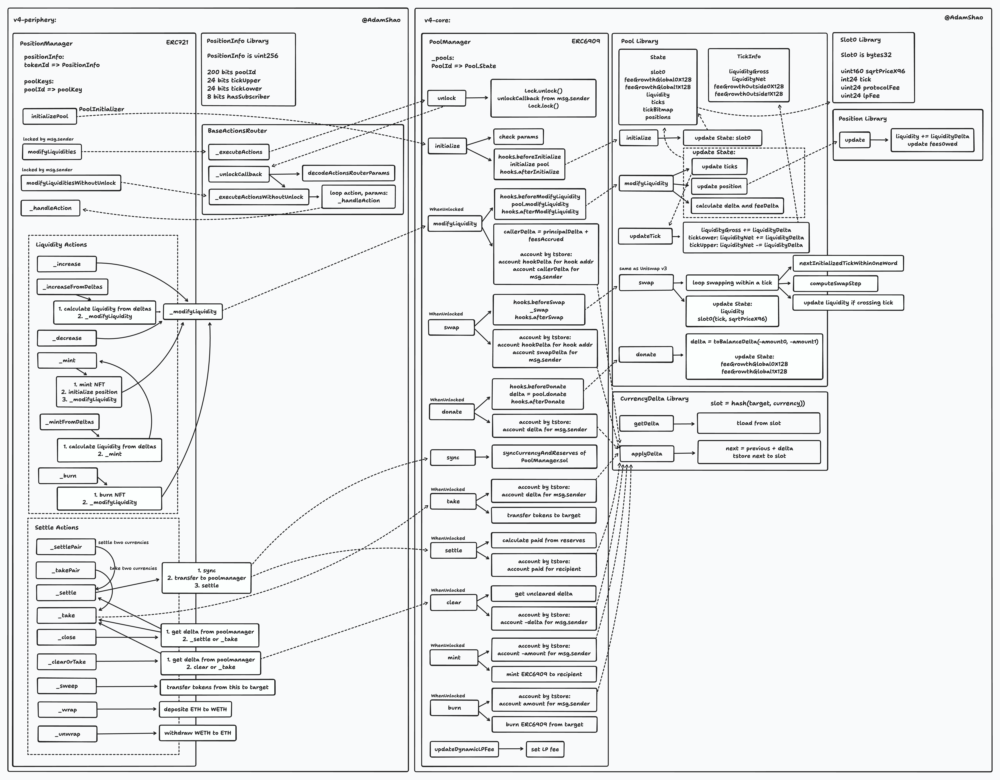

[English](./README.md) | [中文](./README_zh.md)

# 深入理解 Uniswap v4 智能合约

###### tags: `uniswap` `solidity` `hooks` `uniswap-v4`

# 工作流

下图为 Uniswap v4 合约的工作流程：

与 Uniswap v2/v3 一样，Uniswap v4 合约也分为两个仓库：

* [v4-core](./v4-core/zh/README.md) [[Github](https://github.com/Uniswap/v4-core)]：包含 Uniswap v4 核心合约，主要包括： 
  * [PoolManager.sol](./v4-core/zh/PoolManager.md)：单例合约，管理所有 Uniswap v4 池子，提供池子所有对外接口，包括创建、修改流动性、交易等操作
  * Library 合约：
    * [Pool.sol](./v4-core/zh/PoolLibrary.md)：Pool Library 合约，用于具体执行每个池子的操作，比如修改流动性、交易等
    * [Position.sol](./v4-core/zh/PositionLibrary.md)：Position Library 合约，用于具体执行每个头寸的相关操作，如更新流动性和手续费等
    * [Hooks.sol](./v4-core/zh/HooksLibrary.md)：Hooks Library 合约，用于执行 Uniswap v4 合约的 Hooks 钩子函数
    * [CurrencyDelta.sol](./v4-core/zh/CurrencyDeltaLibrary.md)：CurrencyDelta Library 合约，用于执行闪电记账（Flash Accouting）相关操作
    * [BalanceDelta.sol](./v4-core/zh/BalanceDelta.md)：BalanceDelta 定义了记账余额变化量的类型

* [v4-periphery](./v4-periphery/zh/README.md) [[Github](https://github.com/Uniswap/v4-periphery/)]：包含 Uniswap v4 外围合约，主要包括：
  * [PositionManager.sol](./v4-periphery/zh/PositionManager.md)：PositionManager 合约，用于管理头寸的创建、销毁、修改流动性等操作，底层调用 [PoolManager](./v4-core/zh/PoolManager.md) 执行具体操作。
    * 外部合约通过 PositionManager 合约来操作头寸，而不是直接调用 v4-core 的 PoolManager 合约
    * 支持将多个操作组合成一个事务，保证事务的原子性，同时减少 gas 消耗
  * [V4Router.sol](./v4-periphery/zh/V4Router.md)：V4Router 合约，用于执行交易操作，调用 [PoolManager](./v4-core/zh/PoolManager.md) 合约来执行具体的交易操作
    * 支持单跳和多跳交易
    * 支持指定输入或输出代币数量
