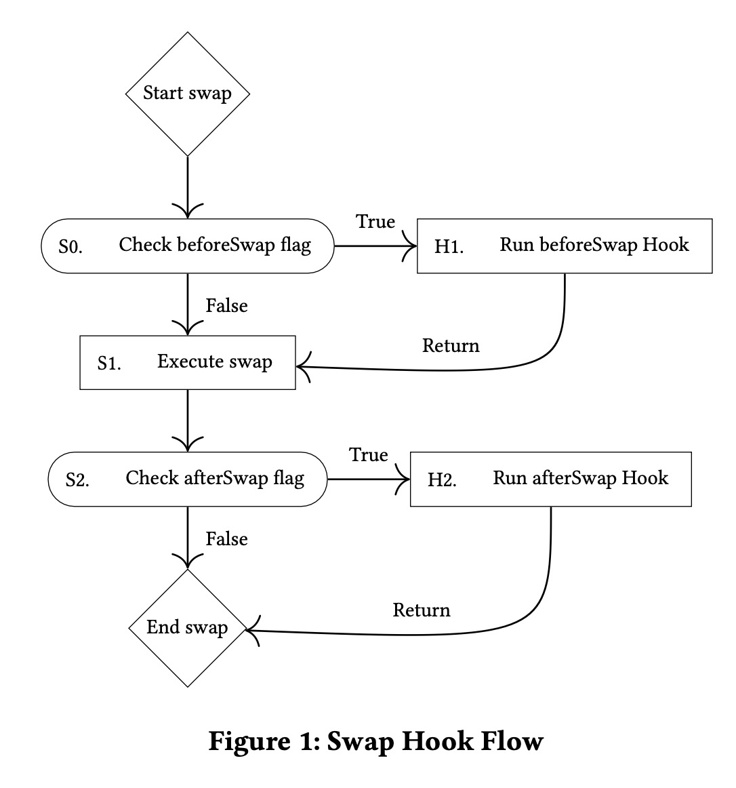

[English](./README.md) | [中文](./README_zh.md)

# 深入理解 Uniswap v4 白皮书

###### tags: `uniswap` `uniswap-v4` `whitepaper`

## Abstract | 概述

Uniswap v4 是为以太坊虚拟机（EVM）实现的去托管自动化做市商。Uniswap v4 通过任意代码逻辑的 hook 实现定制化功能，允许开发者在 Uniswap v3 引入的集中流动性模型的基础上添加新功能。在 Uniswap v4 中，任何人都可以创建带有指定 hook 的新池，该 hook 可以在预先定义的池操作之前或之后执行。Hook 既可以用于实现之前内置于协议中的功能（如预言机），也可以实现此前需要在协议外独立开发的全新功能。Uniswap v4 还通过单例实现、闪电记账以及对原生 ETH 的支持，带来了更高效的 gas 和更友好的开发者体验。

> 注： Uniswap v4 在 AMM 核心逻辑上没有发生变化，仍然采用了 Uniswap v3 中的集中流动性模型。通过引入 Hook 机制，使得 Uniswap v4 更加灵活，甚至可以通过 Hook 跳过集中流动性模型，实现自定义 AMM 算法。另外，Uniswap v4 使用单例设计重构了整个合约的架构，使得合约更加高效和节省 gas。

## 1 Introduction | 介绍

Uniswap v4 是一个在以太坊虚拟机（EVM）上进行高效价值交换的自动做市商（AMM）。与之前版本的 Uniswap 协议一样，它具有去托管、不可升级和无许可等特性。Uniswap v4 基于 Uniswap v1 和 v2 的 AMM 模型，以及 Uniswap v3 引入的集中流动性模型，它的核心关注点在于：为开发者带来更多的可定制化功能，以及为了提高 gas 效率所进行的架构调整。

Uniswap v1 [1] 和 v2 [3] 是 Uniswap 协议的前两代版本，分别实现了 ERC20 <-> ETH 和 ERC20 <-> ERC20 的兑换，并均采用了“常数乘积做市商”（CPMM）模型。Uniswap v3 [4] 引入了集中流动性，通过在指定价格区间提供流动性的头寸，实现更高效的资金利用率，同时引入了多级费率。

> 注：这里的常数乘积做市商（CPMM）模型即： $x \cdot y = k$ ，其中 $x$ 和 $y$ 分别为两个资产的数量， $k$ 为常数。

虽然集中流动性和多级费率为流动性提供者增加了灵活性，并允许新的流动性管理策略。但随着 AMM 和 DeFi 的持续演变，Uniswap v3 在支持新功能方面的灵活性仍然不足。

一些特性，例如，在 Uniswap v2 中首次引入的价格预言机功能（并在 Uniswap v3 中也被沿用），允许集成方利用去中心化的链上价格数据，但这会增加每笔交易的 gas 成本，同时也缺少对集成方的定制化空间。其它可能的增强功能，例如通过“时间加权平均做市商（TWAMM）[8]”实现的时间加权平均价格订单（TWAP）、波动率预言机、限价单、或者动态费率等，都需要对核心协议进行重新实现，第三方开发者无法为 Uniswap v3 添加此类功能。

此外，在之前版本的 Uniswap 中，每创建一个新池都需要部署一个新合约，其成本与合约字节码大小正相关。而且，若一次交易需要跨多个 Uniswap 池，则会出现多个合约间的代币转移、重复的状态更新等问题。自 Uniswap v2 开始，Uniswap 要求将 ETH 包装成 ERC-20，而不支持原生 ETH。这些设计都导致了最终用户在 gas 成本的增加。

> 注：Uniswap v2 和 v3 都会将 ETH 转换为 WETH 进行交易，因此增加了额外的 gas 成本。

在 Uniswap v4 中，我们通过以下一些值得关注的特性来改进这些不足：

**Hooks（钩子）**：Uniswap v4 允许任何人部署具有自定义功能的集中流动性的新池。创建者可以为每个池子都指定一个 hook 合约，该合约可在调用的生命周期的特定阶段执行自定义逻辑。这些 hook 也可动态管理池的交易费，实现自定义曲线，以及通过“自定义记账”来调整分配给流动性提供者和交易者的费用。

> 注：Hook 是一种钩子机制，与 Javascript 中的钩子函数类似，用于在特定的生命周期阶段执行自定义逻辑，比如在交易之前或之后执行某些自定义操作。但与一般的 hook 函数不同的是，它不单单是一种回调机制，hook 可以通过返回自定义的“差额（deltas）”，从而改变交换（swap）的行为，如完全绕过内置的集中流动性模型，而在 hook 内就完成整个 swap 交易。

**Singleton（单例模式）**：Uniswap v4 不再采用之前版本的工厂模式，而是实现一个单一合约来持有所有池子。单例模式能够降低创建新池以及多跳交易（multi-hop）的成本。

> 注：在 Uniswap v3 中，每个池子都是一个独立的合约，由一个工厂合约创建。而在 Uniswap v4 中，所有池子都由一个单一合约管理存放。

**Flash accounting（闪电记账）**：单例模式使用了“闪电记账”机制，允许调用方锁定池并访问池内的代币，只要在调用结束时，所有该调用方与池之间的代币借贷都结清即可。该功能是通过 EIP-1153 [5] 定义的“瞬时存储（transient storage）”操作码来高效实现的。闪电记账能进一步降低跨池的交易的 gas 成本，也能为与 Uniswap v4 的更复杂的整合提供支持。

> 注：EIP-1153 提出了引入两种新的以太坊虚拟机（EVM）操作码：TLOAD（0x5c）和 TSTORE（0x5d）。这些操作码用于操作称为“瞬态存储”的状态，该存储在每个交易结束后被丢弃。与传统的存储操作码 SLOAD 和 SSTORE 相比，瞬态存储不需要从磁盘加载或保存数据，因此在执行时更为高效，且不涉及退款的复杂计算。

**原生 ETH**：Uniswap v4 再次支持原生 ETH，可在 v4 池直接使用带原生代币的交易对。对于使用 ETH 进行交易或提供流动性的用户而言，这使他们受益，因为更便宜的转账和避免了额外包装操作的开销都降低了 gas 成本。

> 注：Uniswap v1 支持原生 ETH，但出于对 ETH 和 WETH 流动性分裂的担忧，Uniswap v2 和 v3 的 core 合约都只支持 WETH。

**Custom Accounting（自定义记账）**：单例合约通过 hook 返回的差额（deltas），支持增强或者绕过原生的集中流动性池，从而将单例合约视为关联池的一个不可变的结算层。该特性使得某些用例成为可能，如在 hook 中增加提现费用、包装资产，或者使用类似 Uniswap v2 的常数乘积做市商曲线等。

> 注：通过定义返回的 delta，hook 不仅能够实现自定义回调逻辑，还能够改变交换的行为，如绕过内置的集中流动性模型，实现自定义 AMM 算法。

以下章节将深入介绍这些变化以及使这些特性成为可能的架构变化。

## 2 Hooks | 钩子

Hook 是外部部署的合约，可在池子执行过程的特定阶段执行开发者自定义的逻辑。这些 hook 允许集成方创建具有灵活可定制执行逻辑的集中流动性池。可选地，hook 还能返回自定义的“差额（deltas）”，从而改变交换（swap）的行为 —— 详情可见第 5 节的“自定义记账（Custom Accounting）”。

Hook 可以修改池的参数，或增加新特性和功能。以下是一些可能在 hook 中实现的功能示例：

* 通过 TWAMM [8] 将大额订单分开在一段时间内执行
* 在价格跳点（tick price）触发的链上限价单
* 随波动率而调整的动态费率
* 帮助流动性提供者将 MEV 内部化的机制 [1]
* 中位数、截断或其它定制化预言机的实现
* 常数乘积做市商（Uniswap v2 的功能）

### 2.1 Action Hooks | 操作钩子

当有人在 Uniswap v4 上创建一个池时，他们可指定一个 hook 合约。该合约实现了自定义逻辑的回调方法，这些方法会在池子执行流程中被调用。当前 Uniswap v4 支持 10 个 hook 回调方法：

* beforeInitialize/afterInitialize
* beforeAddLiquidity/afterAddLiquidity1
* beforeRemoveLiquidity/afterRemoveLiquidity
* beforeSwap/afterSwap
* beforeDonate/afterDonate

hook 合约地址决定了哪些回调方法会被执行。这样的设计既高效又灵活，并可确保即便是可升级的 hook，也必须遵守特定的不变量。这些是创建一个可工作的 hook 的最小化要求。在图 1 中，我们展示了 `beforeSwap` 和 `afterSwap` hook 如何作为 `swap` 执行工作流程的一部分来工作的。

> 注：在 Uniswap v4 中，一个池是由两种代币地址、LP 费率、tick spacing，以及 hook 地址来唯一确定的。这意味着，如果同样两种代币，使用了不同的 hook 进行部署，那么这两个池是不同的。

> 注：实现一个基础可用的 hook 并不需要实现所有回调。例如，一个简单的 hook 可能只实现 `beforeSwap` 回调，以便在交换之前执行某些逻辑。

### 2.2 Hook-managed fees | Hook 管理的费用

Uniswap v4 允许通过 hook 征收交易手续费。

交易手续费可以是固定的，也可以是由 hook 合约动态管理的。Hook 合约也可以把一部分交易手续费分给自身。Hook 合约得到手续费后，可以按照合约代码逻辑任意分配给流动性提供者、交易者、hook 创建者或其它任意方。

不过，Hook 的权限会受到池子在创建时设定的不可变标记（immutable flags）的限制。例如，池创建者可以指定一个池是否采用固定费率（以及费率大小）或动态费率。

> 注：如前所述，如果在池创建时指定 LP fee 为 `0x800000`，则表示该池采用动态费率。同时，在创建池时，池创建者可以指定 hook 地址，以及 hook 权限。实际上，hook 的权限是包含在地址中的，因此这些权限在池创建后也是不可变的。

治理层也可以拿走一部分交易手续费，但有上限，详见 6.2 节“治理”。

## 3 Singleton and Flash Accounting | 单例和闪电记账

以往版本的 Uniswap 协议采用“工厂/池”的模式，由工厂负责为每对代币创建独立的合约。Uniswap v4 采用单例设计模式，所有池都由一个合约管理，从而减少 99% 的池创建成本。

> 注：在 Uniswap v2 和 v3 中，每一对交易对都是一个独立的合约，由工厂合约创建。而在 Uniswap v4 中，所有池都保存在一个单一合约中。

单例设计与 v4 的另一个架构改动 —— 闪电记账（flash accounting）—— 相得益彰。在之前版本的 Uniswap 协议中，大多数操作（例如交换或往池中添加流动性）会在操作结束时执行代币转移。而在 v4 中，每个操作仅更新一个内部的净余额（delta），只有在 lock 结束时才执行外部代币转移。新的 `take()` 和 `settle()` 函数可分别用于从池中借出或归还资金。协议要求在调用结束时，调用方与池的代币借出数量都必须为零，从而确保池的资金安全。

闪电记账简化了复杂的池操作，比如原子化兑换和添加流动性操作。当与单例模型结合时，也简化了多跳交易或更复杂的组合操作，比如先兑换，再添加流动性等。

> 注：在 Uniswap v4 中，无论进行多少操作，都仅在单例合约中更新内部的净余额，在交易结束时才执行代币转移操作，极大减少了 gas 成本。

在坎昆（Cancun）硬分叉之前，闪电记账的架构比较昂贵，因为它要求每次余额变动都需要进行存储更新。即使合约确保内部记账数据永远不会序列化到存储上，但只要超过了存储退还的上限，用户仍然需要承担与普通存储操作同样的成本 [6]。然而，因为在同一笔交易结束时，所有余额必须为0，这些余额的记账工作正好可利用 EIP-1153 [5] 提出的“瞬时存储”来实现。

总体而言，单例和闪电记账使得跨多个 v4 池的路由更加高效，减少流动性分散造成的成本。这一点在 hook 的引入可能大量增加池子数量时，显得尤为重要。

> 注：如前所述，同样两种代币，使用了不同的 hook 进行部署，那么这两个池是不同的。因此，hook 会导致池子数量的增加。但是由于闪电记账可极大减少跨多个池的交易成本，因此 hook 的引入并不会导致交易成本大量增加。

## 4 Native ETH | 原生 ETH

Uniswap v4 再次在交易对中支持原生 ETH。在 Uniswap v1 中，所有交易对都严格基于 ETH 与 ERC-20 的组合，到了 Uniswap v2，由于实现复杂度和对 WETH/ETH 流动性分散的担忧，原生 ETH 被移除。单例和闪电记账解决了这些问题，因此 Uniswap v4 可以同时支持 WETH 与原生 ETH。

> 注：在 Uniswap v4 中，每一种代币都需要一个唯一的合约地址，原生 ETH 则使用 `address(0)` 表示。

原生 ETH 转账消耗的 gas 大约为 ERC-20 转账的一半（转移 ETH 需 21k gas，而转移 ERC-20 代币需 40k gas）。目前 Uniswap v2 和 v3 要求大多数用户在 Uniswap 协议上开始（或结束）交易时，将 ETH 封装成 WETH（或反之），从而带来了额外的 gas 开销。根据交易数据统计，大部分用户都会用 ETH 开始或结束他们的交易，这带来了额外的不必要的复杂性。

## 5 Custom Accounting | 自定义记账

Uniswap v4 新增了自定义记账功能，它允许 hook 开发者利用 hook 返回的差额（deltas）、用户与 hook 借贷的代币数量来修改用户操作行为。这可被合约开发者用于实现诸如：在移除头寸时增加提现费用、为 LP 定义不同的费率分配模型，或者在 hook 中进行撮合等操作，同时仍可利用 Uniswap v4 自身的内部集中流动性逻辑。

值得强调的是，hook 开发者也可以完全舍弃集中流动性模型，根据 v4 交易参数创建定制化曲线（自定义 AMM）。这为集成方创造了接口可组合性 —— 允许 hook 将交易参数映射为其内部逻辑。

> 注：Hook 不仅可以实现手续费的再分配，实现自定义回调逻辑，还可以实现一套完全独立的 AMM 算法。

在 Uniswap v3 中，用户必须依赖该版本自带的集中流动性 AMM。自推出以来，集中流动性模型已在 DeFi 市场获得了广泛应用。虽然集中流动性可以支持大多数流动性管理策略，但对于某些特定策略而言，它可能带来额外 gas 开销。

一个可能的例子是：利用 Uniswap v4 hook 实现 Uniswap v2，它完全跳过内部集中流动性模型，而在 hook 内部实现一个常数乘积做市商。使用自定义记账比在集中流动性的数学算法中实现一个类似的策略更加节省成本。

相比从零开始自研一套自定义 AMM，开发者使用自定义记账的优势是可以利用单例、闪电记账和 ERC-6909。这些特性可支持更便宜的多跳交易，安全优势，并且流程更易集成。开发者也能够受益于一套经过充分审计的底层代码，以实现他们自己的 AMM。

自定义记账也支持对流动性策略进行快速实验，在过去，这种实验需要创建一套全新的 AMM。创建一套自定义 AMM 需要大量的技术资源和资金，这对于大多数人而言，从经济上不太可行。

## 6 Other Notable Features | 其它值得关注的特性

### 6.1 ERC-6909 Accounting | ERC-6909 记账

Uniswap v4 支持在单例合约内直接铸造/销毁 ERC-6909 代币，以进行多样化的代币记账，详见 ERC-6909 标准 [7]。现在用户可以在单例合约内直接持有这些代币，避免与合约之间进行 ERC-20 代币转移操作。对于那些需要在多个区块和交易中频繁与合约交互的用户和 hook（如高频交易者、流动性提供者，或自定义记账 hook）而言，这一特性尤为重要。

> 注：ERC-6909 是一个多代币标准，旨在提供比 ERC-1155 更简化和高效的替代方案。与 ERC-1155 不同，ERC-6909 移除了回调和批量操作等功能，专注于最基本的多代币管理功能，从而提高了合约的 gas 效率。

### 6.2 Governance update | 治理更新

与 Uniswap v3 类似，Uniswap v4 允许治理层（Governance）获取部分交易手续费（swap fee），但有一个上限，这部分费用是叠加在 LP 费率之上的。与 Uniswap v3 不同的是，Uniswap v4 的治理层无法控制可使用的费率档或 tick spacing 范围。

> 注：在 Uniswap v4 中，协议手续费基于每个池子设置，最大为 0.1% (1000 pips)。协议手续费会先从输入的代币中扣除，LP 手续费再从剩余的代币中扣除。

### 6.3 Gas reductions | Gas 降低

如前所述，Uniswap v4 通过闪电记账、单例模型和支持原生 ETH 等方式显著优化了 gas 成本。此外，hook 的引入使得在 Uniswap v2 和 Uniswap v3 中内置的价格预言机功能变得不再必要，所以基础池不再需要预言机相关的功能，并且可以在每个区块的首笔 swap 交易中节省大约 15k gas。

### 6.4 donate() | 捐赠

`donate()` 允许用户、集成方和 hook 直接向当前价格区间（in-range）的流动性提供者捐赠池内一种或两种代币。该功能依赖交易费记账系统以实现高效的支付。交易费支付系统能够只支持使用该池的任意一种代币进行支付。一个潜在的用例是，为在 TWAMM 订单中提供流动性的用户提供奖励，或实现某些新的费用分配系统。

## 7 Summary | 总结

总的来说，Uniswap v4 是一个去托管的、不可升级的，且无许可的 AMM 协议。它构建在 Uniswap v3 集中流动性模型的基础上，通过 hook 引入了定制化池的功能。与 hook 相补充的其它架构改动，如单例合约：在单个合约中保存所有池状态；闪电记账：高效地确保每个池的资金完整性。此外，hook 开发者可选择完全跳过集中流动性，利用 v4 单例作为任意的记账结算层。其它一些改进，如原生 ETH 支持、ERC-6909 记账、新的费用机制和直接向流动性提供者捐赠等。

## References | 参考文献

* [1] Austin Adams, Ciamac Moallemi, Sara Reynolds, and Dan Robinson. 2024. am-AMM: An Auction-Managed Automated Market Maker. arXiv preprint arXiv:2403.03367 (2024).
* [2] Hayden Adams. 2018. Uniswap v1 Core. Retrieved Jun 12, 2023 from https://hackmd.io/@HaydenAdams/HJ9jLsfTz
* [3] Hayden Adams, Noah Zinsmeister, and Dan Robinson. 2020. Uniswap v2 Core. Retrieved Jun 12, 2023 from https://uniswap.org/whitepaper.pdf
* [4] Hayden Adams, Noah Zinsmeister, Moody Salem, River Keefer, and Dan Robin-son. 2021. Uniswap v3 Core. Retrieved Jun 12, 2023 from https://uniswap.org/whitepaper-v3.pdf
* [5] Alexey Akhunov and Moody Salem. 2018. EIP-1153: Transient storage opcodes. Retrieved Jun 12, 2023 from https://eips.ethereum.org/EIPS/eip-1153
* [6] Vitalik Buterin and Martin Swende. 2021. EIP-3529: Reduction in refunds. Retrieved Jun 12, 2023 from https://eips.ethereum.org/EIPS/eip-3529
* [7] JT Riley, Dillon, Sara, Vectorized, and Neodaoist. 2023. ERC-6909: Minimal Multi-Token Interface. Retrieved Aug 26, 2024 from https://eips.ethereum.org/EIPS/eip-6909
* [8] Dave White, Dan Robinson, and Hayden Adams. 2021. TWAMM. Retrieved Jun 12, 2023 from https://www.paradigm.xyz/2021/07/twamm
